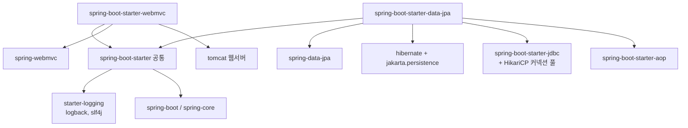
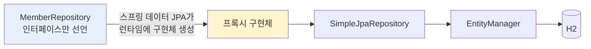

# 1. 프로젝트 환경설정 — 부트 4.x로 스프링 데이터 JPA 시작하기

> `1. 프로젝트 환경설정.pdf` 강의자료와 내가 직접 만든 `study/SpringDataJPA` 프로젝트의
> `build.gradle`, `application.yml`, `HelloContorller`, `MemberJpaRepository`, `MemberRepository` 코드를 기준으로 정리한다.
>
> ⚠️ **이 챕터는 강의와 버전 차이가 가장 큰 챕터다.**
> 강의는 부트 2.2.1 (PDF 코드) / 부트 3.x (보정 안내), 내 프로젝트는 **Spring Boot 4.1.0** 이다.
> 스타터 이름부터 바뀐 것이 있어서, 아래 `⚠️` 표시를 특히 잘 봐야 한다.

---

## 0. 이 챕터의 한 줄 요약

> **스프링 부트가 JPA 설정을 전부 자동화해 준다. `persistence.xml` 도, `LocalContainerEntityManagerFactoryBean` 도 없다.**
> 우리는 `application.yml` 몇 줄만 쓰고, 리포지토리 **인터페이스만 선언**하면 끝난다.

기본편에서 손으로 짰던 `persistence.xml` / `EntityManagerFactory` 부트스트랩이 전부 사라진다.
그리고 이 챕터 마지막에 그 정점을 보여준다 — **구현체 없는 인터페이스 하나로 리포지토리가 동작한다.**

---

## 1. 프로젝트 생성

[start.spring.io](https://start.spring.io/) 에서 생성한다.

| 항목 | 값 |
|------|-----|
| Project | **Gradle - Groovy** |
| Language | Java |
| groupId | `study` |
| artifactId | `data-jpa` |
| 사용 기능 | web, jpa, h2, lombok |

`settings.gradle` 에 그 결과가 남아 있다.

```groovy
rootProject.name = 'data-jpa'
```

⚠️ **패키지명 주의** — 강의는 `study.datajpa` 지만 내 프로젝트는 **`study.data_jpa`** 다.
Initializr가 artifactId `data-jpa` 의 하이픈을 `_` 로 바꿔서 만들어 준 결과다.
앞으로 강의 코드를 복붙할 때 패키지 선언만 고쳐야 한다.

---

## 2. build.gradle — 강의와의 차이 총정리

내가 쓰고 있는 전체 설정이다.

```groovy
plugins {
	id 'java'
	id 'org.springframework.boot' version '4.1.0'
	id 'io.spring.dependency-management' version '1.1.7'
}

group = 'study'
version = '0.0.1-SNAPSHOT'

java {
	toolchain {
		languageVersion = JavaLanguageVersion.of(17)
	}
}

repositories {
	mavenCentral()
}

dependencies {
	implementation 'org.springframework.boot:spring-boot-h2console'
	implementation 'org.springframework.boot:spring-boot-starter-data-jpa'
	implementation 'org.springframework.boot:spring-boot-starter-webmvc'
	// 쿼리 파라미터 로그 (강의는 1.9.0, 부트 4.x 는 2.x 를 써야 한다)
	implementation 'com.github.gavlyukovskiy:p6spy-spring-boot-starter:2.0.1'
	compileOnly 'org.projectlombok:lombok'
	runtimeOnly 'com.h2database:h2'
	annotationProcessor 'org.projectlombok:lombok'
	testImplementation 'org.springframework.boot:spring-boot-starter-data-jpa-test'
	testImplementation 'org.springframework.boot:spring-boot-starter-webmvc-test'
	testCompileOnly 'org.projectlombok:lombok'
	testRuntimeOnly 'org.junit.platform:junit-platform-launcher'
	testAnnotationProcessor 'org.projectlombok:lombok'
}

tasks.named('test') {
	useJUnitPlatform()
}
```

### ⚠️ 차이 비교표

| 항목 | 강의 (PDF, 부트 2.2.1) | 내 코드 (부트 4.1.0) |
|------|----------------------|---------------------|
| 부트 버전 | `2.2.1.RELEASE` | `4.1.0` |
| 자바 | `sourceCompatibility = '1.8'` | `java { toolchain { ... 17 } }` |
| 웹 스타터 | `spring-boot-starter-web` | **`spring-boot-starter-webmvc`** |
| H2 콘솔 | `starter-web` 에 딸려옴 | **`spring-boot-h2console` 별도 의존성** |
| 테스트 | `spring-boot-starter-test` 하나 | **`starter-data-jpa-test` + `starter-webmvc-test`** 로 분리 |
| p6spy | `1.5.7` (부트 3.x는 `1.9.0`) | **`2.0.1`** |
| lombok 설정 | `configurations { compileOnly { extendsFrom annotationProcessor } }` | 불필요 (`compileOnly` + `annotationProcessor` 를 각각 선언) |
| JUnit | vintage 추가해서 JUnit4 | **JUnit5 그대로** (vintage 추가 안 함) |

💡 **부트 4.x의 스타터 재편** — 부트 4부터 스타터를 잘게 쪼갰다.
`spring-boot-starter-web` 이라는 뭉뚱그린 이름 대신 `spring-boot-starter-webmvc`(서블릿 MVC),
`spring-boot-starter-webflux`(리액티브)처럼 **무엇을 쓰는지 이름으로 드러낸다.**
테스트 스타터도 마찬가지라, 예전처럼 `starter-test` 하나가 JPA·MVC 테스트 지원을 다 끌고 오지 않는다.

⚠️ **강의의 "JUnit4 추가" 안내는 따르지 않았다.**

```groovy
//JUnit4 추가 — 나는 넣지 않음
testImplementation("org.junit.vintage:junit-vintage-engine") { ... }
```

강의 영상이 JUnit4 기준이라 vintage 엔진을 넣으라고 안내하지만,
기본편·활용편을 이미 JUnit5로 진행했으므로 그대로 JUnit5를 쓴다.
그래서 `@RunWith(SpringRunner.class)` 도 필요 없다.

---

## 3. 라이브러리 살펴보기

```bash
./gradlew dependencies --configuration compileClasspath
```

내 프로젝트의 **최상위 의존성은 딱 4개**다.

```
+--- org.projectlombok:lombok -> 1.18.46
+--- org.springframework.boot:spring-boot-h2console -> 4.1.0
+--- org.springframework.boot:spring-boot-starter-data-jpa -> 4.1.0
+--- org.springframework.boot:spring-boot-starter-webmvc -> 4.1.0
```

이 4줄이 끌고 오는 실제 라이브러리(부트 BOM이 버전을 관리한다):

| 역할 | 라이브러리 | 내 프로젝트 버전 |
|------|-----------|----------------|
| 웹 서버 | `tomcat-embed-core` | 11.0.22 |
| 스프링 웹 MVC | `spring-webmvc` | 7.0.8 |
| JPA 표준 | `jakarta.persistence-api` | 3.2.0 |
| JPA 구현체 | `hibernate-core` | **7.4.1.Final** |
| 스프링 ORM | `spring-orm` | 7.0.8 |
| 스프링 데이터 JPA | `spring-data-jpa` | 4.1.0 |
| 커넥션 풀 | `HikariCP` | 7.0.2 |
| DB | `h2` | 2.4.240 |
| 로깅 | `logback-classic` + `slf4j-api` | 1.5.34 / 2.0.18 |

**의존성 계층**을 그림으로 보면 이렇다.



**테스트 라이브러리** — `starter-*-test` 가 아래를 함께 가져온다.

| 라이브러리 | 역할 |
|-----------|------|
| JUnit 5 (jupiter) | 테스트 프레임워크 (부트 2.2부터 기본, 과거는 vintage) |
| mockito | 목(mock) 라이브러리 |
| **assertj** | `assertThat(...).isEqualTo(...)` 형태의 편한 검증 |
| spring-test | 스프링 통합 테스트 지원 |

---

## 4. H2 데이터베이스

개발/테스트용 경량 DB. 웹 콘솔 화면을 제공한다. → https://www.h2database.com

⚠️ **버전을 부트에 맞춘다.** 부트 2.x는 1.4.200, 부트 3.x 이상은 2.1.214 이상.
내 프로젝트는 부트 BOM이 **2.4.240** 을 붙여 준다. 설치하는 H2 실행 파일도 이 계열로 맞춘다.

### 데이터베이스 파일 생성 (최초 1회만)

1. `h2/bin/h2.bat` 실행 (Mac/Linux는 `chmod 755 h2.sh` 후 `h2.sh`)
2. 접속 URL을 **`jdbc:h2:~/springDataJpa`** 로 넣고 한 번 접속 → `~/springDataJpa.mv.db` 파일 생성 확인
3. **이후로는 항상 `jdbc:h2:tcp://localhost/~/springDataJpa`** 로 접속

💡 왜 TCP로 바꾸나 — 파일 모드(`jdbc:h2:~/...`)는 **한 프로세스만 파일을 잠근다.**
애플리케이션과 H2 콘솔을 동시에 띄우려면 TCP 서버 모드여야 한다.
즉 **애플리케이션 실행 전에 `h2.bat` 을 먼저 켜 둬야 한다.**

⚠️ MVCC 옵션은 H2 1.4.198부터 제거됐다. 최신 버전에서 쓰면 오류가 난다.

---

## 5. application.yml

```yaml
spring:
  application:
    name: data-jpa
  # 콘솔 로그 색상 출력 (기본값 detect 는 Gradle 로 실행하면 감지에 실패해서 색이 안 나온다)
  output:
    ansi:
      enabled: always
  datasource:
    url: jdbc:h2:tcp://localhost/~/springDataJpa
    username: sa
    password:
    driver-class-name: org.h2.Driver

  jpa:
    hibernate:
      ddl-auto: create
    properties:
      hibernate:
        # show_sql: true # System.out 에 찍히므로 아래 logging.level 방식을 쓴다
        format_sql: true

logging.level:
  org.hibernate.SQL: debug
  # 쿼리 파라미터 로그 (하이버네이트 6 이상. 강의의 org.hibernate.type: trace 는 동작하지 않는다)
  # org.hibernate.orm.jdbc.bind: trace
```

| 설정 | 의미 |
|------|------|
| `ddl-auto: create` | **애플리케이션 실행 시점에 테이블을 drop 하고 다시 생성**한다. 학습용이라 매번 깨끗하게 시작. |
| `format_sql: true` | SQL을 여러 줄로 보기 좋게 정렬해서 출력. |
| `org.hibernate.SQL: debug` | 하이버네이트 실행 SQL을 **로거로** 남긴다. |
| `spring.output.ansi.enabled: always` | 내가 추가한 설정. Gradle로 실행하면 터미널 감지에 실패해 로그 색이 안 나온다. |

⚠️ **`show_sql` 대신 `logging.level` 을 쓰는 이유** — 강의가 짚는 포인트다.
`show_sql: true` 는 `System.out` 에 찍고, `org.hibernate.SQL: debug` 는 **로거**를 통해 찍는다.
**모든 로그 출력은 가급적 로거를 통해 남겨야 한다.** 그래서 `show_sql` 은 주석 처리해 뒀다.

⚠️ **쿼리 파라미터 로그 — 강의 설정은 이제 동작하지 않는다.**

| | 설정 |
|---|---|
| 강의 (하이버네이트 5) | `org.hibernate.type: trace` |
| 하이버네이트 6 이상 | `org.hibernate.orm.jdbc.bind: trace` |

내 yml에는 이것도 **주석 처리**돼 있는데, p6spy가 이미 파라미터가 바인딩된 완성 SQL을 찍어주기 때문이다.
둘 다 켜면 같은 쿼리가 중복으로 나온다.

### p6spy — 쿼리 파라미터 로그

```groovy
// 쿼리 파라미터 로그 (강의는 1.9.0, 부트 4.x 는 2.x 를 써야 한다)
implementation 'com.github.gavlyukovskiy:p6spy-spring-boot-starter:2.0.1'
```

의존성만 추가하면 끝이다(→ [spring-boot-data-source-decorator](https://github.com/gavlyukovskiy/spring-boot-data-source-decorator)).
결과적으로 `?` 대신 실제 값이 박힌 SQL을 볼 수 있다.

```sql
insert into member (age,team_id,username,member_id) values (?,?,?,?)      -- 하이버네이트 로그
insert into member (age,team_id,username,member_id) values (10,1,'member1',1);  -- p6spy 로그
```

| 부트 버전 | p6spy 버전 |
|-----------|-----------|
| 2.x | 1.5.7 |
| 3.x | 1.9.0 |
| **4.x (내 프로젝트)** | **2.0.1** |

⚠️ **운영에서는 주의** — 파라미터 로그 라이브러리는 시스템 자원을 쓴다.
개발 단계에서는 편하게 쓰되, 운영에 적용하려면 반드시 성능 테스트를 하고 넣는다.

---

## 6. 동작 확인

### ① 웹 동작 확인

```java
package study.data_jpa.controller;

@RestController
public class HelloContorller {
    @GetMapping("/hello")
    public String hello() {
        return "Hello Spring Data JPA!";
    }
}
```

애플리케이션을 실행하고 http://localhost:8080/hello 로 확인한다.
(`http://localhost:8080` 은 매핑이 없어서 에러 페이지가 뜨는데, **에러 페이지가 뜬다는 것 자체가 톰캣이 떴다는 증거**다.)

⚠️ 강의는 `@RequestMapping("/hello")` 를 쓰지만 나는 **`@GetMapping`** 을 썼다.
`@RequestMapping` 은 메서드를 지정하지 않으면 모든 HTTP 메서드를 받아버린다. GET만 받도록 좁히는 게 맞다.

### ② 순수 JPA 리포지토리

```java
@Repository
public class MemberJpaRepository {

    @PersistenceContext
    private EntityManager em;

    public Member save(Member member) {
        em.persist(member);
        return member;
    }

    public Member findById(Long id) {
        return em.find(Member.class, id);
    }
}
```

⚠️ 강의는 메서드명이 `find(Long id)` 지만, 나는 **`findById`** 로 지었다.
바로 다음에 나올 스프링 데이터 JPA의 `findById` 와 이름을 맞춰서 비교하기 좋게 하려는 의도다.

```java
@SpringBootTest
@Transactional
@Rollback(false)
class MemberJpaRepositoryTest {

    @Autowired
    MemberJpaRepository memberJpaRepository;

    @Test
    public void testMember() {
        Member member = new Member("memberA");
        Member saved = memberJpaRepository.save(member);

        Member findMember = memberJpaRepository.findById(saved.getId());

        assertThat(findMember.getId()).isEqualTo(member.getId());
        assertThat(findMember.getUsername()).isEqualTo(member.getUsername());
        assertThat(findMember).isEqualTo(member);   // JPA 엔티티 동일성 보장
    }
}
```

💡 **마지막 줄이 이 테스트의 핵심이다.**
`assertThat(findMember).isEqualTo(member)` 가 통과하는 이유는 `equals()` 를 오버라이딩해서가 아니다.
**같은 트랜잭션(= 같은 영속성 컨텍스트) 안에서 같은 식별자로 조회하면 항상 같은 인스턴스가 반환**되기 때문이다(1차 캐시).
JPA가 보장하는 **엔티티 동일성(identity)** 이고, `find` 호출 때 SELECT 쿼리조차 안 나간다.

### ③ 스프링 데이터 JPA 리포지토리

```java
public interface MemberRepository extends JpaRepository<Member, Long> {

}
```

**이게 전부다.** 구현 클래스가 없다.

```java
@SpringBootTest
@Transactional
@Rollback(false)
class MemberRepositoryTest {

    @Autowired
    private MemberRepository memberRepository;   // ← 구현체가 없는데 주입이 된다

    @Test
    public void testMember() {
        Member member = new Member("memberA");
        Member saved = memberRepository.save(member);

        Optional<Member> byId = memberRepository.findById(saved.getId());
        Member findMember = byId.get();

        assertThat(findMember.getId()).isEqualTo(saved.getId());
        assertThat(findMember.getUsername()).isEqualTo(member.getUsername());
        assertThat(findMember).isEqualTo(member);
    }
}
```

인터페이스만 선언했는데 `save()`, `findById()` 가 동작한다.
스프링 데이터 JPA가 **실행 시점에 구현체(프록시)를 만들어 스프링 빈으로 등록**해 주기 때문이다.
그 원리는 3장 「공통 인터페이스 기능」에서 다룬다.

💡 **순수 JPA와의 차이 두 가지**
1. `findById()` 의 반환 타입이 **`Optional<Member>`** 다. `em.find()` 는 없으면 `null` 을 주지만,
   스프링 데이터 JPA는 `Optional` 로 감싸서 NPE 가능성을 타입으로 드러낸다.
2. `@PersistenceContext EntityManager` 를 내가 다룰 일이 없다.



---

## ✅ 핵심 요약

| 항목 | 결론 |
|------|------|
| 프로젝트 | Gradle-Groovy, group `study`, artifact `data-jpa` → 패키지는 `study.data_jpa` |
| 부트 버전 | 강의 2.2.1 / 3.x → 내 프로젝트 **4.1.0** (스타터 이름이 바뀌었다) |
| 웹 스타터 | `starter-web` ❌ → **`starter-webmvc`**, H2 콘솔은 `spring-boot-h2console` 별도 |
| 테스트 | JUnit5 그대로. vintage 추가 안 함 → `@RunWith` 불필요 |
| p6spy | 부트 4.x는 **2.0.1** (강의 1.5.7 / 1.9.0) |
| SQL 로그 | `show_sql` ❌ → **`logging.level: org.hibernate.SQL: debug`** (로거로 남긴다) |
| 파라미터 로그 | `org.hibernate.type` ❌ → **`org.hibernate.orm.jdbc.bind`** 또는 p6spy |
| H2 | 최초 1회 `jdbc:h2:~/springDataJpa` 로 파일 생성 → 이후 `tcp://localhost/~/springDataJpa` |
| 동일성 보장 | 같은 트랜잭션 안에서 같은 id로 조회하면 **같은 인스턴스**가 온다 (1차 캐시) |
| 스프링 데이터 JPA | **인터페이스만 선언**하면 런타임에 구현체가 주입된다 → 3장에서 원리 확인 |

> ⚠️ 부트 3.0 이상은 `javax.*` 패키지가 전부 **`jakarta.*`** 로 바뀌었다.
> `javax.persistence.Entity` → `jakarta.persistence.Entity`,
> `javax.annotation.PostConstruct` → `jakarta.annotation.PostConstruct`,
> `javax.validation` → `jakarta.validation`.
> 강의 코드를 복붙할 때 IDE가 `javax` 를 못 찾으면 십중팔구 이 문제다.
