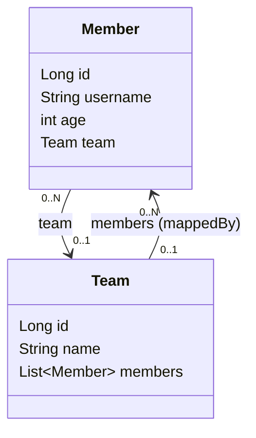

# 2. 예제 도메인 모델 — Member / Team 양방향 연관관계와 동작 확인

> `2. 예제 도메인 모델.pdf` 강의자료와 내가 직접 작성한 `study/SpringDataJPA` 의
> `Member`, `Team`, `MemberTest` 코드를 기준으로 정리한다.
> Spring Boot 4.1.0, Java 17, Hibernate ORM 7.4.1, H2, `jakarta.persistence` 기준.
>
> ✅ 엔티티 2개와 동작 확인 테스트를 모두 직접 작성하고 실행해서 로그까지 확인한 상태다.
> 강의(부트 2.x, `javax.persistence`)와 차이가 있는 곳은 `⚠️` 로 명시한다.

---

## 0. 이 챕터의 한 줄 요약

> **앞으로 스프링 데이터 JPA 기능을 실습할 때 쓸 도메인(Member ↔ Team)을 만들고,
> "순수 JPA"로 먼저 동작을 확인한다.**

챕터 자체는 짧지만, 여기서 만든 `Member`/`Team` 이 3장 이후 **모든 실습의 기반**이 된다.
그리고 강의가 강조하는 포인트가 하나 있다 — **"가급적 순수 JPA로 동작 확인 (뒤에서 변경)"**.
스프링 데이터 JPA가 뭘 대신해 주는지 알려면, 먼저 손으로 짠 버전을 봐야 하기 때문이다.

---

## 1. 도메인 구조

### 엔티티 클래스



### ERD

| member | | team |
|--------|---|------|
| **member_id (PK)** | | **team_id (PK)** |
| username | | name |
| age | | |
| **team_id (FK)** | → | |

회원 여러 명이 팀 하나에 속한다. **FK는 항상 N 쪽(`member.team_id`)에 있다.**
객체는 `Member.team` / `Team.members` 양쪽으로 참조가 가능하지만, 테이블은 FK 하나뿐이다.
이 불일치를 메우는 개념이 아래의 **연관관계 주인**이다.

---

## 2. Member 엔티티

```java
package study.datajpa.entity;

import jakarta.persistence.*;   // ⚠️ 강의는 javax.persistence
import lombok.*;

@Entity
@Getter
@Setter
@NoArgsConstructor(access = AccessLevel.PROTECTED)
@ToString(of = {"id", "username", "age"})
public class Member {

    @Id @GeneratedValue
    @Column(name = "member_id")
    private Long id;
    private String username;
    private int age;

    @ManyToOne(fetch = FetchType.LAZY)
    @JoinColumn(name = "team_id")
    private Team team;
}
```

### 롬복 어노테이션의 의미

| 어노테이션 | 왜 쓰는가 |
|-----------|----------|
| `@Getter` | 조회용. 자유롭게 열어도 된다. |
| `@Setter` | ⚠️ **실무에서는 가급적 쓰지 않는다.** 아무 데서나 값이 바뀌면 변경 추적이 불가능해진다. 지금은 학습 편의상 열어둔 것. |
| `@NoArgsConstructor(access = PROTECTED)` | JPA 스펙상 **기본 생성자가 반드시 필요**하다(프록시/리플렉션 때문). 하지만 `new Member()` 를 아무나 못 쓰게 막고 싶으니 `PROTECTED` 로 최소한만 연다. |
| `@ToString(of = {...})` | **연관관계 필드는 절대 넣지 않는다.** |

내 코드에도 원래 주석 처리해 둔 `protected Member() {}` 가 남아 있다.
`@NoArgsConstructor(access = AccessLevel.PROTECTED)` 가 정확히 이 코드를 대신 만들어 준다.

```java
//    protected Member() {}   ← 롬복이 대신 생성해 주므로 주석 처리
```

⚠️ **`@ToString` 에 연관관계 필드를 넣으면 안 되는 이유** — `Team` 쪽 내 코드에 직접 적어둔 주석 그대로다.

```java
@ToString(of = {"id", "name"}) // 절대 Member 포함하지 말것 무한 순환호출로 stackOverFlowError 발생
```

`Member.toString()` → `team.toString()` → `members.toString()` → 다시 `member.toString()` … 로
무한 재귀가 돌아 `StackOverflowError` 가 난다. 게다가 LAZY 프록시를 강제로 초기화해서
로그 한 줄 찍자고 쿼리가 날아가는 부작용도 있다.

### 생성자

```java
public Member(String username){
    this(username, 0);
}

public Member(String username, int age){
    this(username, age, null);
}

public Member(String username, int age, Team team) {
    this.username = username;
    this.age = age;
    if(team != null){
        changeTeam(team);
    }
}
```

💡 **생성자 3개를 `this(...)` 로 체이닝한다.** 인자가 적은 생성자가 많은 쪽을 호출해서,
**실제 초기화 로직은 3-arg 생성자 한 곳에만** 존재한다.
`new Member("member1")` 은 `age = 0`, `team = null` 로 채워진다.

`if (team != null)` 체크가 필요한 이유도 여기서 나온다.
`Member(String, int)` 가 `team` 에 `null` 을 넘기기 때문에, 체크가 없으면
`changeTeam(null)` 안의 `team.getMembers()` 에서 **NPE**가 난다.

---

## 3. Team 엔티티

```java
@Entity
@Getter
@Setter
@NoArgsConstructor(access = AccessLevel.PROTECTED)
@ToString(of = {"id", "name"}) // 절대 Member 포함하지 말것 무한 순환호출로 stackOverFlowError 발생
public class Team {

    @Id @GeneratedValue
    @Column(name = "team_id")
    private Long id;
    private String name;

    @OneToMany(mappedBy = "team")
    private List<Member> members = new ArrayList<>();

    public Team(String name) {
        this.name = name;
    }
}
```

💡 **컬렉션은 필드에서 바로 초기화한다** (`= new ArrayList<>()`).
`null` 체크가 사라지고, 하이버네이트가 자신의 내장 컬렉션으로 바꿔치기해도 안전하다.

⚠️ **강의와의 차이** — 강의 PDF는 `List<Member> members` 가 접근 제어자 없이(package-private) 선언돼 있다.
내 코드는 `private` 으로 닫았다. 캡슐화 관점에서 `private` 이 맞다.

---

## 4. 연관관계 주인과 편의 메서드

> Member와 Team은 **양방향 연관관계**다.
> **`Member.team` 이 연관관계의 주인**이고, `Team.members` 는 주인이 아니다(`mappedBy = "team"`).
> 따라서 **`Member.team` 만 DB 외래키 값을 변경**할 수 있고, `Team.members` 는 **읽기 전용**이다.

| | 주인 여부 | DB 반영 |
|---|---|---|
| `Member.team` (`@ManyToOne` + `@JoinColumn`) | ✅ 주인 | `member.team_id` 를 변경 |
| `Team.members` (`@OneToMany(mappedBy)`) | ❌ 주인 아님 | 읽기만 가능. 여기에 add 해도 SQL이 안 나감 |

그래서 **주인 쪽 세팅을 빠뜨리면 FK가 NULL** 이 된다.
반대로 주인 쪽만 세팅하면 DB는 맞는데 같은 트랜잭션 안의 `team.getMembers()` 는 비어 있다.
이 두 실수를 한 번에 막는 것이 **연관관계 편의 메서드**다.

```java
// 연관관계 편의 메서드(db와 객체를 동일하게 만들어줌) - 팀변경 + 회원 추가
public void changeTeam(Team team){
    this.team = team;             // 나의 팀을 변경 (주인 → DB에 반영됨)
    team.getMembers().add(this);  // 해당 팀에 나를 추가 (반대편 → 객체 상태만 맞춤)
}
```

💡 메서드 이름이 `setTeam` 이 아니라 **`changeTeam`** 인 게 포인트다.
단순 setter가 아니라 "양쪽을 함께 바꾸는 행위"라는 걸 이름으로 드러낸다.

---

## 5. 동작 확인 테스트

```java
@SpringBootTest
class MemberTest {

    @PersistenceContext
    private EntityManager em;   // 순수 JPA로 먼저 확인 (뒤에서 스프링 데이터 JPA로 변경)

    @Test
    @Transactional
    // @Rollback(false)   // DB를 눈으로 확인할 때만 잠깐 켠다 (아래 ⚠️ 참고)
    public void testEntity() {
        Team teamA = new Team("teamA");
        Team teamB = new Team("teamB");
        em.persist(teamA);
        em.persist(teamB);

        Member member1 = new Member("member1", 10, teamA);
        // ... member2~4

        em.persist(member1);
        // ...

        // 초기화
        em.flush();  // db
        em.clear();  // persistence cash

        // 확인
        List<Member> members =
                em.createQuery("select m from Member m", Member.class).getResultList();

        for (Member member: members) {
            System.out.println("member: " + member);
            System.out.println("-> member.team = " + member.getTeam());
        }
    }
}
```

핵심 3줄:

| 코드 | 의미 |
|------|------|
| `@Rollback(false)` | 테스트가 끝나도 롤백하지 않는다. **H2 콘솔로 실제 테이블을 눈으로 확인**하려는 목적. |
| `em.flush()` | 쓰기 지연 SQL 저장소의 INSERT를 **DB로 날린다.** |
| `em.clear()` | 영속성 컨텍스트(1차 캐시)를 비운다. 이걸 해야 아래 JPQL이 **1차 캐시가 아닌 DB에서** 진짜로 조회한다. |

⚠️ **`@Rollback(false)` 는 확인이 끝나면 다시 꺼야 한다.** 켜둔 채로 전체 테스트를 돌리면
이 테스트가 넣은 회원 4명이 DB에 그대로 남아서, 뒤에 실행되는 다른 테스트의 **개수 검증이 깨진다.**
(3장 `basicCRUD` 에서 실제로 `expected: 2 but was: 6` 으로 걸렸다)
`ddl-auto: create` 는 테스트 컨텍스트가 뜰 때 **한 번만** 테이블을 새로 만들기 때문이다.
**테스트는 롤백되는 것이 기본**이다.

⚠️ **강의(JUnit 4)와의 차이**

| 강의 | 내 코드 |
|------|---------|
| `@RunWith(SpringRunner.class)` 필요 | JUnit 5라 **불필요** (`@SpringBootTest` 에 포함) |
| `org.junit.Test` | `org.junit.jupiter.api.Test` |
| `javax.persistence.EntityManager` | `jakarta.persistence.EntityManager` |
| `public class MemberTest` | 클래스/메서드 `public` 불필요 (JUnit 5) |

### 실행 결과 — 실제 로그

p6spy 덕분에 파라미터까지 바인딩된 SQL이 그대로 찍힌다.

```sql
create sequence member_seq start with 1 increment by 50;
create sequence team_seq start with 1 increment by 50;

select next value for team_seq;
insert into team (name,team_id) values ('teamA',1);
insert into team (name,team_id) values ('teamB',2);
insert into member (age,team_id,username,member_id) values (10,1,'member1',1);
insert into member (age,team_id,username,member_id) values (20,1,'member2',2);
insert into member (age,team_id,username,member_id) values (30,2,'member3',3);
insert into member (age,team_id,username,member_id) values (40,2,'member4',4);
```

```
member: Member(id=1, username=member1, age=10)
-> member.team = Team(id=1, name=teamA)
member: Member(id=2, username=member2, age=20)
-> member.team = Team(id=1, name=teamA)
...
```

**확인할 것 3가지**

1. **DB 결과** — `member.team_id` 에 1, 1, 2, 2 가 제대로 들어갔다 → 연관관계 편의 메서드가 동작했다.
2. **지연 로딩** — `select m from Member m` 로 회원만 조회했는데, `member.getTeam()` 을 찍는 순간
   로그 사이에 `select ... from team where team_id=?` 가 끼어든다. `FetchType.LAZY` 가 동작한 증거다.
3. **N+1의 씨앗** — 위 로그를 잘 보면 팀 조회 쿼리가 **회원 조회 1번 + 팀 조회 N번** 으로 나간다.
   (여기선 1차 캐시 덕에 팀당 1번씩 총 2번) 활용 2편에서 다룬 그 N+1 문제가 이 도메인에서도 그대로 재현된다.

⚠️ **`@GeneratedValue` 의 기본값은 `AUTO`** 이고, Hibernate 6 이상 + H2 에서는 **SEQUENCE 전략**으로 풀린다.
그래서 `IDENTITY` 를 쓴 적이 없는데도 `member_seq` / `team_seq` 가 생성된다.
`increment by 50` 은 `pooled` 최적화라 시퀀스를 한 번 조회해서 50개의 ID를 미리 확보하는 방식이다.
DB 시퀀스 값과 엔티티 id가 1:1로 안 맞아 보여도 정상이다.

---

## ✅ 핵심 요약

| 항목 | 결론 |
|------|------|
| 도메인 | `Member` N : 1 `Team` 양방향. FK는 `member.team_id`. |
| 연관관계 주인 | `Member.team`. `Team.members` 는 `mappedBy` 로 읽기 전용. |
| 편의 메서드 | `changeTeam()` 에서 양쪽을 함께 세팅 → 객체와 DB 상태를 일치시킨다. |
| 롬복 | `@Setter` 는 실무에서 지양, 기본 생성자는 `PROTECTED`, `@ToString` 에 연관관계 필드 금지. |
| 페치 전략 | `@ManyToOne` 은 반드시 `LAZY`. (기본값이 EAGER라 명시해야 한다) |
| 검증 방법 | `em.flush()`/`em.clear()` + 쿼리 로그로 확인. `@Rollback(false)` 는 DB를 볼 때만 잠깐 켠다. |
| 다음 단계 | 이 도메인 위에 순수 JPA 리포지토리 → 스프링 데이터 JPA 리포지토리를 올려 비교한다. (3장) |

> ⚠️ `@ManyToOne` 의 기본 페치 전략은 **EAGER** 다. 실무에서는 **모든 `@ManyToOne`/`@OneToOne` 에
> `fetch = FetchType.LAZY` 를 명시**하는 것이 원칙이다. 예제 코드에도 빠짐없이 붙어 있다.
