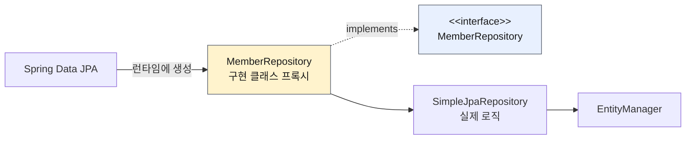
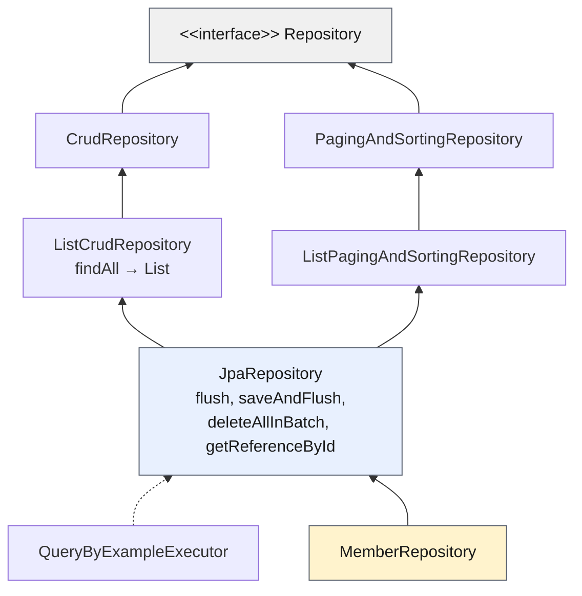

# 3. 공통 인터페이스 기능 — 순수 JPA 리포지토리를 인터페이스 한 줄로 대체하기

> `3. 공통 인터페이스 기능.pdf` 강의자료와 내가 작성 중인 `study/SpringDataJPA` 의
> `MemberJpaRepository`, `MemberRepository`, 그리고 두 테스트 코드를 기준으로 정리한다.
> Spring Boot 4.1.0, **spring-data-jpa 4.1.0**, Hibernate 7.4.1 기준.
>
> ✅ 순수 JPA 리포지토리(회원·팀)와 스프링 데이터 JPA 리포지토리, 두 쪽의 `basicCRUD` 테스트까지
> **전부 직접 구현하고 테스트 6개 통과를 확인한 상태**다.
>
> ⚠️ **강의는 스프링 데이터 2.x 기준이라 인터페이스 계층 구조가 지금과 다르다.**
> 아래 「공통 인터페이스 분석」에서 실제 4.1.0 소스를 열어 확인한 내용으로 바로잡는다.

---

## 0. 이 챕터의 한 줄 요약

> **엔티티마다 똑같이 반복되던 CRUD 리포지토리를, `JpaRepository<T, ID>` 를 상속한
> 인터페이스 한 줄로 없앤다.**

이 챕터의 구성이 곧 논리 전개다.

```
① 순수 JPA로 CRUD 리포지토리를 직접 짜 본다   (Member용 / Team용 — 코드가 거의 똑같다)
        ↓ "이거 엔티티마다 복붙이잖아?"
② 스프링 데이터 JPA 공통 인터페이스로 바꾼다   (인터페이스 선언 한 줄)
        ↓ "구현체도 없는데 왜 동작하지?"
③ 그 원리(프록시)와 계층 구조를 분석한다
```

---

## 1. 순수 JPA 기반 리포지토리 만들기

먼저 **비교 대상**을 손으로 만든다. 기본 CRUD는 6가지다.

| 기능 | 순수 JPA |
|------|---------|
| 저장 | `em.persist(member)` |
| **변경** | **없음 — 변경 감지(dirty checking)** |
| 삭제 | `em.remove(member)` |
| 전체 조회 | `em.createQuery("select m from Member m", ...)` |
| 단건 조회 | `em.find(Member.class, id)` |
| 카운트 | `em.createQuery("select count(m) from Member m", Long.class)` |

💡 **수정(update) 메서드가 없는 게 포인트다.**
JPA에서 수정은 **변경 감지**로 처리한다. 트랜잭션 안에서 엔티티를 조회한 뒤 값을 바꾸면,
트랜잭션 종료 시점에 하이버네이트가 스냅샷과 비교해서 바뀐 엔티티를 감지하고 `UPDATE` SQL을 실행한다.
그래서 리포지토리에 `update()` 를 만들 일이 없다.

### 내 코드 — `MemberJpaRepository`

```java
package study.datajpa.repository;

// 순수 JPA 사용 클래스 - 변경감지를 사용하여 데이터를 수정하는 방식
@Repository
public class MemberJpaRepository {

    @PersistenceContext
    private EntityManager em;

    // 회원 저장 및 삭제
    public Member save(Member member) {
        em.persist(member);
        return member;
    }

    // 변경감지로 대체
    // public void update(Member member) {...}

    public void delete(Member member) {
        em.remove(member);
    }

    // jpql을 사용하여 회원 전체 조회
    public List<Member> findAll() {
        return em.createQuery("select m from Member m", Member.class)
                .getResultList();
    }

    // 단건 회원 조회(Optional)
    public Optional<Member> findById(Long id) {
        Member member = em.find(Member.class, id);
        return Optional.ofNullable(member); // member가 (null)없을수도 있다.
    }

    // 단건 인원수 조회(count(*))
    public long count() {
        return em.createQuery("select count(m) from Member m", Long.class)
                .getSingleResult();
    }

    // 회원 단건 조회
    public Member find(Long id) {
        return em.find(Member.class, id);
    }
}
```

내 코드에 남겨둔 `// 변경감지로 대체` 주석이 위 표의 "수정 메서드가 없다"를 그대로 보여준다.

💡 **`findById` 가 `Optional` 을 반환하는 이유** — `em.find()` 는 없으면 그냥 `null` 을 준다.
내 주석대로 "member가 없을수도 있다"는 사실을 **호출하는 쪽이 타입으로 강제로 인지하게** 만드는 것이
`Optional.ofNullable()` 로 감싸는 목적이다. 스프링 데이터 JPA의 `findById` 도 정확히 같은 시그니처다.

⚠️ **`find(Long)` 과 `findById(Long)` 을 둘 다 둔 이유** — 강의를 따라간 것이다.
`find` 는 `Member` 를 그대로, `findById` 는 `Optional<Member>` 로 반환한다.
1장에서 쓴 `testMember()` 가 `find` 를 쓰고 있어서 그대로 남겨 뒀다. 실무라면 하나로 통일하는 게 맞다.

| 강의 | 내 코드 | 비고 |
|------|---------|------|
| `javax.persistence.*` | `jakarta.persistence.*` | 부트 3.x 이상 |
| 나머지 | **동일** | `save`/`delete`/`findAll`/`findById`/`count`/`find` 전부 같다 |

### `TeamJpaRepository` — 회원과 판박이

```java
@Repository // Spring Component Scan
public class TeamJpaRepository {

    @PersistenceContext
    private EntityManager em;

    public Team save(Team team) {
        em.persist(team);
        return team;
    }

    public void delete(Team team) {
        em.remove(team);
    }

    // 단건 조회
    public Optional<Team> findById(Long id) {
        Team findTeam = em.find(Team.class, id);
        return Optional.ofNullable(findTeam);
    }

    public List<Team> findAll() {
        return em.createQuery("select t from Team t", Team.class)
                .getResultList();
    }

    public Long count() {
        return em.createQuery("select count(t) from Team t", Long.class)
                .getSingleResult();
    }
}
```

💡 **써 보면 바로 느껴진다.** `MemberJpaRepository` 에서 `Member` → `Team`, `m` → `t` 로 바꾼 것 말고는
**단 한 줄도 다르지 않다.** 엔티티가 10개면 이 클래스를 10번 복붙해야 한다.
"엔티티 타입과 식별자 타입만 다르고 나머지는 똑같다" → **제네릭으로 뽑아낼 수 있다**는 뜻이고,
그게 다음 절의 `JpaRepository<T, ID>` 다.

⚠️ 내 `TeamJpaRepository.count()` 는 반환 타입이 `Long`(래퍼)이다. 회원 쪽은 `long`(원시)이라 서로 다르다.
`getSingleResult()` 가 `Long` 을 주므로 둘 다 동작하지만, 통일하는 편이 낫다.

### 순수 JPA 리포지토리 테스트 — `basicCRUD`

```java
@Test
public void basicCRUD() {
    Member member1 = new Member("member1");
    Member member2 = new Member("member2");
    memberJpaRepository.save(member1);
    memberJpaRepository.save(member2);

    // 단건 조회 검증
    Member findMember1 = memberJpaRepository.findById(member1.getId()).get();
    Member findMember2 = memberJpaRepository.findById(member2.getId()).get();

    assertThat(findMember1).isEqualTo(member1);
    assertThat(findMember2).isEqualTo(member2);

    // 리스트 조회 검증
    List<Member> all = memberJpaRepository.findAll();
    assertThat(all.size()).isEqualTo(2);

    // 카운트 검증
    long count = memberJpaRepository.count();
    assertThat(count).isEqualTo(2);

    // 삭제 검증
    memberJpaRepository.delete(member1);
    memberJpaRepository.delete(member2);

    long deletedCount = memberJpaRepository.count();
    assertThat(deletedCount).isEqualTo(0);
}
```

⚠️ **`@Rollback(false)` 를 떼야 이 테스트가 통과한다.** 실제로 걸려서 확인한 부분이다.

```java
@SpringBootTest
@Transactional
// @Rollback(false) // DB를 눈으로 확인할 때만 잠깐 켠다. 켜두면 데이터가 쌓여서 개수 검증이 깨진다.
class MemberJpaRepositoryTest {
```

1·2장에서 DB를 눈으로 보려고 `@Rollback(false)` 를 붙여 뒀는데, 그 상태로 전체 테스트를 돌리면
앞선 테스트가 넣은 데이터가 그대로 남아서 이렇게 깨진다.

```
expected: 2 but was: 6      ← MemberJpaRepositoryTest.basicCRUD
expected: 2 but was: 9      ← MemberRepositoryTest.basicCRUD
```

`ddl-auto: create` 는 **애플리케이션(테스트 컨텍스트) 시작 시점에 한 번만** 테이블을 새로 만든다.
한 번의 테스트 실행 안에서 여러 테스트 클래스가 도는 동안에는 초기화되지 않으므로,
롤백을 끄면 `MemberTest` 가 넣은 회원 4명 + `testMember` 의 1명이 그대로 누적된다.
**테스트는 롤백되는 것이 기본**이고, 강의 코드에도 `@Rollback(false)` 가 없다.

---

## 2. 공통 인터페이스 설정

### JavaConfig — 스프링 부트에서는 생략 가능

```java
@Configuration
@EnableJpaRepositories(basePackages = "study.datajpa")
public class AppConfig {}
```

내 프로젝트에는 이런 설정 클래스가 **없다.** 부트가 알아서 하기 때문이다.

```java
@SpringBootApplication          // study.datajpa 패키지에 위치
public class DataJpaApplication { ... }
```

`@SpringBootApplication` 이 있는 **패키지와 그 하위 패키지**를 자동으로 스캔한다.
내 리포지토리는 `study.datajpa` 하위 패키지이므로 그냥 잡힌다.

### 스프링 데이터 JPA가 구현 클래스를 대신 생성한다



`org.springframework.data.repository.Repository` 를 (직·간접적으로) 구현한 인터페이스는 **스캔 대상**이 된다.
`JpaRepository` → … → `Repository` 로 이어지므로, 내가 만든 `MemberRepository` 도 자동으로 잡힌다.

**프록시 직접 확인하기** — 내 `MemberRepositoryTest` 에서 실제로 찍어 봤다.

```java
// memberRepository: class jdk.proxy1.$Proxy149
System.out.println("memberRepository: " + memberRepository.getClass());
```

| | 출력 |
|---|---|
| 강의 (자바 8) | `class com.sun.proxy.$Proxy###` |
| **내 환경 (자바 17)** | **`class jdk.proxy1.$Proxy149`** |

⚠️ 이름이 다른 건 자바 9의 모듈 시스템 때문이다. 예전에는 모든 JDK 동적 프록시가 `com.sun.proxy` 에
들어갔지만, 지금은 `jdk.proxy1`, `jdk.proxy2` … 처럼 동적으로 만들어진 모듈에 배치된다.
**`$Proxy` 라는 이름이 곧 JDK 동적 프록시**라는 뜻이고, 그 사실 자체는 같다.

내가 만든 건 인터페이스뿐인데, 스프링 데이터 JPA가 그 인터페이스를 구현한 프록시 객체를 만들어
스프링 빈으로 등록해 준 것이다.

💡 **`@Repository` 애노테이션을 붙이지 않아도 된다.** 내 `MemberRepository` 에도 없다.

```java
public interface MemberRepository extends JpaRepository<Member, Long> {
}
```

`@Repository` 가 하는 일 두 가지를 스프링 데이터 JPA가 대신 해주기 때문이다.
1. **컴포넌트 스캔** — 리포지토리 인터페이스 스캔을 스프링 데이터 JPA가 자동 처리
2. **예외 변환** — JPA 예외를 스프링 예외(`DataAccessException`)로 바꾸는 과정도 자동 처리

⚠️ 반대로 순수 JPA로 만든 `MemberJpaRepository` 는 **일반 클래스**라 `@Repository` 가 반드시 필요하다.
내 코드에도 붙어 있다.

---

## 3. 공통 인터페이스 적용

순수 JPA로 만든 `MemberJpaRepository` 를 이걸로 대체한다.

```java
package study.datajpa.repository;

import org.springframework.data.jpa.repository.JpaRepository;
import study.datajpa.entity.Member;

public interface MemberRepository extends JpaRepository<Member, Long> {

}
```

**앞 절에서 손으로 짠 save / delete / findAll / findById / count 가 전부 여기 들어 있다.**

| 제네릭 | 의미 |
|--------|------|
| `T` (= `Member`) | 엔티티 타입 |
| `ID` (= `Long`) | 식별자(PK) 타입 |

### 테스트를 그대로 복사해서 리포지토리만 바꾼다

`MemberRepositoryTest.basicCRUD()` 는 앞의 순수 JPA 테스트와 **`memberJpaRepository` → `memberRepository`
한 단어만 다르고 나머지가 완전히 동일하다.**

```java
@Test
public void basicCRUD() {
    Member member1 = new Member("member1");
    Member member2 = new Member("member2");
    memberRepository.save(member1);
    memberRepository.save(member2);

    // 단건 조회 검증
    Member findMember1 = memberRepository.findById(member1.getId()).get();
    Member findMember2 = memberRepository.findById(member2.getId()).get();

    assertThat(findMember1).isEqualTo(member1);
    assertThat(findMember2).isEqualTo(member2);

    // 리스트 조회 검증
    List<Member> all = memberRepository.findAll();
    assertThat(all.size()).isEqualTo(2);

    // 카운트 검증
    long count = memberRepository.count();
    assertThat(count).isEqualTo(2);

    // 삭제 검증
    memberRepository.delete(member1);
    memberRepository.delete(member2);

    long deletedCount = memberRepository.count();
    assertThat(deletedCount).isEqualTo(0);
}
```

**구현 코드를 40줄 지웠는데 테스트는 한 글자도 안 고쳐도 된다** — 이게 이 절의 핵심이다.

### `TeamRepository` — 30여 줄이 두 줄로

```java
public interface TeamRepository extends JpaRepository<Team, Long> {

}
```

앞에서 본 `TeamJpaRepository` 40여 줄이 **이 두 줄로 사라진다.** 이 대비가 이 챕터의 전부다.
(강의도 `TeamRepository` 테스트는 생략한다)

### 공통으로 만들 수 없는 기능은?

`JpaRepository` 가 모든 걸 해주지는 않는다. 예를 들어 "이름으로 회원 찾기"는
**엔티티마다 필드가 다르므로 공통 인터페이스에 넣을 수가 없다.**

```java
public interface MemberRepository extends JpaRepository<Member, Long> {

    // 공통으로 만드는 것이 불가능한 예 - 이 하나를 위해 내가 지원하는 모든 기능을 구현하는것이 맞는가?
    List<Member> findByUsername(String username);
}
```

내 주석의 질문이 이 강의의 다음 챕터로 이어지는 다리다.
메서드 **이름만 선언**해두면 스프링 데이터 JPA가 이름을 파싱해서 쿼리를 만들어 준다.
(→ 4장 「쿼리 메소드 기능」)

⚠️ **이 메서드를 어느 리포지토리에 두느냐가 중요하다.** 처음에 `TeamRepository` 에 넣었다가
애플리케이션이 아예 뜨지 못했다.

```
BeanCreationException: Error creating bean with name 'teamRepository'
  QueryCreationException: Cannot create query for method [TeamRepository.findByUsername(String)]
    PropertyReferenceException: No property 'username' found for type 'Team'
```

쿼리 메서드는 **반환 타입이 아니라 그 리포지토리의 도메인 타입**(`JpaRepository<Team, Long>` → `Team`)을
기준으로 이름을 파싱한다. `Team` 에는 `username` 필드가 없으니 실패한다.
반환 타입이 `List<Member>` 라도 아무 소용이 없다. **`Member` 를 다루는 `MemberRepository` 에 둬야 한다.**

💡 이런 오류는 **애플리케이션 시작 시점에** 터진다. 런타임까지 숨어 있지 않고 바로 잡히는 건 큰 장점이다.

---

## 4. 공통 인터페이스 분석

### ⚠️ 강의 자료의 계층 구조는 지금과 다르다

강의 PDF는 이렇게 설명한다.

```java
// 강의 (스프링 데이터 2.x)
public interface JpaRepository<T, ID extends Serializable>
        extends PagingAndSortingRepository<T, ID> { ... }
```

내 프로젝트가 쓰는 **spring-data-jpa 4.1.0의 실제 소스**는 이렇다.

```java
@NoRepositoryBean
public interface JpaRepository<T, ID>
		extends ListCrudRepository<T, ID>, ListPagingAndSortingRepository<T, ID>,
		        QueryByExampleExecutor<T> {

	void flush();
	<S extends T> S saveAndFlush(S entity);
	<S extends T> List<S> saveAllAndFlush(Iterable<S> entities);
	void deleteAllInBatch(Iterable<T> entities);
	T getReferenceById(ID id);
	...
}
```

바뀐 점 세 가지:

| | 강의 (2.x) | 현재 (4.1.0) |
|---|-----------|-------------|
| ID 제약 | `ID extends Serializable` | **`ID`** (제약 없음) |
| 상위 인터페이스 | `PagingAndSortingRepository` 하나 | **`ListCrudRepository` + `ListPagingAndSortingRepository` + `QueryByExampleExecutor`** |
| `PagingAndSortingRepository` | `CrudRepository` 를 상속 | **`Repository` 를 직접 상속** (CRUD를 상속하지 않음) |

⚠️ **세 번째가 중요하다.** 스프링 데이터 3.0부터 `PagingAndSortingRepository` 가
`CrudRepository` 를 상속하지 않도록 분리됐다. "페이징만 필요하고 CRUD는 필요 없는" 경우를 위해서다.
그래서 `JpaRepository` 가 **두 갈래를 각각 상속**하는 형태로 바뀌었다.

`List...` 계열은 반환 타입이 다르다. `CrudRepository.findAll()` 은 `Iterable<T>` 를 주지만,
`ListCrudRepository.findAll()` 은 **`List<T>`** 를 준다. 우리가 쓰기 편한 쪽이다.

### 실제 계층 구조 (4.1.0)



### 제네릭 타입

| 타입 | 의미 |
|------|------|
| `T` | 엔티티 |
| `ID` | 엔티티의 식별자 타입 |
| `S` | 엔티티와 **그 자식 타입** (`<S extends T> S save(S entity)`) |

### 주요 메서드

| 메서드 | 내부 동작 |
|--------|----------|
| `save(S)` | **새 엔티티면 저장(`persist`), 이미 있으면 병합(`merge`)** |
| `delete(T)` | `EntityManager.remove()` 호출 |
| `findById(ID)` | `EntityManager.find()` 호출 → `Optional<T>` 반환 |
| `getReferenceById(ID)` | `EntityManager.getReference()` 호출 → **프록시로 조회** |
| `findAll(…)` | 전체 조회. `Sort`(정렬) / `Pageable`(페이징) 을 파라미터로 받을 수 있다 |
| `count()` | 전체 개수 |
| `flush()`, `saveAndFlush(S)` | 변경 내용을 즉시 DB에 반영 |

⚠️ **2.x → 3.x 이상에서 이름이 바뀐 메서드**

| 옛날 | 지금 |
|------|------|
| `T findOne(ID)` | `Optional<T> findById(ID)` |
| `boolean exists(ID)` | `boolean existsById(ID)` |
| `T getOne(ID)` | **`T getReferenceById(ID)`** |

`getOne(ID)` 과 `getById(ID)` 는 4.1.0 소스에도 아직 남아 있지만 **둘 다 `@Deprecated`** 이고,
자바독이 `getReferenceById(ID)` 를 쓰라고 안내한다.

⚠️ **`save()` 의 병합(merge) 동작은 주의해야 한다.**
이미 DB에 있는 엔티티를 `save()` 하면 `merge` 가 호출되는데, 이건 **모든 필드를 DB 값으로 덮어쓰는** 동작이라
값이 없는 필드가 `null` 로 날아갈 수 있다. **데이터 변경은 `save()` 가 아니라 변경 감지로 하는 게 원칙**이다.
(이 내용은 7장 「나머지 기능들」에서 다시 다룬다)

---

## ✅ 핵심 요약

| 항목 | 결론 |
|------|------|
| 순수 JPA 리포지토리 | 엔티티마다 CRUD 코드가 **거의 100% 중복**된다 → 제네릭으로 뽑아낼 수 있다는 신호 |
| 수정(update) | 리포지토리에 만들지 않는다. **변경 감지**가 트랜잭션 종료 시점에 UPDATE를 날린다 |
| 공통 인터페이스 | `interface MemberRepository extends JpaRepository<Member, Long> {}` **한 줄** |
| 설정 | 부트에서는 `@EnableJpaRepositories` 생략 가능 (`@SpringBootApplication` 하위 패키지 스캔) |
| 동작 원리 | 스프링 데이터 JPA가 **JDK 동적 프록시**로 구현체를 만들어 빈으로 등록 (실제 로직은 `SimpleJpaRepository`) |
| `@Repository` | 인터페이스에는 **생략 가능** (스캔 + 예외 변환 자동). 순수 JPA 클래스에는 **필수** |
| 계층 구조 | ⚠️ 강의(2.x)와 다르다. 3.0부터 `PagingAndSortingRepository` 가 `CrudRepository` 를 상속하지 않는다 |
| 메서드 이름 | `findOne` → `findById`, `exists` → `existsById`, `getOne` → **`getReferenceById`** |
| 쿼리 메서드 | 리포지토리의 **도메인 타입 기준**으로 이름을 파싱한다. 엉뚱한 리포지토리에 두면 **시작 시점에** 터진다 |
| 테스트 | `@Rollback(false)` 는 DB를 눈으로 볼 때만. 켜두면 데이터가 누적돼 개수 검증이 깨진다 |

### 이 챕터에서 만든 것

| 구분 | 파일 |
|------|------|
| 순수 JPA | `MemberJpaRepository` (save/delete/findAll/findById/count/find), `TeamJpaRepository` |
| 스프링 데이터 JPA | `MemberRepository`, `TeamRepository` — **각각 인터페이스 선언 한 줄** |
| 테스트 | `MemberJpaRepositoryTest`(testMember, basicCRUD), `MemberRepositoryTest`(testMember, basicCRUD) |

**테스트 6개 전부 통과 확인.** 순수 JPA 쪽과 스프링 데이터 JPA 쪽의 `basicCRUD` 는
리포지토리 이름 한 단어만 다르고 코드가 동일하다.

### 다음 챕터로 넘어가는 질문

> `findByUsername` 처럼 **공통으로 만들 수 없는 기능**은 어떻게 하나?

→ 4장 「쿼리 메소드 기능」. 메서드 이름만 선언하면 스프링 데이터 JPA가 쿼리를 만들어 준다.
