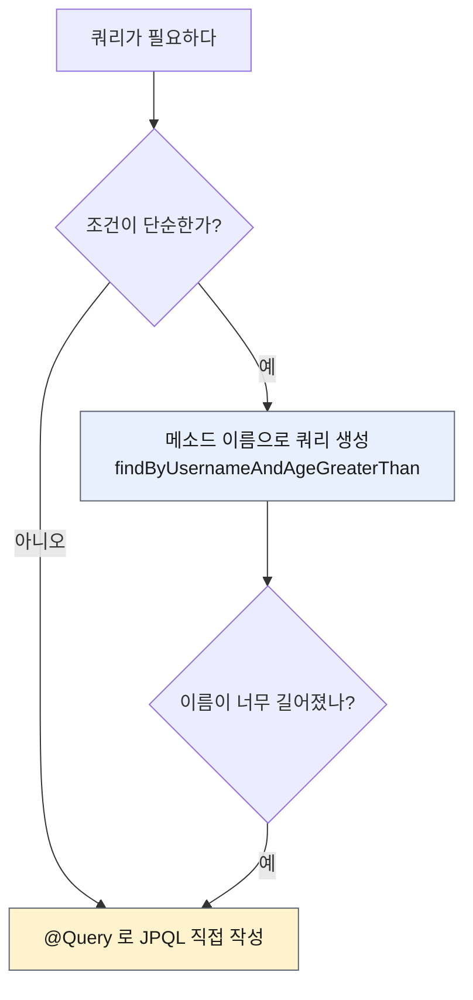
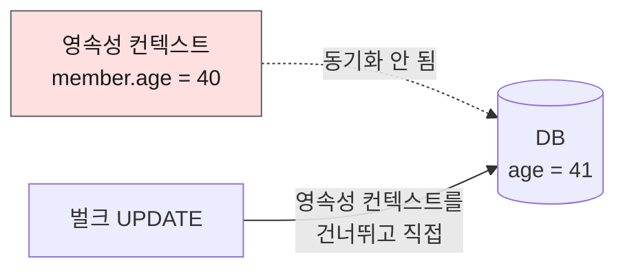

# 4. 쿼리 메소드 기능 — 메서드 이름·`@Query`·페이징·벌크·페치 조인

> `4. 쿼리 메소드 기능.pdf` 강의자료와 내가 작성한 `MemberJpaRepository`, `MemberRepository`,
> 그리고 두 테스트 코드를 기준으로 정리한다.
> Spring Boot 4.1.0, spring-data-jpa 4.1.0, Hibernate 7.4.1 기준.
>
> ✅ **각 기능을 순수 JPA로 먼저 만들고 스프링 데이터 JPA로 대체하는 순서로 전부 구현했다.**
> 테스트 29개 통과. 아래 SQL은 p6spy가 찍은 **실제 실행 로그**다.

---

## 0. 이 챕터의 한 줄 요약

> **3장에서 남긴 질문 — "공통으로 만들 수 없는 기능은?" 에 대한 답.**
> 쿼리를 만드는 방법 3가지와, 페이징·벌크 연산·페치 조인 같은 실무 필수 기능을 배운다.

3장 끝에서 내가 직접 써 둔 주석이 그대로 출발점이다.

```java
// 공통으로 만드는 것이 불가능한 예 - 이 하나를 위해 내가 지원하는 모든 기능을 구현하는것이 맞는가?
List<Member> findByUsername(String username);
```

### 쿼리 메소드 기능 3가지

| # | 방법 | 실무 사용도 |
|---|------|-----------|
| 1 | **메소드 이름으로 쿼리 생성** | 조건 1~2개일 때 |
| 2 | 메소드 이름으로 **JPA NamedQuery** 호출 | ⚠️ 거의 안 씀 |
| 3 | **`@Query`** 로 리포지토리 메소드에 쿼리 직접 정의 | **가장 많이 씀** |



---

## 1. 메소드 이름으로 쿼리 생성

**"이름이 AAA이고 나이가 15살보다 많은 회원"** 을 찾는다고 하자.

### 순수 JPA — 내 코드

```java
public List<Member> findByUsernameAndAgeGreaterThan(String username, int age) {
    return em.createQuery(
            "select m from Member m where m.username = :username and m.age > :age",
            Member.class)
            .setParameter("username", username)
            .setParameter("age", age)
            .getResultList();
}
```

### 스프링 데이터 JPA — 내 코드

```java
List<Member> findByUsernameAndAgeGreaterThan(String username, int age);
```

**끝이다.** 스프링 데이터 JPA가 메소드 이름을 분석해서 JPQL을 생성하고 실행한다.
위 순수 JPA 코드 8줄이 **선언 한 줄**로 사라진다. 양쪽이 만드는 SQL은 완전히 같다.

```sql
select m1_0.member_id,m1_0.age,m1_0.team_id,m1_0.username
from member m1_0 where m1_0.username='AAA' and m1_0.age>15;
```

### 이름 규칙

| 용도 | 접두사 | 반환 타입 |
|------|--------|----------|
| 조회 | `find…By`, `read…By`, `query…By`, `get…By` | 엔티티 / 컬렉션 |
| 카운트 | `count…By` | `long` |
| 존재 | `exists…By` | `boolean` |
| 삭제 | `delete…By`, `remove…By` | `long` |
| 중복 제거 | `findDistinct`, `findMemberDistinctBy` | |
| 개수 제한 | `findFirst3`, `findFirst`, `findTop`, `findTop3` | |

💡 `…` 자리에는 **설명을 아무거나 넣어도 된다.** `findHelloBy` 처럼 써도 동작한다.
`By` 뒤에 조건이 없으면 전체 조회다.

⚠️ **엔티티 필드명이 바뀌면 메서드 이름도 반드시 같이 바꿔야 한다.**
안 그러면 **애플리케이션 시작 시점에** 오류가 난다.

> 3장에서 `findByUsername` 을 `TeamRepository` 에 잘못 뒀을 때 실제로 겪은 그 오류다.
> ```
> PropertyReferenceException: No property 'username' found for type 'Team'
> ```
> 런타임까지 숨어 있지 않고 **로딩 시점에 바로 잡히는 것이 스프링 데이터 JPA의 큰 장점**이다.

📎 [공식 문서 — Query Creation](https://docs.spring.io/spring-data/jpa/reference/jpa/query-methods.html)

---

## 2. JPA NamedQuery

엔티티에 쿼리를 미리 등록해 두고 이름으로 부르는 방식이다.

```java
@Entity
@NamedQuery(
    name = "Member.findByUsername",
    query = "select m from Member m where m.username = :username")
public class Member { ... }
```

```java
// 순수 JPA
em.createNamedQuery("Member.findByUsername", Member.class)
  .setParameter("username", username)
  .getResultList();
```

```java
// 스프링 데이터 JPA — @Query 조차 생략 가능
List<Member> findByUsername(@Param("username") String username);
```

💡 **`@Query(name = ...)` 를 생략해도 동작하는 이유** — 스프링 데이터 JPA는
**"도메인 클래스 + `.`(점) + 메서드 이름"** 으로 NamedQuery를 먼저 찾는다.
`MemberRepository extends JpaRepository<Member, Long>` 이므로 `Member.findByUsername` 을 찾고,
**없으면 그때 메서드 이름으로 쿼리를 생성**한다.

⚠️ **실무에서는 거의 쓰지 않는다.** 쿼리가 엔티티에 붙어 있어서 관리가 불편하다.
대신 `@Query` 로 리포지토리 메서드에 직접 정의한다. **NamedQuery의 진짜 장점(애플리케이션
로딩 시점 문법 검증)은 `@Query` 도 똑같이 가진다.**

---

## 3. `@Query` — 리포지토리 메소드에 쿼리 직접 정의

```java
@Query("select m from Member m where m.username = :username and m.age = :age")
List<Member> findUser(@Param("username") String username, @Param("age") int age);
```

- `org.springframework.data.jpa.repository.Query` 를 사용한다.
- 메서드에 정적 쿼리를 직접 쓰므로 **"이름 없는 NamedQuery"** 라고 볼 수 있다.
- 따라서 **애플리케이션 실행 시점에 JPQL 문법 오류를 잡아준다.** (매우 큰 장점)

💡 **실무에서 가장 많이 쓰는 방법이다.** 메소드 이름으로 쿼리를 만들면
파라미터가 늘어날수록 이름이 감당 안 되게 길어진다.

```java
// 조건 3개만 붙어도 이 지경이 된다
List<Member> findByUsernameAndAgeGreaterThanAndTeamNameOrderByAgeDesc(...);
```

### 값 / DTO 조회

```java
// 값 하나 (@Embedded 값 타입도 가능)
@Query("select m.username from Member m")
List<String> findUsernameList();

// DTO 직접 조회 — new 명령어 필요
@Query("select new study.datajpa.dto.MemberDto(m.id, m.username, t.name) " +
       "from Member m join m.team t")
List<MemberDto> findMemberDto();
```

⚠️ **DTO 조회에는 JPA의 `new` 명령어와 패키지 전체 경로가 필요하다.** 생성자가 맞는 DTO도 있어야 한다.
(JPA 기본편의 JPQL DTO 조회와 사용 방식이 동일하다)

```java
package study.datajpa.dto;

@Data
public class MemberDto {
    private Long id;
    private String username;
    private String teamName;

    public MemberDto(Long id, String username, String teamName) { ... }
}
```

```sql
-- findMemberDto() 실행 결과: 엔티티가 아니라 필요한 컬럼만 조회한다
select m1_0.member_id,m1_0.username,t1_0.name
from member m1_0 join team t1_0 on t1_0.team_id=m1_0.team_id;
```

⚠️ 강의 PDF는 `MemberDto` 를 `study.datajpa.repository` 패키지에 두지만,
`@Query` 문자열 안의 경로는 `study.datajpa.dto.MemberDto` 로 쓰고 있다. **DTO는 `dto` 패키지에 만든다.**

⚠️ **패키지 경로는 문자열이라 오타를 컴파일러가 못 잡는다.** 처음에 순수 JPA 쪽에
`study.datajpa.repository.MemberDto` 라고 썼다가(존재하지 않는 경로) 실행 시점에야 터졌다.
`@Query` 는 JPQL 문법은 로딩 시점에 검증하지만, **`new` 뒤의 클래스 경로까지 봐주지는 않는다.**

---

## 4. 파라미터 바인딩

| 방식 | 예 |
|------|-----|
| 위치 기반 | `select m from Member m where m.username = ?0` |
| **이름 기반** ✅ | `select m from Member m where m.username = :name` |

```java
@Query("select m from Member m where m.username = :name")
Member findMembers(@Param("name") String username);
```

⚠️ **반드시 이름 기반을 쓴다.** 위치 기반은 파라미터 순서만 바뀌어도 조용히 잘못 동작한다.

### 컬렉션 파라미터 바인딩 (in 절)

```java
@Query("select m from Member m where m.username in :names")
List<Member> findByNames(@Param("names") List<String> names);
```

`Collection` 타입을 넘기면 `in` 절이 만들어진다.

---

## 5. 반환 타입

```java
List<Member> findByUsername(String name);       // 컬렉션
Member findByUsername(String name);             // 단건
Optional<Member> findByUsername(String name);   // 단건 Optional
```

### 결과가 없거나 많으면?

| 반환 타입 | 결과 없음 | 결과 2건 이상 |
|-----------|----------|--------------|
| 컬렉션 | **빈 컬렉션** (`null` 아님) | 정상 |
| 단건 | **`null`** | `NonUniqueResultException` |
| `Optional` | `Optional.empty()` | `NonUniqueResultException` |

⚠️ **컬렉션은 절대 `null` 이 아니다.** `if (result != null)` 같은 체크는 불필요하다.

💡 **단건 조회에서 결과가 없을 때 `null` 이 나오는 이유** — 내부적으로 `Query.getSingleResult()` 를
호출하는데, 이건 결과가 없으면 `NoResultException` 을 던진다. 다루기 불편해서
**스프링 데이터 JPA가 이 예외를 잡아 `null` 로 바꿔 준다.**

⚠️ **강의와의 차이** — 예외 패키지가 바뀌었다.

| 강의 (부트 2.x) | 내 환경 (부트 3.x 이상) |
|----------------|----------------------|
| `javax.persistence.NonUniqueResultException` | **`jakarta.persistence.NonUniqueResultException`** |

---

## 6. 순수 JPA 페이징과 정렬

> 검색 조건: 나이 10살 / 정렬: 이름 내림차순 / 페이징: 첫 페이지, 3건

```java
public List<Member> findByPage(int age, int offset, int limit) {
    return em.createQuery(
            "select m from Member m where m.age = :age order by m.username desc",
            Member.class)
            .setParameter("age", age)
            .setFirstResult(offset)   // 시작 위치
            .setMaxResults(limit)     // 개수
            .getResultList();
}

public long totalCount(int age) {
    return em.createQuery("select count(m) from Member m where m.age = :age", Long.class)
            .setParameter("age", age)
            .getSingleResult();
}
```

⚠️ **직접 하면 귀찮은 점** — 데이터 조회 쿼리와 **count 쿼리를 따로 만들어야** 하고,
`totalPage`, `isFirst`, `hasNext` 같은 **페이지 계산 공식을 매번 손으로 짜야 한다.**
다음 절이 이걸 전부 없앤다.

---

## 7. 스프링 데이터 JPA 페이징과 정렬

### 파라미터와 반환 타입

| 구분 | 타입 | 설명 |
|------|------|------|
| 파라미터 | `Sort` | 정렬 |
| 파라미터 | **`Pageable`** | 페이징 (내부에 `Sort` 포함) |
| 반환 | **`Page<T>`** | **count 쿼리 포함** — 전체 개수/전체 페이지 수를 안다 |
| 반환 | `Slice<T>` | count 쿼리 **없음.** 내부적으로 `limit + 1` 조회해서 다음 페이지 존재만 판단 |
| 반환 | `List<T>` | count 쿼리 없음. 결과만 |

```java
Page<Member>  findByUsername(String name, Pageable pageable);  // count 쿼리 O
Slice<Member> findByUsername(String name, Pageable pageable);  // count 쿼리 X
List<Member>  findByUsername(String name, Pageable pageable);  // count 쿼리 X
List<Member>  findByUsername(String name, Sort sort);
```

### 사용 예 — 내 코드

```java
Page<Member>  findByAge(int age, Pageable pageable);       // count 쿼리 O
Slice<Member> findSliceByAge(int age, Pageable pageable);  // count 쿼리 X
List<Member>  findListByAge(int age, Pageable pageable);   // count 쿼리 X
```

💡 **`Slice` 가 `limit + 1` 을 조회한다는 걸 SQL로 확인할 수 있다.** 같은 `PageRequest.of(0, 3, ...)` 인데
`Page` 는 3건, `Slice` 는 **4건**을 조회한다. 그 1건으로 "다음 페이지가 있다"를 판단하는 것이다.

```sql
-- Page: 3건
select ... from member m1_0 where m1_0.age=10 order by m1_0.username desc fetch first 3 rows only;
-- Slice: 4건 (limit + 1)
select ... from member m1_0 where m1_0.age=10 order by m1_0.username desc fetch first 4 rows only;
```

```java
PageRequest pageRequest = PageRequest.of(0, 3, Sort.by(Sort.Direction.DESC, "username"));
Page<Member> page = memberRepository.findByAge(10, pageRequest);

List<Member> content = page.getContent();      // 조회된 데이터
page.getTotalElements();  // 전체 데이터 수  → 5
page.getNumber();         // 현재 페이지 번호 → 0
page.getTotalPages();     // 전체 페이지 수   → 2
page.isFirst();           // 첫 페이지인가?   → true
page.hasNext();           // 다음 페이지 있나? → true
```

⚠️ **페이지는 0부터 시작한다.** 1이 아니다.

⚠️ `Pageable` 은 **인터페이스**다. 실제로는 구현체인 `PageRequest` 를 쓴다.
`PageRequest.of(현재 페이지, 조회할 개수, 정렬)`.

### count 쿼리 분리 — 실무에서 매우 중요

```java
@Query(value = "select m from Member m left join m.team t",
       countQuery = "select count(m) from Member m")
Page<Member> findMemberAllCountBy(Pageable pageable);
```

💡 **전체 count 쿼리는 매우 무겁다.** 데이터 조회는 조인이 필요해도,
**개수만 세는 count 쿼리에는 조인이 필요 없는 경우가 많다.** 그럴 때 분리해서 성능을 확보한다.

### 페이지를 유지하면서 DTO로 변환

```java
Page<MemberDto> dtoPage = page.map(m -> new MemberDto(m.getId(), m.getUsername(), null));
```

💡 **엔티티를 그대로 API로 반환하면 안 된다.** `Page.map()` 을 쓰면
페이지 정보(전체 개수, 페이지 번호 등)를 유지한 채 내용물만 DTO로 바꿀 수 있다.
(활용 2편 1장의 "엔티티를 API 스펙에서 분리" 원칙과 같은 이야기)

### ⚠️ 하이버네이트 6 이상의 left join 최적화

부트 3 이상(하이버네이트 6+)에서는 **의미 없는 `left join` 을 알아서 제거**한다.

```java
@Query(value = "select m from Member m left join m.team t")
Page<Member> findByAge(int age, Pageable pageable);
```

```sql
-- 실행 결과: LEFT JOIN 이 사라진다
select m1_0.member_id, m1_0.age, m1_0.team_id, m1_0.username
from member m1_0
```

**버그가 아니다.** `select` 절에도 `where` 절에도 `t` 를 안 쓰므로 이 JPQL은 사실상
`select m from Member m` 과 같다. `left join` 이라 왼쪽 `member` 는 어차피 전부 조회된다.
그래서 조인을 지워도 결과가 동일하다.

⚠️ **`Team` 을 한 번에 같이 조회하고 싶다면 페치 조인을 써야 한다.**

```java
select m from Member m left join fetch m.team t   -- 이 경우 join 문이 정상 수행된다
```

💡 **`Limit` / `Window` (스프링 데이터 3.x+ 추가)** — 강의에는 없지만 내 버전(4.1.0)에는
`org.springframework.data.domain.Limit`, `ScrollPosition`, `Window` 가 있다.
`findFirst3By` 처럼 이름에 개수를 박지 않고 파라미터로 넘길 수 있다.

---

## 8. 벌크성 수정 쿼리

"20살 이상 회원의 나이를 전부 +1" 처럼 **여러 건을 한 번에 수정**하는 쿼리다.
변경 감지는 엔티티 하나하나에 UPDATE를 날리므로 이럴 때 쓸 수 없다.

### 순수 JPA

```java
public int bulkAgePlus(int age) {
    return em.createQuery(
            "update Member m set m.age = m.age + 1 where m.age >= :age")
            .setParameter("age", age)
            .executeUpdate();   // 영향받은 행 수 반환
}
```

### 스프링 데이터 JPA

```java
@Modifying(clearAutomatically = true)
@Query("update Member m set m.age = m.age + 1 where m.age >= :age")
int bulkAgePlus(@Param("age") int age);
```

⚠️ **`@Modifying` 을 빠뜨리면 예외가 난다.**

```
org.hibernate.hql.internal.QueryExecutionRequestException: Not supported for DML operations
```

### 💥 벌크 연산의 함정 — 영속성 컨텍스트를 무시한다



벌크 연산은 **영속성 컨텍스트를 거치지 않고 DB에 직접 SQL을 날린다.**
그래서 벌크 실행 후 1차 캐시에는 **옛날 값이 그대로 남아 있다.**
이 상태로 `findById` 하면 DB가 아니라 1차 캐시의 과거 값을 돌려받는다.

```sql
update member m1_0 set age=(m1_0.age+1) where m1_0.age>=20;
```

**권장 방안**
1. 영속성 컨텍스트에 엔티티가 **없는 상태에서** 벌크 연산을 먼저 실행한다.
2. 부득이하게 있다면 벌크 연산 **직후 영속성 컨텍스트를 초기화**한다.
   → `@Modifying(clearAutomatically = true)` (기본값은 `false`)

💡 **내 테스트는 이 옵션이 실제로 동작하는지까지 검증한다.**

```java
Member member5 = memberRepository.save(new Member("member5", 40));
int resultCount = memberRepository.bulkAgePlus(20);
assertThat(resultCount).isEqualTo(3);

// clearAutomatically = true 라 영속성 컨텍스트가 비워졌고, DB 에서 다시 읽어온다.
// 이 옵션이 없으면 1차 캐시의 과거 값(40)이 그대로 나온다.
Member found = memberRepository.findById(member5.getId()).get();
assertThat(found.getAge()).isEqualTo(41);
```

---

## 9. `@EntityGraph` — 페치 조인의 간편 버전

`Member → Team` 은 지연 로딩이라, 회원을 조회한 뒤 팀을 꺼낼 때마다 쿼리가 나간다. **N+1 문제**다.

```java
List<Member> members = memberRepository.findAll();   // 쿼리 1번
for (Member member : members) {
    member.getTeam().getName();                      // 회원 수만큼 쿼리 N번
}
```

> 2장 「실행 결과」에서 이미 이 현상을 로그로 확인했고, 활용 2편 3~4장에서 다룬 그 문제다.

### 해결 ① JPQL 페치 조인

```java
@Query("select m from Member m left join fetch m.team")
List<Member> findMemberFetchJoin();
```

### 해결 ② `@EntityGraph` — JPQL 없이

```java
// 공통 메서드 오버라이드
@Override
@EntityGraph(attributePaths = {"team"})
List<Member> findAll();

// JPQL + 엔티티 그래프
@EntityGraph(attributePaths = {"team"})
@Query("select m from Member m")
List<Member> findMemberEntityGraph();

// 메서드 이름으로 쿼리 + 엔티티 그래프 (이게 제일 편하다)
@EntityGraph(attributePaths = {"team"})
List<Member> findByUsername(String username);
```

```sql
-- findAll() / findMemberEntityGraph() : team 을 LEFT OUTER JOIN 으로 함께 조회 (쿼리 1번)
select m1_0.member_id,m1_0.age,t1_0.team_id,t1_0.name,m1_0.username
from member m1_0 left join team t1_0 on t1_0.team_id=m1_0.team_id;

-- findEntityGraphByUsername("member1") : 메서드 이름 조건 + 엔티티 그래프
select m1_0.member_id,m1_0.age,t1_0.team_id,t1_0.name,m1_0.username
from member m1_0 left join team t1_0 on t1_0.team_id=m1_0.team_id where m1_0.username='member1';
```

💡 **`@EntityGraph` 는 사실상 페치 조인의 간편 버전**이고, **`LEFT OUTER JOIN` 을 사용**한다.
간단한 경우엔 `@EntityGraph`, 복잡해지면 JPQL 페치 조인을 쓴다.

내 테스트는 프록시가 아니라 **실제로 로딩됐는지**를 단언한다.

```java
List<Member> members = memberRepository.findAll();
for (Member member : members) {
    assertThat(Hibernate.isInitialized(member.getTeam())).isTrue(); // 프록시가 아니라 이미 로딩됨
}
```

`@NamedEntityGraph` 로 엔티티에 이름 붙여 등록해 둘 수도 있다.

```java
@NamedEntityGraph(name = "Member.all", attributeNodes = @NamedAttributeNode("team"))
@Entity
public class Member {}
```

💡 **지연 로딩 초기화 여부 확인법**

```java
Hibernate.isInitialized(member.getTeam());                    // 하이버네이트 기능
em.getEntityManagerFactory().getPersistenceUnitUtil()
  .isLoaded(member.getTeam());                                // JPA 표준
```

---

## 10. JPA Hint & Lock

### 쿼리 힌트 — 읽기 전용 최적화

```java
@QueryHints(value = @QueryHint(name = "org.hibernate.readOnly", value = "true"))
Member findReadOnlyByUsername(String username);
```

```java
Member member = memberRepository.findReadOnlyByUsername("member1");
member.setUsername("member2");
em.flush();   // UPDATE 쿼리가 실행되지 않는다
```

💡 **원리** — JPA는 변경 감지를 위해 엔티티의 **원본 스냅샷을 따로 들고 있다.** 즉 메모리를 2배 쓴다.
읽기 전용이 확실하면 스냅샷을 만들지 않게 해서 최적화하는 것이다.

⚠️ SQL 힌트가 아니라 **JPA 구현체(하이버네이트)에게 주는 힌트**다.

```java
@QueryHints(value = {@QueryHint(name = "org.hibernate.readOnly", value = "true")},
            forCounting = true)
Page<Member> findByUsername(String name, Pageable pageable);
```

`forCounting` — `Page` 반환 시 추가로 나가는 **count 쿼리에도 힌트를 적용**할지 (기본값 `true`).

### Lock

```java
@Lock(LockModeType.PESSIMISTIC_WRITE)
List<Member> findByUsername(String name);
```

`org.springframework.data.jpa.repository.Lock` 을 사용한다.
SQL 끝에 **`for update`** 가 붙는 것을 로그로 확인할 수 있다.

```sql
select m1_0.member_id,m1_0.age,m1_0.team_id,m1_0.username
from member m1_0 where m1_0.username='member1' for update;
```

(락 자체는 『자바 ORM 표준 JPA 프로그래밍』 16.1 트랜잭션과 락 참고)

---

## ✅ 핵심 요약

| 항목 | 결론 |
|------|------|
| 쿼리 생성 3가지 | 메서드 이름 / NamedQuery / **`@Query`** — 실무는 `@Query` 가 주력 |
| 메서드 이름 | 조건 1~2개까지만. 길어지면 `@Query` 로 간다 |
| NamedQuery | ⚠️ 실무에서 거의 안 씀. `@Query` 가 같은 장점(로딩 시점 문법 검증)을 가진다 |
| 오류 시점 | 필드명 불일치·JPQL 문법 오류를 **애플리케이션 시작 시점에** 잡아준다 |
| 파라미터 바인딩 | **이름 기반(`:name` + `@Param`)** 만 쓴다 |
| 반환 타입 | 컬렉션은 없으면 **빈 컬렉션**, 단건은 **`null`**, 2건 이상이면 `NonUniqueResultException` |
| 페이징 | `Pageable`(`PageRequest.of`) + `Page`/`Slice`/`List`. **페이지는 0부터** |
| count 분리 | `@Query(countQuery = ...)` — 무거운 count에서 불필요한 조인 제거. **실무 매우 중요** |
| 벌크 연산 | `@Modifying` 필수. **영속성 컨텍스트를 무시**하므로 `clearAutomatically = true` |
| N+1 | `@EntityGraph(attributePaths = {"team"})` = 페치 조인 간편 버전 (LEFT OUTER JOIN) |
| 쿼리 힌트 | `org.hibernate.readOnly` — 스냅샷을 안 만들어 메모리 절약 |

### 이 챕터에서 만든 것

| 기능 | 순수 JPA (`MemberJpaRepository`) | 스프링 데이터 JPA (`MemberRepository`) |
|------|--------------------------------|--------------------------------------|
| 메소드 이름 쿼리 | `findByUsernameAndAgeGreaterThan` | 선언 한 줄 |
| NamedQuery | `findByUsername` | `@NamedQuery` + 메서드 이름만 |
| `@Query` | JPQL 직접 | `findUser` |
| 값 / DTO | `findUsernameList`, `findMemberDto` | 동일 + `MemberDto` |
| 파라미터 바인딩 | `findMembers`, `findByNames` | `@Param`, 컬렉션 in절 |
| 페이징 | `findByPage` + `totalCount` | `findByAge`(Page) / `findSliceByAge` / `findListByAge` / count 분리 |
| 벌크 수정 | `bulkAgePlus` | `@Modifying(clearAutomatically = true)` |
| N+1 | — | `findMemberFetchJoin`, `@EntityGraph` 3종 |
| Hint / Lock | — | `findReadOnlyByUsername`, `findLockByUsername` |

**테스트 29개 통과** — `MemberJpaRepositoryTest` 11개, `MemberRepositoryTest` 16개, 기타 2개.

⏭️ 생략한 것: `@NamedEntityGraph`, 쿼리 힌트의 `forCounting` 옵션 (강의에서도 참고 항목)
