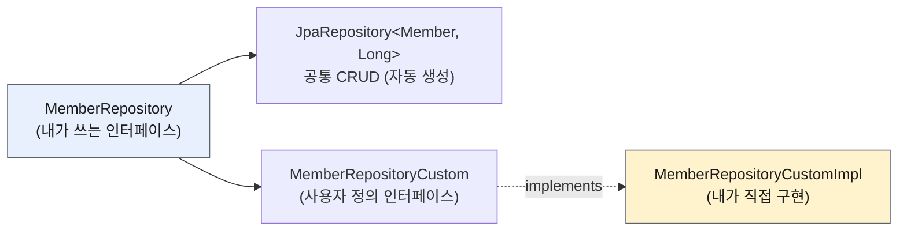

# 5. 확장 기능 — 사용자 정의 리포지토리 · Auditing · Web 확장

> `5. 확장 기능.pdf` 강의자료와 내가 작성한 `MemberRepositoryCustom`, `BaseEntity`, `MemberController`
> 코드를 기준으로 정리한다.
> Spring Boot 4.1.0, spring-data-jpa 4.1.0, Hibernate 7.4.1 기준.
>
> ✅ 4개 절을 전부 구현했다. 테스트 32개 통과.

---

## 0. 이 챕터의 한 줄 요약

> **인터페이스 하나로 안 되는 것들을 메꾸는 4가지 장치.**
> 스프링 데이터 JPA를 **쓰면서도** 직접 짠 코드를 끼워 넣고, 반복되는 일(등록일·수정일, 페이징 파라미터)을 없앤다.

| 절 | 무엇을 해결하나 |
|---|---|
| 1. 사용자 정의 리포지토리 | 인터페이스 선언만으로 안 되는 쿼리를 **직접 구현해서 끼워 넣기** |
| 2. Auditing | 등록일·수정일·등록자·수정자를 **엔티티마다 반복하지 않기** |
| 3. Web 확장 — 도메인 클래스 컨버터 | 컨트롤러에서 **id → 엔티티 조회 코드 없애기** |
| 4. Web 확장 — 페이징과 정렬 | `PageRequest.of(...)` 를 **HTTP 파라미터로 대체하기** |

---

## 1. 사용자 정의 리포지토리 구현

### 왜 필요한가

스프링 데이터 JPA 리포지토리는 인터페이스만 정의하면 구현체를 자동 생성해 준다.
그런데 **그 인터페이스를 내가 직접 구현하려 들면 구현할 메서드가 너무 많다.**
(`save`, `findAll`, `count`, `delete` … 전부)

**일부 메서드만** 직접 구현하고 싶은 경우가 있다.

- `EntityManager` 를 직접 써야 할 때
- **Querydsl** 을 쓸 때 ← 실무에서 이게 제일 많다
- 스프링 `JdbcTemplate`, MyBatis, DB 커넥션 직접 사용

### 구조 — 인터페이스를 쪼개서 상속시킨다



```java
// ① 사용자 정의 인터페이스
public interface MemberRepositoryCustom {
    List<Member> findMemberCustom();
}
```

```java
// ② 구현 클래스 — 이름 규칙이 중요하다
@RequiredArgsConstructor
public class MemberRepositoryCustomImpl implements MemberRepositoryCustom {

    private final EntityManager em;

    @Override
    public List<Member> findMemberCustom() {
        return em.createQuery("select m from Member m", Member.class)
                .getResultList();
    }
}
```

```java
// ③ 상속시키면 끝
public interface MemberRepository extends JpaRepository<Member, Long>, MemberRepositoryCustom {
}
```

```java
// ④ 호출은 그냥 한 덩어리로
List<Member> result = memberRepository.findMemberCustom();
```

### ⚠️ 구현 클래스 이름 규칙

| 방식 | 클래스 이름 | 비고 |
|------|------------|------|
| 예전 (강의 영상) | `MemberRepositoryImpl` | **리포지토리 인터페이스 이름** + `Impl` |
| **최신 (권장)** | **`MemberRepositoryCustomImpl`** | **사용자 정의 인터페이스 이름** + `Impl` |

스프링 데이터 2.x부터 둘 다 지원한다. 내 코드는 **강의를 따라 `MemberRepositoryImpl`** 로 만들었다.
다만 최신 방식이 이름이 짝을 이뤄 더 직관적이고, 사용자 정의 인터페이스를
**여러 개로 쪼개서** 각각 구현하는 것도 가능해서 그쪽을 권장한다.

접미사를 바꾸고 싶으면:

```java
@EnableJpaRepositories(basePackages = "study.datajpa.repository",
                       repositoryImplementationPostfix = "Impl")
```

💡 **항상 사용자 정의 리포지토리가 필요한 건 아니다.** 화면 전용 복잡한 조회라면
그냥 클래스로 만들고 `@Repository` 로 빈 등록해서 써도 된다. 나도 하나 만들어 뒀다.

```java
@Repository
@RequiredArgsConstructor
public class MemberQueryRepository {

    private final EntityManager em;

    List<Member> findAllMembers() {
        return em.createQuery("select m from Member m", Member.class)
                .getResultList();
    }
}
```

**스프링 데이터 JPA와 아무 관계 없이 독립적으로 동작한다.** 이름 규칙도, 상속도 필요 없다.

> 활용 2편 3장에서 화면 전용 조회를 `repository.order.simplequery` 패키지로 분리했던 것과 같은 판단이다.
> **핵심 비즈니스용 리포지토리와 화면 전용 조회용 리포지토리는 생명주기가 다르다.**

---

## 2. Auditing

> 엔티티를 생성·변경할 때 **누가, 언제** 했는지 추적하고 싶다. (등록일 / 수정일 / 등록자 / 수정자)

거의 모든 테이블에 들어가는 컬럼인데 엔티티마다 쓰는 건 낭비다. **공통 클래스로 뽑아 상속**시킨다.

### 방법 ① 순수 JPA — 이벤트 어노테이션

```java
@MappedSuperclass   // 상속받는 엔티티에 컬럼을 물려준다 (테이블은 안 만든다)
@Getter
public class JpaBaseEntity {

    @Column(updatable = false)     // 등록일은 수정되면 안 된다
    private LocalDateTime createdDate;
    private LocalDateTime updatedDate;

    @PrePersist
    public void prePersist() {
        LocalDateTime now = LocalDateTime.now();
        createdDate = now;
        updatedDate = now;         // 저장 시점에 수정일도 같이 채운다
    }

    @PreUpdate
    public void preUpdate() {
        updatedDate = LocalDateTime.now();
    }
}
```

```java
public class Member extends JpaBaseEntity { ... }
```

| 어노테이션 | 시점 |
|-----------|------|
| `@PrePersist` / `@PostPersist` | `persist()` 전 / 후 |
| `@PreUpdate` / `@PostUpdate` | UPDATE 전 / 후 |

💡 **저장할 때 수정일도 같은 값으로 채우는 이유** — 수정 컬럼만 봐도 "마지막에 손댄 사람"을 알 수 있다.
안 그러면 수정일이 `null` 일 때 등록일을 또 찾아봐야 한다.

### 방법 ② 스프링 데이터 JPA — `@CreatedDate`

**설정 2개**

```java
@EnableJpaAuditing              // ① 부트 설정 클래스에
@SpringBootApplication
public class DataJpaApplication { ... }
```

```java
@EntityListeners(AuditingEntityListener.class)   // ② 엔티티(또는 공통 클래스)에
@MappedSuperclass
@Getter
public class BaseEntity { ... }
```

**어노테이션 4개**

```java
@CreatedDate
@Column(updatable = false)
private LocalDateTime createdDate;

@LastModifiedDate
private LocalDateTime lastModifiedDate;

@CreatedBy
@Column(updatable = false)
private String createdBy;

@LastModifiedBy
private String lastModifiedBy;
```

**등록자·수정자는 `AuditorAware` 빈이 채워 준다**

```java
@Bean
public AuditorAware<String> auditorProvider() {
    return () -> Optional.of(UUID.randomUUID().toString());   // 학습용
}
```

⚠️ 실무에서는 **세션 정보나 스프링 시큐리티 로그인 정보**에서 ID를 꺼낸다.

**실행 결과**

```
findMember.createdDate      = 2026-08-19T21:41:59.001750
findMember.lastModifiedDate = 2026-08-19T21:41:59.110584
findMember.createdBy        = 1dcc2f71-7a50-4061-abce-d27463db17a6
findMember.lastModifiedBy   = 98e17f9a-b65e-49b7-aa50-2e3e89c6b808
```

💡 두 UUID가 다른 건 정상이다. `auditorProvider()` 가 **호출될 때마다 새 UUID** 를 만들기 때문이고,
실무에서는 로그인 ID를 꺼내므로 같은 값이 나온다.

### ⚠️ 여기서 두 번 막혔다

**① `@MappedSuperclass` 를 빼먹으면 컬럼 자체가 안 생긴다**

JPA 입장에서 그냥 평범한 부모 클래스가 되어 **매핑 정보를 읽는 대상에서 빠진다.**
`@Column` 도 무시되고 `@PrePersist` **콜백 등록조차 되지 않는다.** 오류 없이 조용히 아무 일도 안 일어난다.

| 어노테이션 | 용도 | 테이블 |
|---|---|---|
| `@Entity` | 엔티티 | 생김 |
| **`@MappedSuperclass`** | **매핑 정보만 물려주는 부모** | 안 생김 (자식 테이블에 컬럼으로 합쳐짐) |
| 없음 | JPA가 모르는 클래스 | — |

**② `@EnableJpaAuditing` 을 빼먹으면 값이 전부 `null` 이다**

`@EntityListeners` 만 붙여 놓으면 **Auditing 인프라(`AuditingHandler`)가 등록되지 않아**
리스너가 아무 일도 하지 않는다. `AuditorAware` 빈도 호출되지 않는다.

```
findMember.createdDate = null      ← 컬럼은 있는데 값만 계속 null
findMember.createdBy   = null
```

컬럼은 `@Column` 으로 매핑됐으니 SELECT에는 멀쩡히 나온다. **설정 2개는 반드시 짝으로 간다.**

### 💡 Base 타입을 둘로 쪼개라

대부분의 엔티티는 **시간은 필요하지만 등록자·수정자는 없을 수도** 있다.

```java
public class BaseTimeEntity {                        // 시간만
    @CreatedDate @Column(updatable = false)
    private LocalDateTime createdDate;
    @LastModifiedDate
    private LocalDateTime lastModifiedDate;
}

public class BaseEntity extends BaseTimeEntity {     // 시간 + 사람
    @CreatedBy @Column(updatable = false)
    private String createdBy;
    @LastModifiedBy
    private String lastModifiedBy;
}
```

필요한 쪽을 골라 상속한다.

💡 저장 시점에 수정일·수정자를 채우고 싶지 않다면 `@EnableJpaAuditing(modifyOnCreate = false)`.

### 전체 적용 — `orm.xml`

`@EntityListeners` 를 엔티티마다 붙이기 싫으면 `META-INF/orm.xml` 에 한 번만 등록하면 된다.

⚠️ **강의 자료의 XML은 그대로 쓰면 안 된다.** `javax` → `jakarta` 전환으로 **네임스페이스가 바뀌었다.**

| | 네임스페이스 | version |
|---|---|---|
| 강의 (JPA 2.2) | `http://xmlns.jcp.org/xml/ns/persistence/orm` | `2.2` |
| **내 환경 (Jakarta Persistence 3.2)** | **`https://jakarta.ee/xml/ns/persistence/orm`** | **`3.2`** |

```xml
<entity-mappings xmlns="https://jakarta.ee/xml/ns/persistence/orm"
                 xmlns:xsi="http://www.w3.org/2001/XMLSchema-instance"
                 version="3.2">
    <persistence-unit-metadata>
        <persistence-unit-defaults>
            <entity-listeners>
                <entity-listener class="org.springframework.data.jpa.domain.support.AuditingEntityListener"/>
            </entity-listeners>
        </persistence-unit-defaults>
    </persistence-unit-metadata>
</entity-mappings>
```

---

## 3. Web 확장 — 도메인 클래스 컨버터

HTTP 파라미터로 넘어온 **id로 엔티티를 찾아서 바인딩**해 준다.

```java
// 사용 전
@GetMapping("/members/{id}")
public String findMember(@PathVariable("id") Long id) {
    Member member = memberRepository.findById(id).get();
    return member.getUsername();
}

// 사용 후 — 파라미터 타입을 엔티티로 바꾸면 끝 (비교용으로 members2 로 열어 뒀다)
@GetMapping("/members2/{id}")
public String findMember2(@PathVariable("id") Member member) {
    return member.getUsername();
}
```

중간에서 `DomainClassConverter` 가 리포지토리를 사용해 엔티티를 찾아 준다.

> ⚠️ **조회용으로만 써야 한다.** 트랜잭션이 없는 범위에서 조회한 엔티티라
> **값을 바꿔도 DB에 반영되지 않는다.** 변경 감지가 동작하지 않는다.

💡 **편해 보이지만 실무에서 손이 잘 안 갈 기능이다.**
① 엔티티가 컨트롤러 파라미터로 올라오고 ② 조회 실패 시 처리를 손댈 수 없으며
③ 어디서 쿼리가 나가는지 코드에 안 보인다. 활용 2편의 "엔티티를 컨트롤러 밖으로"와 결이 다르다.

⚠️ **부트 3.2 이상은 `@PathVariable("id")` 처럼 이름을 명시해야 한다.**
컴파일 시 파라미터 이름 정보가 없으면 매핑에 실패한다.

---

## 4. Web 확장 — 페이징과 정렬

4장에서 손으로 만들던 `PageRequest.of(0, 3, Sort.by(...))` 를 **HTTP 파라미터가 대신**한다.

```java
@GetMapping("/members")
public Page<Member> list(Pageable pageable) {
    return memberRepository.findAll(pageable);
}
```

```
GET /members?page=0&size=3&sort=id,desc&sort=username,desc
```

| 파라미터 | 의미 |
|---------|------|
| `page` | 현재 페이지. **0부터 시작** |
| `size` | 한 페이지에 노출할 건수 |
| `sort` | `정렬속성,(ASC 또는 DESC)` — 여러 개 가능, `asc` 는 생략 가능 |

`Pageable` 은 인터페이스이고, 실제로는 `PageRequest` 객체가 만들어져 주입된다.

**실행되는 SQL** — 내가 `limit` 을 쓴 적이 없는데 알아서 붙는다.

```sql
select m1_0.member_id, m1_0.age, m1_0.created_by, m1_0.created_date,
       m1_0.last_modified_by, m1_0.last_modified_date, m1_0.team_id, m1_0.username
from member m1_0
offset ? rows fetch first ? rows only
```

⚠️ 여기의 `fetch` 는 **페치 조인이 아니라 SQL 표준 LIMIT 문법**이다.
`offset ? rows fetch first ? rows only` = `LIMIT ? OFFSET ?`.
ANSI SQL:2008 표기라 H2·Oracle 12c+·PostgreSQL이 이 형태를 쓰고, MySQL이면 `limit ?, ?` 로 나간다.

| SQL | 의미 |
|---|---|
| `fetch first ? rows only` | 몇 건 가져올지 → `size` |
| `offset ? rows` | 몇 건 건너뛸지 → `page * size` |
| `join fetch` | 연관 엔티티 함께 조회. **완전히 다른 개념** |

💡 반환 타입이 `Page` 라 바로 뒤에 `select count(m1_0.member_id) from member m1_0` 가 한 번 더 나간다.
count가 부담이면 `Slice` 나 `List` 로 바꾼다. (4장 7절)

### 기본값 — 내 `application.yml`

```yaml
spring:
  data:
    web:
      pageable:
        default-page-size: 10
        max-page-size: 200
        one-indexed-parameters: true # 1부터 index 시작
```

메서드별로 다르게 하려면:

```java
public String list(@PageableDefault(size = 12, sort = "username",
                                    direction = Sort.Direction.DESC) Pageable pageable) { ... }
```

💡 **`max-page-size` 는 꼭 설정해 둔다.** 없으면 `?size=1000000` 요청 하나로 DB가 통째로 끌려 나온다.

### 페이징 정보가 둘 이상이면 — 접두사

```java
public String list(@Qualifier("member") Pageable memberPageable,
                   @Qualifier("order")  Pageable orderPageable) { ... }
```

```
GET /members?member_page=0&order_page=1
```

### Page를 DTO로 변환 — `map()`

**엔티티를 그대로 반환하면 안 된다**(활용 2편 1장). `Page.map()` 이 페이지 정보를 유지한 채 내용만 바꿔 준다.

```java
@Data
public class MemberDto {
    private Long id;
    private String username;

    public MemberDto(Member m) {      // 엔티티를 받는 생성자
        this.id = m.getId();
        this.username = m.getUsername();
    }
}
```

내 코드는 4장에서 만든 `MemberDto(Long, String, String)` 생성자를 그대로 써서 람다로 변환했다.

```java
@GetMapping("/members2")
public Page<MemberDto> list2(@PageableDefault(size = 5) Pageable pageable) {
    Page<Member> page = memberRepository.findAll(pageable);
    return page.map(member -> new MemberDto(member.getId(), member.getUsername(), null));
}
```

💡 `MemberDto(Member m)` 생성자를 추가하면 `.map(MemberDto::new)` 로 더 짧아진다.

> 💡 **DTO가 엔티티를 아는 건 괜찮다.** 반대로 엔티티가 DTO를 알면 안 된다. 의존 방향은 DTO → 엔티티.

### Page를 1부터 시작하려면

| 방법 | 설명 |
|------|------|
| ① 직접 클래스를 만든다 | `Pageable`/`Page` 를 파라미터·응답으로 쓰지 않고, `PageRequest` 를 직접 만들어 넘긴다 |
| ② `spring.data.web.pageable.one-indexed-parameters: true` | ⚠️ **web의 `page` 파라미터를 -1 하는 것뿐** |

⚠️ ②는 반쪽짜리다. `?page=1` 로 요청해도 **응답 JSON의 `pageNumber`·`number` 는 여전히 `0`** 이라
클라이언트가 혼란스러워진다. 1부터 써야 한다면 ①이 정답이다.

---

## ✅ 핵심 요약

| 항목 | 결론 |
|------|------|
| 사용자 정의 리포지토리 | 인터페이스를 쪼개서 상속. 구현 클래스는 **`사용자정의인터페이스 + Impl`** (최신 권장 방식) |
| 언제 쓰나 | 주로 **Querydsl**·`JdbcTemplate` 을 함께 쓸 때. 화면 전용이면 그냥 별도 클래스로 만들어도 된다 |
| Auditing 순수 JPA | `@MappedSuperclass` + `@PrePersist` / `@PreUpdate` |
| Auditing 스프링 데이터 | `@EnableJpaAuditing` + `@EntityListeners(AuditingEntityListener.class)` + 어노테이션 4개 |
| Base 타입 | **시간용/사람용을 분리**해서 필요한 쪽만 상속 |
| 도메인 클래스 컨버터 | id → 엔티티 자동 바인딩. ⚠️ **조회 전용** (변경 감지 동작 안 함) |
| Web 페이징 | `Pageable` 파라미터 + `?page=0&size=3&sort=id,desc`. **페이지는 0부터** |
| Web 페이징 기본값 | 글로벌은 `spring.data.web.pageable.*`, 메서드별은 `@PageableDefault` |
| DTO 변환 | `page.map(MemberDto::new)` — 페이지 정보를 유지한 채 내용만 교체 |
| 1부터 시작 | `one-indexed-parameters` 는 **요청만** 보정한다. 제대로 하려면 직접 클래스를 만든다 |

### ⚠️ 강의와 달라지는 지점

| 항목 | 강의 | 내 환경 |
|------|------|--------|
| 구현 클래스 이름 | `MemberRepositoryImpl` | **`MemberRepositoryCustomImpl`** (최신 권장) |
| `orm.xml` 네임스페이스 | `xmlns.jcp.org/.../orm`, version `2.2` | **`jakarta.ee/xml/ns/persistence/orm`, version `3.2`** |
| `@PathVariable` | 이름 생략 가능 | **부트 3.2+ 는 `("id")` 명시 필요** |

### 이 챕터에서 만든 것

| 구분 | 파일 |
|------|------|
| 사용자 정의 리포지토리 | `MemberRepositoryCustom` + `MemberRepositoryImpl`, `MemberRepository` 가 상속 |
| 독립 조회용 리포지토리 | `MemberQueryRepository` (스프링 데이터 JPA와 무관한 일반 빈) |
| Auditing (순수 JPA) | `JpaBaseEntity` (`@PrePersist` / `@PreUpdate`) |
| Auditing (스프링 데이터) | `BaseEntity` + `@EnableJpaAuditing` + `AuditorAware` 빈 — **`Member` 가 상속** |
| Web 확장 | `MemberController` — 컨버터 전/후(`/members/{id}` vs `/members2/{id}`), `Pageable` 페이징 2종 |

**테스트 32개 통과.**

### ⚠️ 테스트가 12개 깨졌던 이유

`MemberController.init()` 의 `@PostConstruct` 가 회원 **100명**을 넣는데,
`@SpringBootTest` 가 애플리케이션을 띄우면서 **모든 테스트에 그 100건이 깔린다.**

```
expected: 2 but was: 102
```

컨트롤러를 테스트 컨텍스트에서 빼는 것으로 해결했다.

```java
@Profile("!test")     // MemberController
```

```groovy
tasks.named('test') {
    useJUnitPlatform()
    systemProperty 'spring.profiles.active', 'test'
}
```

⚠️ **`src/test/resources/application.yml` 로 프로파일을 주는 방법은 쓰면 안 된다.**
그 파일이 **메인 `application.yml` 을 통째로 가려서** datasource 설정이 사라지고,
부트가 H2 인메모리(`jdbc:h2:mem:...`)를 자동 구성해 버린다.
**테스트는 그대로 통과하기 때문에 바뀐 줄도 모른다.** 실제로 한 번 당했다.
