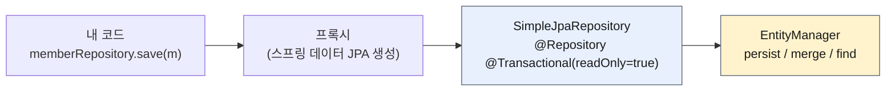

# 6. 스프링 데이터 JPA 분석 — 구현체 `SimpleJpaRepository` 와 `save()` 의 정체

> `6. 스프링 데이터 JPA 분석.pdf` 강의자료와, 내가 작성한 `Item` / `ItemRepository` / `ItemRepositoryTest`
> 코드를 기준으로 정리한다.
> Spring Boot 4.1.0, spring-data-jpa 4.1.0, Hibernate 7.4.1 기준.
> 인용한 스프링 코드는 **실제 4.1.0 소스**에서 그대로 가져왔다.
>
> ✅ 2개 절 모두 구현했다. 테스트 34개 통과(기존 32 + 이번 2개).

---

## 0. 이 챕터의 한 줄 요약

> **`interface MemberRepository extends JpaRepository` 뒤에서 진짜로 일하는 클래스가 무엇인지,
> 그리고 그 클래스의 `save()` 가 왜 가끔 `insert` 대신 `select + insert` 를 날리는지.**

| 절 | 핵심 |
|---|---|
| 1. 구현체 분석 | 공통 인터페이스의 구현체는 `SimpleJpaRepository` — `@Repository` + `@Transactional` 이 여기 걸려 있다 |
| 2. 새로운 엔티티 구별 | `save()` 는 `isNew()` 로 **persist / merge** 를 고른다. id 직접 할당이면 `Persistable` 을 구현해야 한다 |

---

## 1. 스프링 데이터 JPA 구현체 분석

### 인터페이스만 만들었는데 누가 구현했나

내가 만든 건 인터페이스뿐이다.

```java
public interface MemberRepository extends JpaRepository<Member, Long>, MemberRepositoryCustom {
```

스프링 데이터 JPA가 **프록시 객체**를 만들어 주입하고, 그 프록시가 호출을 넘기는 실제 구현체가

```
org.springframework.data.jpa.repository.support.SimpleJpaRepository
```



### 실제 소스 (spring-data-jpa 4.1.0)

```java
@Repository
@Transactional(readOnly = true)
public class SimpleJpaRepository<T, ID> implements JpaRepositoryImplementation<T, ID> {

    @Override
    @Transactional
    public <S extends T> S save(S entity) {

        Assert.notNull(entity, ENTITY_MUST_NOT_BE_NULL);

        if (entityInformation.isNew(entity)) {
            entityManager.persist(entity);
            return entity;
        } else {
            return entityManager.merge(entity);
        }
    }
}
```

> 💡 강의(부트 2.x, spring-data-jpa 2.x)의 `save()` 와 **코드가 사실상 그대로다.**
> 필드 이름이 `em` → `entityManager` 로 바뀌고 null 체크가 붙은 정도.

### `@Repository` — 예외 추상화

JPA·하이버네이트 예외를 스프링의 `DataAccessException` 계층으로 **변환**해 준다.
덕분에 서비스 계층이 JPA 예외에 직접 의존하지 않는다. (JDBC로 바꿔도 잡는 예외가 그대로다.)

### `@Transactional` — 트랜잭션은 이미 여기 걸려 있다

| 상황 | 동작 |
|---|---|
| 서비스에 `@Transactional` 이 **없음** | 리포지토리 메서드가 트랜잭션을 **시작**한다 |
| 서비스에 `@Transactional` 이 **있음** | 리포지토리는 그 트랜잭션에 **전파(참여)** 한다 |

- JPA의 모든 변경은 트랜잭션 안에서 동작해야 한다.
- 그런데 예제에서 `memberRepository.save(member)` 를 트랜잭션 없이 호출해도 저장이 됐다.
  → **트랜잭션이 없었던 게 아니라, 리포지토리 계층에 걸려 있었던 것이다.**
- 클래스에는 `readOnly = true`, 변경 메서드(`save`, `delete` …)에만 `@Transactional` 을 다시 붙여 덮어쓴다.

⚠️ 단, **리포지토리 트랜잭션에 의존하면 안 된다.** 트랜잭션 단위는 보통 서비스의 비즈니스 로직 단위다.
`save()` 두 번이 각각 별도 트랜잭션이 되면 원자성이 깨진다.

### `readOnly = true` 가 하는 일

읽기 전용 트랜잭션에서는 **플러시를 생략**한다.
더티 체킹(스냅샷 비교) 대상에서 빠지므로 약간의 성능 이득이 있다.
→ JPA 책 15.4.2 「읽기 전용 쿼리의 성능 최적화」 참고.

---

## 2. 새로운 엔티티를 구별하는 방법 (매우 중요)

### `save()` 는 저장 메서드가 아니라 **분기 메서드**다

| `isNew()` | 호출되는 것 | SQL |
|---|---|---|
| `true` | `em.persist(entity)` | 쓰기 지연 후 flush 시점에 `insert` |
| `false` | `em.merge(entity)` | **`select` 한 번 + `insert`(또는 `update`)** |

### 기본 판단 전략 — 실제 코드

`AbstractEntityInformation.isNew()` (spring-data-commons 4.1.0)

```java
public boolean isNew(T entity) {

    ID id = getId(entity);
    Class<ID> idType = getIdType();

    if (!idType.isPrimitive()) {
        return id == null;          // 식별자가 객체면 null 이면 새 엔티티
    }

    if (id instanceof Number n) {
        return n.longValue() == 0L; // 자바 기본 타입이면 0 이면 새 엔티티
    }

    throw new IllegalArgumentException(...);
}
```

| 식별자 전략 | `save()` 시점의 id | 판단 | 결과 |
|---|---|---|---|
| `@GeneratedValue` (`Member`) | `null` | 새 엔티티 | ✅ `persist` — 정상 |
| `@Id` 직접 할당 (`Item`) | `"ItemA"` | 새 엔티티 **아님** | ⚠️ `merge` — 비효율 |

### ⚠️ merge 가 왜 문제인가 — 직접 찍어본 로그

`Persistable` 을 구현하지 **않은** 상태의 `Item` 을 저장해 봤다.

```java
Item item = new Item("ItemA");
Item saved = itemRepository.save(item);
em.flush();
System.out.println("same instance? = " + (saved == item));
```

```sql
-- save() 호출 즉시 (merge 가 DB 에 먼저 물어본다)
select i1_0.id, i1_0.created_date from item i1_0 where i1_0.id='ItemA';
-- flush 시점
insert into item (created_date,id) values ('2026-08-22T17:06:59.557+0900','ItemA');
```

```
same instance? = false
```

두 가지가 확인된다.

1. **쓸데없는 `select` 가 한 번 더 나간다.** merge 는 "DB 에 있나?" 부터 확인한다.
2. **넘긴 객체가 영속 상태가 되지 않는다.** merge 는 **복사본**을 만들어 반환하므로
   내가 들고 있던 `item` 은 여전히 준영속이다. 이후 그 객체를 수정해도 더티 체킹이 안 된다.

> ⚠️ 여기에 더해 merge 는 **모든 필드를 넘긴 객체 값으로 덮어쓴다.**
> 값을 채우지 않은 필드가 있으면 DB 의 기존 값이 `null` 로 날아간다.
> (활용 1편 「변경 감지 vs 병합」과 같은 이야기)

### 해결 — `Persistable` 구현

```java
package org.springframework.data.domain;

public interface Persistable<ID> {
    ID getId();
    boolean isNew();
}
```

내가 작성한 `Item`:

```java
@Entity
@EntityListeners(AuditingEntityListener.class) // BaseEntity 를 상속하지 않으므로 직접 붙여야 @CreatedDate 가 동작한다
@Getter
@NoArgsConstructor(access = AccessLevel.PROTECTED)
public class Item implements Persistable<String> {

    @Id
    private String id;              // @GeneratedValue 없이 직접 할당

    @CreatedDate
    private LocalDateTime createdDate;

    public Item(String id) {
        this.id = id;
    }

    @Override
    public String getId() {
        return id;
    }

    @Override
    public boolean isNew() {
        return createdDate == null; // persist 전에는 Auditing 이 아직 값을 안 넣었으므로 null
    }
}
```

```java
public interface ItemRepository extends JpaRepository<Item, String> { // 식별자 타입이 String 이다
}
```

**왜 `createdDate` 로 판단하나?**
`@CreatedDate` 는 `@PrePersist` 시점, 즉 **persist 직전에** 채워진다.
따라서 "createdDate 가 비어 있다 = 아직 한 번도 저장된 적이 없다" 가 성립한다.
등록 시간이라는 이미 있는 정보를 재활용하는 것이라 별도 플래그 필드를 둘 필요가 없다.

### 스프링은 `Persistable` 을 어떻게 알아채나

`JpaEntityInformationSupport.getEntityInformation()` — 엔티티 타입을 보고 구현체를 갈아끼운다.

```java
if (Persistable.class.isAssignableFrom(domainClass)) {
    return new JpaPersistableEntityInformation(entityType, metamodel, persistenceUnitUtil);
} else {
    return new JpaMetamodelEntityInformation(entityType, metamodel, persistenceUnitUtil);
}
```

```java
public class JpaPersistableEntityInformation<T extends Persistable<ID>, ID>
        extends JpaMetamodelEntityInformation<T, ID> {

    @Override
    public boolean isNew(T entity) {
        return entity.isNew();   // 내가 짠 isNew() 가 그대로 호출된다
    }

    @Override
    public @Nullable ID getId(T entity) {
        return entity.getId();
    }
}
```

즉 `SimpleJpaRepository.save()` 안의 `entityInformation.isNew(entity)` 가
**내 `Item.isNew()` 로 연결된다.**

### 적용 후 로그 — `select` 가 사라졌다

```java
@Test
public void save() {
    Item item = new Item("ItemA");

    Item saved = itemRepository.save(item);

    // persist 는 넘긴 인스턴스를 그대로 영속화한다. merge 였다면 "복사본"이 돌아와서 다른 객체가 된다.
    assertThat(saved).isSameAs(item);
    assertThat(em.contains(item)).isTrue();
    assertThat(saved.getCreatedDate()).isNotNull();
}

@Test
public void isNew() {
    Item item = new Item("ItemB");
    assertThat(item.isNew()).isTrue();   // 저장 전 - createdDate == null

    itemRepository.save(item);
    em.flush();

    assertThat(item.isNew()).isFalse();  // 저장 후 - createdDate 채워짐 -> 다음 save 는 merge
}
```

```sql
-- save() 시점: SQL 이 아예 안 나간다 (persist 는 쓰기 지연)
-- flush 시점:
insert into item (created_date,id) values ('2026-08-22T17:07:22.183+0900','ItemB');
```

- `save()` 직후 `select` 가 **완전히 사라졌다.**
- `assertThat(saved).isSameAs(item)` 통과 → 넘긴 객체 그대로가 영속 상태다.

### ⚠️ 여기서 세 번 막혔다

| 증상 | 원인 | 해결 |
|---|---|---|
| `Item` 이 엔티티로 인식되지 않음 (테이블 생성 안 됨) | `Item` 에 **`@Entity` 를 안 붙임** | `@Entity` 추가 |
| 리포지토리 타입 불일치 | `JpaRepository<Item, Long>` 인데 식별자는 `String` | `JpaRepository<Item, String>` |
| `createdDate` 가 계속 `null` → `isNew()` 가 항상 `true` | `Item` 은 `BaseEntity` 를 **상속하지 않아서** Auditing 리스너가 없음 | 클래스에 `@EntityListeners(AuditingEntityListener.class)` 직접 부착 |

> 세 번째가 제일 헷갈린다. 5장에서 `@EnableJpaAuditing` 을 켜 뒀지만,
> 그것만으로는 부족하고 **엔티티마다 리스너가 연결돼 있어야** 한다.
> `Member` 는 `BaseEntity`(리스너 부착됨)를 상속해서 자동으로 됐던 것뿐이다.
> 전역으로 걸고 싶으면 5장의 `orm.xml` 방식을 쓰면 된다.

### 💡 `@Version` 이 있으면 판단 기준이 또 바뀐다 (강의 밖 내용)

`JpaMetamodelEntityInformation.isNew()` 실제 코드:

```java
public boolean isNew(T entity) {

    if (versionAttribute.isEmpty()
            || versionAttribute.map(Attribute::getJavaType).map(Class::isPrimitive).orElse(false)) {
        return super.isNew(entity);          // 식별자 null / 0 기준
    }

    BeanWrapper wrapper = new DirectFieldAccessFallbackBeanWrapper(entity);
    return versionAttribute.map(it -> wrapper.getPropertyValue(it.getName()) == null).orElse(true);
}
```

`@Version` 필드가 **객체 타입**(`Long` 등)이면 식별자가 아니라 **버전이 null 인지**로 판단한다.
즉 낙관적 락을 쓰는 엔티티는 id 를 직접 할당해도 `Persistable` 없이 정상 동작할 수 있다.

---

## ✅ 핵심 요약

| 주제 | 결론 |
|---|---|
| 구현체 | `SimpleJpaRepository` — 프록시가 여기로 위임한다 |
| `@Repository` | JPA 예외 → 스프링 데이터 접근 예외로 변환 |
| `@Transactional` | 리포지토리에 이미 걸려 있음. 서비스 트랜잭션이 있으면 참여, 없으면 자기가 시작 |
| `readOnly = true` | 조회 전용 트랜잭션은 플러시 생략 → 약간의 성능 이득 |
| `save()` | **새 엔티티면 `persist`, 아니면 `merge`** |
| 새 엔티티 판단 | 식별자가 객체면 `null`, 기본 타입이면 `0` (`@Version` 이 객체 타입이면 버전 기준) |
| `@GeneratedValue` | `save()` 시점에 id 가 없으므로 항상 정상 동작 |
| `@Id` 직접 할당 | id 가 이미 있어 **merge 로 빠진다 → `Persistable` 구현으로 해결** |
| merge 를 피해야 하는 이유 | 불필요한 `select` + 넘긴 객체가 영속되지 않음 + 필드를 통째로 덮어씀 |

### ⚠️ 강의와 달라지는 지점

| 항목 | 강의 (부트 2.x) | 내 환경 (부트 4.1.0) |
|---|---|---|
| 패키지 | `javax.persistence.*` | **`jakarta.persistence.*`** |
| `save()` 내부 | `em.persist(entity)` | `entityManager.persist(entity)` (로직 동일) |
| `isNew()` 기본 구현 | 식별자 null / 0 | 동일 + **`@Version` 분기**(`JpaMetamodelEntityInformation`) |
| 반환 타입 표기 | — | `@Nullable ID getId(T entity)` (JSpecify 널 어노테이션) |

### 이 챕터에서 만든 것

| 파일 | 내용 |
|---|---|
| `entity/Item.java` | `@Id` 직접 할당 + `Persistable<String>` 구현 + `@EntityListeners` |
| `repository/ItemRepository.java` | `JpaRepository<Item, String>` |
| `test/.../ItemRepositoryTest.java` | persist 경로 검증(`isSameAs`, `em.contains`) + `isNew()` 전환 검증 |

**테스트 34개 통과.**
