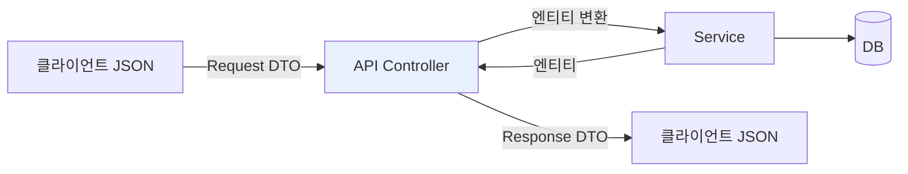

# 1. API 개발 기본 — 엔티티를 API 스펙에서 분리하기

> `1. API 개발 기본.pdf` 강의자료와 현재 `study/SpringBootJPA/jpashop`의 `MemberApiController`, `Member`, `MemberService`, 그리고 활용 1편에서 만든 `MemberController`·`MemberForm` 코드를 기준으로 정리한다.
> Spring Boot 3.5.x, Java 17, `jakarta.persistence` / `jakarta.validation` 기준.
>
> ✅ 회원 **등록(V1/V2)·수정·조회(V1/V2)** API를 모두 직접 구현한 상태다. 아래는 실제 내 코드를 인용하며, 강의(PDF/영상, 구버전)와 차이가 있는 곳은 `⚠️`로 명시한다.

---

## 0. 이 챕터의 한 줄 요약

> **엔티티를 API 요청/응답으로 절대 쓰지 않는다. API 스펙마다 별도의 DTO를 만든다.**

챕터 전체가 이 한 문장을 세 가지 API(등록·수정·조회)로 반복해서 보여준다. V1은 항상 "엔티티를 그대로 쓴 잘못된 버전", V2는 "DTO로 고친 버전"이다.

| API | V1 (안티패턴) | V2 (정답) |
|-----|--------------|-----------|
| 회원 등록 | `@RequestBody Member` 직접 받음 | `CreateMemberRequest` DTO |
| 회원 수정 | — | `UpdateMemberRequest` / `UpdateMemberResponse` |
| 회원 조회 | `List<Member>` 그대로 반환 | `Result<List<MemberDto>>` |



컨트롤러가 **DTO ↔ 엔티티 변환 지점**이 되고, 엔티티는 컨트롤러 바깥으로 나가지 않는다.

---

## 1. 준비 — API 전용 컨트롤러 분리

활용 1편의 화면용 컨트롤러(`jpabook.jpashop.controller`)와 API 컨트롤러를 **패키지부터 나눈다.**

```java
package jpabook.jpashop.api;   // ← 화면용 controller 패키지와 분리

@RestController // @Controller, @ResponseBody
@RequiredArgsConstructor
public class MemberApiController {

    private final MemberService memberService;
```

내 코드 주석대로 `@RestController = @Controller + @ResponseBody` 다. 반환값을 뷰 이름으로 해석하지 않고 **JSON으로 직렬화해서 HTTP 응답 바디에 그대로 쓴다.**

💡 **왜 패키지를 나누나** — 화면용과 API용은 예외 처리 방식(에러 페이지 vs JSON), 공통 응답 포맷, 인증 방식이 전부 다르다. 나중에 `@ControllerAdvice`를 각각 다르게 적용하려면 패키지가 갈라져 있어야 편하다.

⚠️ **테스트 도구** — 강의는 Postman(https://www.getpostman.com)을 쓴다. IntelliJ Ultimate의 `.http` 스크래치 파일이나 `curl`로 대체해도 무방하다.

⚠️ **강의(부트 2.x)와의 차이** — 강의 코드는 `javax.validation.Valid`를 import한다. 부트 3.x는 전부 `jakarta` 로 바뀌었다.

| 강의 (부트 2.x) | 내 코드 (부트 3.x) |
|-----------------|--------------------|
| `javax.persistence.*` | `jakarta.persistence.*` |
| `javax.validation.Valid` | `jakarta.validation.Valid` |
| `javax.annotation.PostConstruct` | `jakarta.annotation.PostConstruct` |

---

## 2. 회원 등록 V1 — 엔티티를 직접 받으면 생기는 일

```java
// 내 코드 (MemberApiController)
@PostMapping("/api/v1/members")
public CreateMemberResponse saveMemberV1(@RequestBody @Valid Member member) {
    Long id = memberService.join(member);
    return new CreateMemberResponse(id);
}
```

`@RequestBody`가 요청 JSON을 `Member` **엔티티에 직접 바인딩**한다. 동작은 하지만 실무에서 절대 쓰면 안 되는 코드다.

### 왜 안 되는가 — 엔티티와 프레젠테이션 계층

`Member` 엔티티에 남겨 둔 내 주석이 이 절의 답이다.

```java
// 내 코드 (Member)
@Id @GeneratedValue
@Column(name = "member_id")
private Long id;
// entity를 외부 api로 노출하면 안되는 2가지이유
// if) 필요에 의해 엔티티에 password를 추가하였다.
// 이때문에 1. 패스워드 노출, 2. api 스펙 변경 두가지 오류가 발생한다.
// private String password;

// @NotEmpty // 요구되는 스펙이 다를경우 문제가 됨 (null 허용 및 미허용)
private String name;
```

문제는 양방향으로 일어난다.

**① 프레젠테이션 계층의 관심사가 엔티티로 흘러들어온다**

API 검증을 위해 `@NotEmpty`를 엔티티에 붙이는 순간, **그 엔티티를 쓰는 모든 API가 같은 규칙을 강제받는다.** 회원 등록에선 `name`이 필수지만 관리자 일괄 등록에선 비어도 된다면? 엔티티는 하나인데 요구 스펙은 API마다 다르므로 만족시킬 수 없다. 그래서 위 주석처럼 엔티티의 `@NotEmpty`는 **주석 처리해서 뺀 것**이 맞다.

**② 엔티티를 바꾸면 API 스펙이 조용히 깨진다**

- 엔티티에 `password` 필드를 추가하면 → 응답 JSON에 그대로 새어 나간다 (**보안 사고**)
- `name` → `username`으로 리팩터링하면 → **API 스펙이 바뀐다.** 컴파일은 통과하고, 운영 중인 클라이언트가 런타임에 깨진다

엔티티는 **여러 곳에서 함께 쓰는 공용 자산**이고, API 스펙은 **한번 배포하면 마음대로 못 바꾸는 대외 계약**이다. 변경 주기가 근본적으로 다른 둘을 하나로 묶으면 안 된다.

⚠️ **더 나쁜 점: 엔티티만 봐서는 API 스펙을 알 수 없다.** `@JsonIgnore`가 여기저기 붙어 있으면 실제로 어떤 JSON이 오가는지 파악하려고 엔티티 전체를 뒤져야 한다.

---

## 3. `@Valid` — 검증은 어디에 붙이나

`@Valid`는 **Bean Validation(JSR-380) 자바 표준** 어노테이션이다. 스프링 MVC가 파라미터를 바인딩한 직후 검증기를 돌려준다.

```java
import jakarta.validation.Valid;   // 부트 3.x. 강의(2.x)는 javax.validation.Valid
```

`build.gradle`의 `spring-boot-starter-validation`이 있어야 동작한다. 부트 2.3부터 web 스타터에서 분리돼서, **이 의존성이 없으면 에러 없이 조용히 검증이 무시된다.**

역할 분담은 이렇다.

| 위치 | 어노테이션 | 역할 |
|------|-----------|------|
| DTO **필드** | `@NotEmpty`, `@NotBlank`, `@Min` … | 규칙을 선언 |
| 컨트롤러 **파라미터** | `@Valid` | "이 객체의 규칙을 검사하라"는 스위치 |

둘 중 하나만 있으면 아무 일도 일어나지 않는다.

### 검증 실패 시 동작 — 폼과 API가 다르다

내 프로젝트에 두 방식이 다 있다. 시그니처가 다른 게 우연이 아니다.

**① 화면 폼 — `BindingResult` 있음** (활용 1편, `MemberController`)

```java
// 내 코드 (MemberController)
@PostMapping("/members/new")
public String create(@Valid MemberForm form, BindingResult result) {
    // springframework.validation.BindingResult > 에러를 다시 members/create
    if(result.hasErrors()) {
        return "members/createMemberForm";
    }
```

`@Valid` **바로 뒤**에 `BindingResult`가 있으면 스프링은 예외를 던지지 않고 오류를 담은 채 메서드를 실행한다. 그래서 폼 화면을 다시 띄우고 `th:errors`로 메시지를 보여줄 수 있다.

⚠️ **파라미터 순서가 문법이다.** `BindingResult`는 반드시 검증 대상 **바로 다음**에 와야 한다. 사이에 다른 파라미터가 끼면 짝을 못 지어 예외가 난다.

**② API — `BindingResult` 없음** (`MemberApiController`)

```java
public CreateMemberResponse saveMemberV2(@RequestBody @Valid CreateMemberRequest request) {
```

`BindingResult`가 없으므로 검증 실패 시 **`MethodArgumentNotValidException` → 400 Bad Request** + 기본 오류 JSON이 나간다. API는 화면을 되돌려 줄 필요가 없으니 이게 자연스럽다. 실무에선 `@RestControllerAdvice`로 이 예외를 잡아 응답 포맷을 통일한다.

| 구분 | 화면 폼 | API |
|------|---------|-----|
| 바인딩 | `@ModelAttribute` (생략 가능) | `@RequestBody` |
| 실패 시 예외 | `BindException` | `MethodArgumentNotValidException` |
| `BindingResult` | **필요** (폼 재출력) | 보통 안 씀 (400 응답) |

### 중첩 객체는 전파되지 않는다

`@Valid`는 **한 겹만** 검사한다. 안쪽 객체까지 내려가려면 필드에도 붙여야 한다.

```java
public class MemberForm {
    @Valid                      // ← 없으면 AddressForm 내부 규칙은 검사 안 됨
    private AddressForm address;

    @Valid                      // 컬렉션도 동일
    private List<ItemForm> items;
}
```

💡 지금 내 `MemberForm`은 `city/street/zipcode`를 평평하게 풀어놨기 때문에 해당 없다.

### `@Valid` vs `@Validated`

| | `@Valid` (jakarta) | `@Validated` (spring) |
|---|---|---|
| 출처 | 자바 표준 | 스프링 전용 |
| groups 지정 | ❌ | ✅ `@Validated(Create.class)` |
| 적용 위치 | 파라미터·필드·메서드 | **+ 클래스 레벨** |

클래스에 `@Validated`를 붙이면 AOP 프록시가 끼어서 **서비스 계층 메서드 파라미터**도 검증할 수 있다. 컨트롤러 파라미터만 검증할 거면 `@Valid`로 충분하다.

### 자주 쓰는 검증 어노테이션

| 어노테이션 | 의미 |
|-----------|------|
| `@NotNull` | null 불가 (`""`, `" "`는 통과) |
| `@NotEmpty` | null·`""` 불가 (`" "`는 **통과**) |
| `@NotBlank` | null·`""`·`" "` 모두 불가 — **문자열은 보통 이게 정답** |
| `@Size(min=, max=)` | 문자열/컬렉션 길이 |
| `@Min` / `@Max` | 숫자 범위 |
| `@Email`, `@Pattern` | 형식 |

💡 내 `MemberForm`의 `@NotEmpty(message = "회원 이름은 필수 입니다.")`는 공백 문자열 `" "`을 통과시킨다. 이름 필드라면 `@NotBlank`가 더 적절하다.

---

## 4. 회원 등록 V2 — 별도 DTO를 파라미터로 받는다

```java
// 내 코드 (MemberApiController)
@PostMapping("/api/v2/members")
public CreateMemberResponse saveMemberV2(@RequestBody @Valid CreateMemberRequest request) {
    Member member = new Member();
    member.setName(request.getName()); // DTO > api는 영향을 받지 않게됨(컴파일 타임에 감지 가능)
    // member.name > member.username
    // membser.setName() > member.setUsername()

    Long id = memberService.join(member);
    return new CreateMemberResponse(id);
}

// 별도의 DTO
@Data
static class CreateMemberRequest {
    @NotEmpty // 필요한 시점에서만 null 검사가 가능해진다.
    private String name;
}

@Data
static class CreateMemberResponse {
    private Long id;

    public CreateMemberResponse(Long id) {
        this.id = id;
    }
}
```

내 주석 **"컴파일 타임에 감지 가능"** 이 이 절의 핵심이다.

엔티티 필드를 `name` → `username`으로 바꾸면 `member.setName(...)` 줄에서 **컴파일 에러**가 난다. API 스펙(`request.getName()`)은 그대로 두고 매핑 한 줄만 고치면 된다. 즉 **런타임에 클라이언트가 깨지는 대신, 개발자가 빌드 시점에 먼저 알게 된다.**

| | V1 (엔티티 직접) | V2 (DTO) |
|---|---|---|
| API 스펙 | 엔티티에 종속 | DTO로 독립 고정 |
| 엔티티 필드명 변경 | 런타임에 클라이언트 깨짐 | **컴파일 에러로 즉시 감지** |
| 검증 | 모든 API가 같은 규칙 강제 | API별로 다르게 |
| 스펙 파악 | 엔티티를 다 뒤져야 함 | DTO만 보면 끝 |

💡 **DTO를 컨트롤러 내부 `static class`로 두는 이유** — 이 API에서만 쓰는 스펙이라 밖으로 꺼낼 이유가 없고, 컨트롤러 파일 하나만 열면 스펙이 전부 보인다. 여러 컨트롤러가 공유하기 시작하면 그때 별도 파일로 분리한다.

💡 `@Data`는 롬복이 `@Getter @Setter @ToString @EqualsAndHashCode @RequiredArgsConstructor`를 한번에 붙여 주는 어노테이션이다. **DTO에는 편해서 쓰지만, 엔티티에는 쓰지 않는다** (`@Setter` 무분별 개방 + 연관관계에서 `@ToString`/`@EqualsAndHashCode` 무한 순환 위험).

---

## 5. 회원 수정 API — 변경 감지와 REST

```java
// 내 코드 (MemberApiController)
@PutMapping("/api/v2/members/{id}")
public UpdateMemberResponse updateMemberV2(
        @PathVariable("id") Long id,
        @RequestBody @Valid UpdateMemberRequest request) {

    memberService.update(id, request.getName());
    Member findMember = memberService.findOne(id); // jpa 영속상태가 끊기는걸 방지할수있다.
    return new UpdateMemberResponse(findMember.getName(), findMember.getId());
}

// 업데이트용 DTO
@Data
static class UpdateMemberRequest {
    @NotEmpty
    private String name;
}

@Data
@AllArgsConstructor
static class UpdateMemberResponse {
    private String name;
    private Long id;
}
```

등록 API와 마찬가지로 **요청·응답 모두 별도 DTO**를 쓴다. 등록(`CreateMemberRequest`)과 수정(`UpdateMemberRequest`)이 필드가 같은데도 클래스를 나눈 이유는, 두 API의 스펙이 앞으로 **따로 진화**하기 때문이다. 등록에만 `password`가 추가되는 상황을 생각하면 된다.

💡 `@AllArgsConstructor`는 롬복이 모든 필드를 받는 생성자를 만들어 준다. `CreateMemberResponse`처럼 생성자를 직접 쓸 필요가 없어진다.

### 변경 감지(dirty checking)로 수정한다

```java
// 내 코드 (MemberService)
// 회원 이름 업데이트 Put(/api/v2/members/{id})
@Transactional
public void update(Long id, String name) {
    Member member = memberRepository.findOne(id);
    member.setName(name);
    // 변경감지 사용 <> return member;
    // member를 return 해도 좋지만 영속 상태가 끊기기 때문에 유의해야한다.
    // id만 반환해서 다시 찾아서 쓸수있도록 하는것도 괜찮다.
}
```

`findOne()`으로 가져온 엔티티는 **영속 상태**라, 값만 바꿔 두면 트랜잭션 커밋 시점에 하이버네이트가 스냅샷과 비교해 `UPDATE`를 자동으로 날린다. `save()`나 `merge()`를 부를 필요가 없다.

⚠️ `MemberService`는 클래스에 `@Transactional(readOnly = true)`가 걸려 있으므로, 쓰기 메서드에는 내 주석대로 **"쓰기에서는 readOnly 옵션을 꺼준다"** — 즉 `@Transactional`을 따로 붙여야 한다. 안 붙이면 읽기 전용 트랜잭션이라 **변경 감지가 동작하지 않는다.**

### 왜 `update()`가 `Member`를 반환하지 않는가

```java
memberService.update(id, request.getName());     // ① 수정 (커맨드)
Member findMember = memberService.findOne(id);   // ② 조회 (쿼리)
```

방금 수정한 값을 쓸 거면서 굳이 **다시 조회**한다. 이게 **CQS(Command-Query Separation)** 다. 내 `MemberService.join()`에도 같은 맥락의 주석(`return member.getId(); // CQS`)이 있다.

내 주석 **"member를 return 해도 좋지만 영속 상태가 끊기기 때문에 유의해야한다"** 가 핵심이다. `update()`가 끝나면 트랜잭션이 종료되어 반환된 엔티티는 **준영속 상태**가 된다. 이 상태의 엔티티를 컨트롤러가 받아 들면

- 지연 로딩된 필드에 접근하는 순간 `LazyInitializationException`
- 값을 바꿔도 DB에 반영되지 않아 "왜 안 바뀌지?" 하는 혼란

이 생긴다. 그래서 **변경을 일으키는 메서드는 아무것도(혹은 id만) 반환하지 않게** 해서, "이 메서드는 상태를 바꾼다"는 사실을 시그니처로 못 박는다. 조회는 조회대로 별도 호출(`findOne`)로 분리한다.

### RESTful API란

강의자료의 오리정정 내용이 REST 이야기와 직결된다.

> `updateMemberV2`는 회원 정보를 **부분 업데이트** 한다. 여기서 PUT 방식을 사용했는데, PUT은 **전체 업데이트**를 할 때 사용하는 것이 맞다. 부분 업데이트를 하려면 **PATCH**를 사용하거나 **POST**를 사용하는 것이 REST 스타일에 맞다.

**REST(REpresentational State Transfer)** 는 HTTP를 원래 설계 의도대로 쓰자는 아키텍처 스타일이다. 핵심 규칙은 세 가지다.

**① 모든 것을 리소스(자원)로 보고, URI로 식별한다**

URI에는 **명사**만 쓰고 동사는 쓰지 않는다. "무엇을 할지"는 HTTP 메서드가 표현한다.

| ❌ 비REST | ✅ REST |
|-----------|---------|
| `POST /api/getMembers` | `GET /api/v1/members` |
| `POST /api/createMember` | `POST /api/v1/members` |
| `POST /api/updateMember?id=1` | `PATCH /api/v1/members/1` |
| `POST /api/deleteMember?id=1` | `DELETE /api/v1/members/1` |

**② HTTP 메서드로 행위를 표현한다**

| 메서드 | 의미 | 멱등성 | 비고 |
|--------|------|--------|------|
| `GET` | 조회 | ✅ | 서버 상태를 바꾸면 안 됨 |
| `POST` | 생성 (또는 그 외 처리) | ❌ | 호출할 때마다 새 리소스 |
| `PUT` | **전체** 교체 | ✅ | 보낸 값으로 통째로 덮어씀 |
| `PATCH` | **부분** 수정 | ❌ | 보낸 필드만 변경 |
| `DELETE` | 삭제 | ✅ | |

**멱등성(idempotent)** — 같은 요청을 여러 번 보내도 결과가 같다는 뜻이다. `PUT /members/1`에 `{"name":"kim"}`을 100번 보내도 결과는 "이름이 kim"으로 동일하지만, `POST /members`를 100번 보내면 회원이 100명 생긴다.

⚠️ 위 코드가 `PUT`인데 `name` 하나만 바꾸는 게 왜 문제인가 — `PUT`의 의미대로라면 요청 바디에 없는 `address`는 **null로 비워져야** 한다. 실제로는 `name`만 바꾸므로 메서드의 의미와 동작이 어긋난다. 부분 수정이라면 `PATCH`가 맞다.

**③ 상태를 서버에 두지 않는다 (Stateless)**

각 요청은 그 자체로 완결돼야 하고, 서버는 이전 요청을 기억하지 않는다. 그래서 REST API는 세션 대신 매 요청에 토큰을 실어 보낸다.

💡 **URI에 `/v1`, `/v2`가 들어간 이유** — API 스펙은 한번 배포하면 마음대로 못 바꾸므로, 스펙이 바뀌면 새 버전을 열고 구버전을 당분간 함께 유지한다. 이 챕터에서 V1(안티패턴)과 V2(정답)를 나란히 두는 것도 같은 맥락이다.

⚠️ **부트 3.2+ 주의** — `@PathVariable("id")`처럼 **이름을 명시**해야 한다. 3.2부터 컴파일 시 `-parameters` 옵션이 없으면 파라미터명을 못 읽어서 이름을 생략한 코드가 런타임 에러(`Name for argument of type [java.lang.Long] not specified`)를 낸다. 강의 코드에도 이미 이름이 붙어 있다.

### 🔥 실습 중 만난 문제 — 수정 API의 NPE

PUT 요청을 보냈더니 500 에러가 났다.

```
java.lang.NullPointerException: Cannot invoke "jpabook.jpashop.domain.Member.setName(String)"
because "member" is null
    at jpabook.jpashop.service.MemberService.update(MemberService.java:69)
```

**원인은 `em.find()`가 null을 반환하는 것**이다.

```java
// MemberRepository
public Member findOne(Long id) {
    return em.find(Member.class, id);  // ← 못 찾으면 예외가 아니라 null
}
```

`em.find()`는 해당 id의 행이 없으면 **조용히 null**을 돌려준다. 그래서 다음 줄 `member.setName(name)`에서 바로 NPE가 터진다.

그럼 회원이 왜 없었나 — `ddl-auto` 설정 때문이다.

```yaml
jpa:
  hibernate:
    ddl-auto: create   # 앱을 띄울 때마다 테이블을 drop + create
```

`create`는 **애플리케이션을 재시작할 때마다 테이블을 날리고 새로 만든다.** 이전에 POST로 등록해 둔 회원이 전부 사라지므로, 저장해 둔 id로 PUT을 보내면 이 NPE가 난다. API를 반복 테스트하려면 데이터가 유지돼야 해서 설정을 바꿨다.

```yaml
ddl-auto: none   # 스키마를 건드리지 않음 (데이터 유지)
```

| 값 | 동작 |
|----|------|
| `create` | 시작 시 drop + create — **데이터 초기화** |
| `create-drop` | `create` + 종료 시 drop |
| `update` | 변경분만 반영 (운영 금지) |
| `none` | 스키마를 건드리지 않음 — **기존 데이터 유지** |

⚠️ `none`으로 바꾸면 테이블이 이미 존재해야 하므로, **처음 한 번은 `create`로 띄워 스키마를 만든 뒤** 바꿔야 한다.

💡 **더 나은 대응** — 지금은 "없는 회원"이라는 정상적인 오류 상황이 NPE + 500으로 나온다. 클라이언트가 원인을 알 수 없다. 조회 지점에서 명시적으로 끊어 주는 편이 낫다.

```java
public Member findOne(Long id) {
    Member member = em.find(Member.class, id);
    if (member == null) {
        throw new IllegalArgumentException("존재하지 않는 회원입니다. id=" + id);
    }
    return member;
}
```

`MemberService.join()`의 중복 검사에서 이미 `throw new IllegalStateException("이미 존재하는 회원입니다.")`를 쓰고 있으니 같은 스타일이다. 실무에선 여기에 더해 `@RestControllerAdvice`로 이 예외를 잡아 **404 Not Found**로 변환한다.

💡 `em.find()`는 **없으면 null**, `em.getReference()`는 프록시를 먼저 주고 실제 접근 시 **`EntityNotFoundException`** 을 던진다. 둘의 차이로 기억해 두면 좋다.

---

## 6. 회원 조회 V1 — 컬렉션을 그대로 반환하면

```java
// 내 코드 (MemberApiController)
@GetMapping("/api/v1/members")
public List<Member> memberV1() {
    return memberService.findMembers();
}
```

등록 V1과 같은 문제(엔티티 노출)에 더해, **조회에만 있는 세 가지 문제**가 추가된다.

### ① 원치 않는 필드가 전부 나간다

`Member`의 `orders`까지 JSON에 딸려 나간다. 그래서 엔티티에 `@JsonIgnore`를 붙여 막았다.

```java
// 내 코드 (Member)
@JsonIgnore // json 변환에서 제외해줌
@OneToMany(mappedBy = "member")
private List<Order> orders = new ArrayList<>();
```

동작은 하지만 **이게 바로 V1이 나쁜 이유의 증거**다. `@JsonIgnore`는 **JSON 직렬화라는 프레젠테이션 관심사**인데, 그게 도메인 엔티티 안으로 들어와 버렸다. 그리고 이 어노테이션은 **모든 API에 전역으로 적용된다.**

> 주문 내역이 필요한 다른 API가 생기면? 이미 `@JsonIgnore`가 박혀 있어서 `orders`를 못 쓴다. 한 API 사정으로 엔티티를 고쳤더니 다른 API가 막히는 것이다.

⚠️ 엔티티를 쓰는 API는 하나가 아니다. **API가 여럿인 순간 `@JsonIgnore` 방식은 반드시 충돌한다.** V2처럼 API마다 DTO를 따로 두면 애초에 이 충돌이 생기지 않는다.

### ② 지연 로딩 프록시 문제

`orders`는 지연 로딩(`LAZY`)이라, `@JsonIgnore`가 없었다면 Jackson이 **초기화되지 않은 프록시 객체**를 직렬화하려다 예외를 낸다. 이 문제와 해결책(Hibernate5Module, 페치 조인)은 다음 챕터(지연 로딩과 조회 성능 최적화)의 주제다.

### ③ JSON 최상위가 배열이 되어 확장이 막힌다

```json
[
  { "id": 1, "name": "kim", "address": null },
  { "id": 2, "name": "lee", "address": null }
]
```

최상위가 `[...]` 배열이면 나중에 `count`, `page` 같은 메타 정보를 **넣을 자리가 없다.** 넣으려면 응답 구조를 통째로 바꿔야 하고, 그건 곧 스펙 파괴다.

---

## 7. 회원 조회 V2 — DTO 변환 + `Result` 래핑

```java
// 내 코드 (MemberApiController)
@GetMapping("/api/v2/members")
public Result memberV2() {
    List<Member> findMembers = memberService.findMembers();
    List<MemberDto> collect = findMembers.stream()
            .map(m -> new MemberDto(m.getName()))
            .collect(Collectors.toList());

    return new Result(collect.size(), collect);
}

@Data
@AllArgsConstructor
static class Result<T> {
    private int count;
    private T data;
}

@Data
@AllArgsConstructor
static class MemberDto {
    private String name;
}
```

세 가지를 동시에 해결한다.

1. **엔티티 → DTO 변환** — `name`만 노출한다. 엔티티가 바뀌어도 API 스펙은 그대로다. `@JsonIgnore` 같은 걸 엔티티에 붙일 필요가 없어진다.
2. **`Result<T>` 래핑** — 최상위를 객체로 만들어 확장 여지를 남긴다.
3. **`count` 추가** — 래핑했기 때문에 이렇게 메타 정보를 얹을 수 있다. V1(배열 반환)이었다면 불가능했다.

```json
{
  "count": 2,
  "data": [
    { "name": "kim" },
    { "name": "lee" }
  ]
}
```

💡 강의 코드는 `Result`에 `data`만 두고 "나중에 `count`를 추가할 수 있다"고 설명하는데, 여기서는 **처음부터 `count`를 넣어** 래핑의 효용을 바로 확인했다. 앞으로 `page`, `hasNext` 같은 필드도 **기존 클라이언트를 깨지 않고** 추가할 수 있다.

⚠️ **제네릭 raw type** — `public Result memberV2()`와 `new Result(...)`는 타입 파라미터가 빠진 raw type이라 컴파일 경고(`unchecked call`)가 난다. 강의 코드를 그대로 따라간 부분인데, 타입을 명시하는 편이 낫다.

```java
public Result<List<MemberDto>> memberV2() {
    ...
    return new Result<>(collect.size(), collect);
}
```

💡 **자바 16+ 에서는** `.collect(Collectors.toList())` 대신 `.toList()`를 쓸 수 있다 (Java 17 사용 중이므로 가능). 다만 `.toList()`는 **불변 리스트**를 반환하므로, 반환 후 리스트를 수정하는 코드가 있다면 `Collectors.toList()`를 유지해야 한다.

### V1 vs V2 응답 비교

| | V1 (`List<Member>`) | V2 (`Result<List<MemberDto>>`) |
|---|---|---|
| 최상위 | 배열 `[...]` | 객체 `{...}` |
| 노출 필드 | 엔티티 전부 (`id`, `address`, …) | `name`만 |
| `orders` 처리 | 엔티티에 `@JsonIgnore` 필요 | **불필요** (DTO에 없으니까) |
| 메타 정보 추가 | 불가능 | `count` 등 자유롭게 |
| 엔티티 변경 영향 | API 스펙 깨짐 | 없음 |

---

## ✅ 핵심 요약

| # | 핵심 | 근거 |
|---|------|------|
| 1 | **엔티티를 API 요청/응답에 절대 쓰지 않는다** | 엔티티 변경 = API 스펙 변경, 필드 추가 시 정보 노출 |
| 2 | 요청·응답 **모두** 별도 DTO를 만든다 | 스펙 고정 + 엔티티 변경을 컴파일 타임에 감지 |
| 3 | 검증(`@NotEmpty` 등)은 **DTO에** 붙인다 | API마다 요구 스펙이 다름. 엔티티는 공용 자산 |
| 4 | `@Valid` + `BindingResult` = 폼 / `@Valid` 단독 = API 400 | 화면은 되돌려주고, API는 예외로 알린다 |
| 5 | 조회 결과는 `Result<T>`로 **한 번 감싼다** | 최상위 배열은 필드 추가가 불가능 |
| 6 | 수정은 **변경 감지**로, 메서드는 CQS를 지킨다 | 영속 엔티티 반환 시 의도치 않은 변경 위험 |
| 7 | URI는 명사, 행위는 HTTP 메서드로 | 부분 수정은 `PUT`이 아니라 `PATCH` |
| 8 | 엔티티의 `@JsonIgnore`는 **해결책이 아니라 증상** | 전역 적용이라 다른 API를 막는다. DTO가 정답 |
| 9 | `em.find()`는 없으면 **null** | 조회 지점에서 예외로 끊어야 NPE가 안 난다 |

> 이 챕터에서 **API 스펙을 엔티티에서 떼어냈다.** 다음 챕터부터는 떼어낸 DTO를 채우는 과정에서 발생하는 **성능 문제(지연 로딩, N+1)** 를 다룬다.
