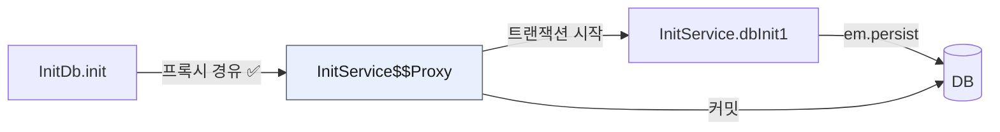
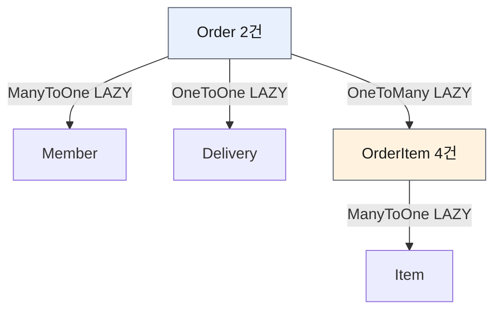

# 2. API 개발 고급 - 준비 — 조회용 샘플 데이터 입력

> `2. API 개발 고급 - 준비.pdf` 강의자료와 현재 `study/SpringBootJPA/jpashop`의 `InitDb`, 그리고 활용 1편에서 만든 `Order`·`OrderItem`·`Delivery`·`Address` 도메인 코드를 기준으로 정리한다.
> Spring Boot 3.5.x, Java 17, `jakarta.persistence` 기준.
>
> ✅ 이번 챕터는 분량이 짧다. **앞으로 성능 최적화를 실습할 데이터를 만드는 것**이 전부다. 하지만 `@PostConstruct`와 트랜잭션, cascade, 값 타입이 한꺼번에 얽히는 자리라 실수하기 쉽다. 실제로 작성하면서 만난 버그를 `🔥` 절에 정리했다.

---

## 0. 이 챕터의 한 줄 요약

> **앞으로 다룰 지연 로딩·N+1 문제를 눈으로 보려면, 연관관계가 얽힌 샘플 데이터가 먼저 필요하다.**

[1장](./1.%20API%20개발%20기본.md)에서 API 스펙을 엔티티에서 떼어냈다. 이제 그 DTO를 채우는 과정에서 터지는 **성능 문제**를 다룰 차례인데, 문제를 재현하려면 데이터가 있어야 한다.

만들 데이터는 정확히 이 모양이다.

```
주문 2건
├─ userA (서울) ──▶ order1 ─┬─ JPA1 BOOK   × 1
│                           └─ JPA2 BOOK   × 2
└─ userB (부산) ──▶ order2 ─┬─ SPRING1 BOOK × 3
                            └─ SPRING2 BOOK × 4
```

**주문 2건 × 각 주문당 상품 2건.** 이 숫자가 중요하다. 3장에서 `Order`를 조회하면 회원·배송 조회가 주문 수만큼 추가로 나가는 것을 세어야 하고, 4장에서 `OrderItem` 컬렉션을 조인하면 결과 행이 2건 → 4건으로 뻥튀기되는 것을 봐야 한다. **주문이 1건뿐이면 N+1이 눈에 안 보인다.**

---

## 1. 애플리케이션 시작 시점에 데이터 넣기 — `@PostConstruct`

```java
// 내 코드 (InitDb)
@Component
@RequiredArgsConstructor
public class InitDb {

    private final InitService initService;

    @PostConstruct
    public void init() {
        initService.dbInit1();
        initService.dbInit2();
    }
```

`@PostConstruct`는 **스프링 빈의 의존성 주입이 모두 끝난 직후 딱 한 번** 호출되는 콜백이다. 생성자에서는 아직 주입이 끝나지 않았을 수 있어서, "빈이 완전히 준비된 뒤 할 초기화"는 여기에 둔다.

| 시점 | 상태 |
|------|------|
| 생성자 | 의존성 주입 **전** (final 필드는 이때 채워짐) |
| `@PostConstruct` | 주입 완료 후 — **초기화 로직 위치** |
| `@PreDestroy` | 빈 소멸 직전 |

⚠️ **강의(부트 2.x)와의 차이** — 강의는 `javax.annotation.PostConstruct`를 import한다. 부트 3.x는 `jakarta.annotation.PostConstruct`다.

⚠️ `@PostConstruct`는 애플리케이션을 띄울 때마다 실행된다. `ddl-auto: create`와 짝을 이뤄야 매번 깨끗한 상태에서 시작한다. `none`으로 두면 재시작할 때마다 같은 데이터가 **중복 누적**된다.

---

## 2. 🔑 왜 `InitService`를 별도 빈으로 분리했나

이 챕터에서 가장 중요한 부분이다. 강의에서도 유일하게 "이건 이렇게 해야만 한다"고 못 박는 지점이다.

```java
// 내 코드 (InitDb)
    // 별도 빈으로 주입받아 호출해야 @Transactional 프록시를 탄다.
    @Component
    @Transactional
    @RequiredArgsConstructor
    static class InitService {

        private final EntityManager em;

        public void dbInit1() { ... }
```

`@PostConstruct` 붙인 메서드에 그냥 `@Transactional`을 달고 그 안에서 다 처리하면 **동작하지 않는다.** 이유는 두 가지가 겹친다.

### ① `@Transactional`은 프록시로 동작한다

스프링의 `@Transactional`은 **AOP 프록시**가 대신 트랜잭션을 열고 닫는 방식이다. 즉 **외부에서 프록시를 거쳐 호출될 때만** 적용된다.



같은 클래스 안에서 `this.dbInit1()`처럼 **자기 자신을 직접 호출하면 프록시를 안 거친다.** 자바의 `this`는 실제 객체를 가리키지 프록시를 가리키지 않기 때문이다. 이걸 **자기 호출(self-invocation) 문제**라고 한다.

```java
// ❌ 이렇게 하면 트랜잭션이 안 걸린다
@PostConstruct
public void init() {
    dbInit1();   // this.dbInit1() — 프록시를 안 탄다
}

@Transactional
public void dbInit1() { ... }
```

`em.persist()`는 예외 없이 지나가지만 커밋이 없어 **DB에 아무것도 남지 않는다.** 조용히 실패하는 종류의 버그라 더 나쁘다.

### ② `@PostConstruct`는 트랜잭션 AOP보다 먼저 돈다

설령 자기 호출이 아니더라도, `@PostConstruct`는 **해당 빈의 초기화 콜백**이라 트랜잭션 어드바이스가 붙기 전 단계에서 실행된다. `@PostConstruct`와 `@Transactional`을 **같은 메서드에** 붙이는 건 그래서 조합 자체가 성립하지 않는다.

> **결론: 초기화 호출부(`InitDb`)와 트랜잭션 작업부(`InitService`)를 다른 빈으로 분리하고, 주입받아 호출한다.**

### ③ 중첩 클래스는 `static`이어야 한다

```java
@Component
static class InitService {   // ← static 필수
```

`static`이 아닌 내부 클래스는 바깥 인스턴스(`InitDb`)에 묶여 있어 스프링이 **단독으로 인스턴스화하지 못한다.** 그래서 빈 등록이 실패한다.

⚠️ **강의와의 차이** — 강의는 `jakarta.transaction.Transactional`(자바 표준)을 쓰기도 하는데, 나는 `org.springframework.transaction.annotation.Transactional`을 썼다. 표준 쪽은 `readOnly`, `propagation`, `isolation` 같은 스프링 옵션을 못 쓴다. **프로젝트 전체에서 스프링 것으로 통일하는 편이 낫다** — `MemberService`, `OrderService`도 전부 스프링 쪽을 쓰고 있다.

| | `jakarta.transaction.Transactional` | `org.springframework...Transactional` |
|---|---|---|
| 출처 | 자바 표준(JTA) | 스프링 |
| `readOnly` | ❌ | ✅ |
| `propagation` | 일부만 | 전부 |
| 롤백 기본 규칙 | 체크 예외도 롤백 | **언체크 예외만** 롤백 |

---

## 3. 샘플 데이터 만들기 — cascade에 태운다

```java
// 내 코드 (InitDb.InitService)
public void dbInit1() {
    // userA - JPA1, JPA2
    Member member = createMember("userA", "서울", "1", "1111");
    em.persist(member);

    Book book1 = createBook("JPA1 BOOK", 10000, 100);
    em.persist(book1);

    Book book2 = createBook("JPA2 BOOK", 20000, 100);
    em.persist(book2);

    OrderItem orderItem1 = OrderItem.createOrderItem(book1, book1.getPrice(), 1);
    OrderItem orderItem2 = OrderItem.createOrderItem(book2, book2.getPrice(), 2);

    // delivery, orderItem은 Order의 cascade = ALL 로 함께 persist 된다.
    Order order = Order.createOrder(member, createDelivery(member), orderItem1, orderItem2);
    em.persist(order);
}
```

`em.persist()`를 부른 대상은 `member`, `book1`, `book2`, `order` **넷뿐**이다. `delivery`와 `orderItem`은 직접 저장하지 않는다.

### cascade가 대신 저장한다

```java
// 내 코드 (Order)
// 주문을 취소하면 배송이 취소되므로 주문을 주인관계로 설정하였다.
// Order 시에 Delivery 자동 persist 설정
@OneToOne(fetch = FetchType.LAZY, cascade = CascadeType.ALL)
@JoinColumn(name = "delivery_id")
private Delivery delivery;

// Order에 저장 > OrderItem에 자동저장(persist 생략)
@OneToMany(mappedBy = "order", cascade = CascadeType.ALL)
private List<OrderItem> orderItems = new ArrayList<>();
```

`cascade = ALL`이면 `em.persist(order)` 한 번에 연관된 `delivery`, `orderItems`까지 **영속성 전이**된다. 활용 1편에서 이미 걸어 둔 설정이 여기서 그대로 효과를 본다.

⚠️ `em.persist(delivery)`를 **추가로 호출하지 말 것.** 에러가 나진 않지만 cascade와 의도가 중복돼 코드가 거짓말을 하게 된다. "여기서 delivery를 따로 저장해야 하나?"라는 오해를 다음 사람이 하게 된다.

💡 **cascade는 아무 데나 쓰면 안 된다.** `Order`와 `Delivery`/`OrderItem`처럼 **① 라이프사이클이 완전히 같고 ② 소유자가 하나뿐일 때**만 쓴다. `Member`나 `Item`은 여러 주문이 공유하므로 cascade를 걸면 안 된다 — 그래서 위 코드에서 `member`와 `book`은 직접 `persist` 한다.

### 생성 메서드가 연관관계를 맞춰 준다

```java
// 내 코드 (Order)
public static Order createOrder(Member member, Delivery delivery, OrderItem... orderItems) {
    Order order = new Order();
    order.setMember(member);         // 연관관계 편의 메서드
    order.setDelivery(delivery);     // delivery.setOrder(this) 까지 수행
    for(OrderItem orderItem : orderItems) {
        order.addOrderItem(orderItem);   // orderItem.setOrder(this) 까지 수행
    }
    order.setOrderStatus(OrderStatus.ORDER);
    order.setOrderDate(LocalDateTime.now());
    return order;
}
```

`Delivery`의 `order` 필드, `OrderItem`의 `order` 필드를 **내가 직접 채울 필요가 없다.** 연관관계 편의 메서드가 양방향을 한 번에 맞춘다. InitDb에서 `Delivery`에 직접 세팅할 값은 결국 두 개뿐이다.

| `Delivery` 필드 | 누가 채우나 |
|---|---|
| `id` | `@GeneratedValue` |
| `address` | **직접** — 회원 주소 복사 |
| `deliveryStatus` | **직접** — `READY` |
| `order` | `Order.setDelivery()`가 자동 |

---

## 4. 배송지 주소 — 값 타입은 복사해서 박제한다

```java
// 내 코드 (InitDb.InitService)
// 주문 시점의 회원 주소를 배송지로 복사한다. (Address는 불변 값 타입이라 공유해도 안전)
private Delivery createDelivery(Member member) {
    Delivery delivery = new Delivery();
    delivery.setAddress(member.getAddress());
    delivery.setDeliveryStatus(DeliveryStatus.READY);
    return delivery;
}
```

`OrderService.order()`의 실제 주문 로직과 **똑같은 방식**이다.

```java
// 내 코드 (OrderService)
Delivery delivery = new Delivery(); // cascade 옵션에 의해 강제 em.persist
delivery.setAddress(member.getAddress());
delivery.setDeliveryStatus(DeliveryStatus.READY); // 주문 시 배송은 준비 상태로 시작
```

### `Address`가 두 군데 있는 이유

`Member`와 `Delivery`가 각각 `Address`를 가진다. 처음 보면 중복 같지만 의도된 설계다.

`Address`는 엔티티가 아니라 **값 타입(`@Embeddable`)** 이라 **자기 테이블이 없다.** 쓰는 쪽 테이블에 컬럼으로 펼쳐진다.

```
member 테이블                    delivery 테이블
├─ member_id                    ├─ delivery_id
├─ name                         ├─ city      ← Address
├─ city      ← Address          ├─ street    ← Address
├─ street    ← Address          ├─ zipcode   ← Address
└─ zipcode   ← Address          └─ delivery_status
```

**주문 당시의 배송지는 그 시점에 박제되어야 한다.** 회원이 나중에 이사해서 `member.address`를 바꿔도 과거 주문의 `delivery.address`는 그대로여야 한다. 배송지가 회원 주소를 FK로 참조하는 구조였다면 주소를 바꾸는 순간 **과거 주문 이력이 전부 오염**된다.

### 공유 참조가 왜 안전한가

`delivery.setAddress(member.getAddress())`는 **같은 `Address` 인스턴스를 두 엔티티가 공유**하게 만든다. 원래 값 타입에서 금지 사항이다 — 한쪽을 바꾸면 다른 쪽 `UPDATE`까지 나가기 때문이다.

그런데 여기선 안전하다.

```java
// 내 코드 (Address)
@Embeddable
@Getter // 값 타입에 getter만 생성한다.
public class Address {
    private String city;
    private String street;
    private String zipcode;

    // 리플렉션, 프록시 등등을 위한 기본 생성자
    protected Address() { }

    // 생성할때만 값을 설정하며 getter로 값을 가져가기만 한다.
    public Address(String city, String street, String zipcode) { ... }
}
```

`setter`가 없어서 **애초에 값을 바꿀 방법이 없다.** 기본편 `09. 값 타입.md`의 "**값 타입은 불변 객체로 만들어라**"가 여기서 실제로 효력을 발휘한다. 불변이면 공유해도 사고가 안 난다.

💡 굳이 방어하려면 `new Address(m.getCity(), m.getStreet(), m.getZipcode())`로 복사해도 되지만, 불변인 이상 실익은 없다.

---

## 5. 헬퍼 메서드로 반복 줄이기

`dbInit1`/`dbInit2`가 거의 같은 코드를 반복하므로 `private` 헬퍼로 뺐다.

```java
// 내 코드 (InitDb.InitService)
private Member createMember(String name, String city, String street, String zipcode) {
    Member member = new Member();
    member.setName(name);
    member.setAddress(new Address(city, street, zipcode));
    return member;
}

private Book createBook(String name, int price, int stockQuantity) {
    Book book = new Book();
    book.setName(name);
    book.setPrice(price);
    book.setStockQuantity(stockQuantity);
    return book;
}
```

💡 **`dbInit1`과 `dbInit2`를 메서드로 나눈 것 자체가 방어책이다.** 한 메서드에 두 회원의 데이터를 몰아넣으면 `member`/`member2`, `book1`~`book4`, `orderItem1`~`orderItem4`처럼 **번호로 구분되는 변수**가 늘어나고, 그중 하나를 잘못 쓰는 사고가 난다 (아래 `🔥` 참고). 메서드를 나누면 각 스코프에서 `member`, `book1`, `book2`만 존재하므로 애초에 헷갈릴 여지가 없다.

💡 헬퍼는 `InitService` 안에 `private`으로 둔다. 초기 데이터 전용 코드지 도메인 로직이 아니므로 밖으로 꺼낼 이유가 없다.

---

## 6. 🔥 실습 중 만난 문제들

### ① `book.setCategories()` — 컴파일 에러

`Book`에 카테고리를 넣어 보려고 `setCategories()`를 호출했더니 컴파일이 안 됐다. 롬복 `@Setter`가 만드는 건 `setCategories(List<Category>)` 하나라 인자 없는 시그니처가 없다.

더 중요한 건 **인자를 제대로 넘겨도 DB에 안 들어간다**는 점이다.

```java
// 내 코드 (Item)
@ManyToMany(mappedBy = "items")   // ← 연관관계의 주인이 아님 (읽기 전용)
private List<Category> categories = new ArrayList<>();
```

주인은 `Category.items` 쪽이다.

```java
// 내 코드 (Category)
// 다대다 관계는 사용하지 말것을 권장함
@ManyToMany
@JoinTable(name = "category_item",
    joinColumns = @JoinColumn(name = "category_id"),
    inverseJoinColumns = @JoinColumn(name = "item_id"))
private List<Item> items = new ArrayList<>();
```

`mappedBy`가 붙은 쪽은 **읽기 전용**이라 값을 넣어도 `category_item` 테이블에 `INSERT`가 나가지 않는다. 넣으려면 주인 쪽에서 세팅해야 한다.

```java
Category category = new Category();
category.setName("도서");
category.getItems().add(book);   // 주인 쪽에 담아야 조인 테이블에 INSERT
em.persist(category);
```

➡️ **결론: 샘플 데이터에서 카테고리는 빼는 게 맞다.** 활용 2편에서 조회하는 API는 회원·주문·주문상품·배송뿐이고, `Category`는 등장하지 않는다.

### ② `order2`에 `order1`의 `OrderItem`을 재사용 — 데이터가 조용히 사라진다

두 주문을 한 메서드에서 만들다가 낸 실수다.

```java
// ❌ 잘못된 코드
Order order2 = Order.createOrder(member, delivery2, orderItem1, orderItem2);
//                               ^^^^^^              ^^^^^^^^^^^^^^^^^^^^^^
//                               member2여야 함       orderItem3, orderItem4여야 함
```

`orderItem1`은 이미 `order1`에 붙어 있는데, `addOrderItem()`이 `orderItem.setOrder(this)`로 **주인을 `order2`로 덮어쓴다.** `order_item` 테이블의 `order_id` FK가 order2를 가리키게 되므로, **order1의 주문상품이 통째로 사라진다.**

예외도 로그도 없이 데이터만 틀리게 들어간다. 그리고 이건 3~4장 실습을 통째로 망가뜨린다 — 주문 하나에 상품이 0개면 컬렉션 조회 최적화를 관찰할 대상 자체가 없다.

⚠️ **양방향 연관관계에서 `add` 계열 편의 메서드는 "이동"이지 "복사"가 아니다.** 이미 다른 부모에 속한 자식을 넘기면 조용히 옮겨간다.

### ③ `delivery.setAddress()` 누락

`Delivery`를 만들면서 상태만 넣고 주소를 빠뜨렸다. 예외가 안 나고 `city/street/zipcode`가 전부 `null`로 들어간다. 나중에 주문 조회 API 응답에서 `address: null`을 보고 나서야 발견하게 된다.

### ④ 주문 수량에 `getStockQuantity()`를 넘김

```java
// ❌ 재고 100개를 100개 주문 → 재고 0
OrderItem.createOrderItem(book1, book1.getPrice(), book1.getStockQuantity());
```

`OrderItem`의 내 주석대로 `count`는 **주문 수량이지 재고가 아니다.**

```java
// 내 코드 (OrderItem)
private int count; // 주문 수량 (재고 아님!!)

public static OrderItem createOrderItem(Item item, int orderPrice, int count) {
    ...
    // 주문시 재고 감소
    item.removeStock(count);
    return orderItem;
}
```

`createOrderItem`이 `removeStock(count)`로 재고를 깎으므로 재고가 정확히 0이 된다. 예외는 안 나지만(`removeStock`은 음수일 때만 던진다) 의도한 데이터가 아니다. 주문 수량은 `1, 2, 3, 4`처럼 고정값으로 넣는다.

---

## 7. 실행 준비 — `ddl-auto`

```yaml
# 내 설정 (application.yml)
jpa:
  hibernate:
    ddl-auto: create
```

`@PostConstruct`가 뜰 때마다 실행되므로, **매번 스키마를 새로 만드는 `create`가 이 챕터에 맞다.** 1장에서 API를 반복 테스트하려고 `none`으로 바꿨었는데([1장 🔥 절](./1.%20API%20개발%20기본.md)), 샘플 데이터 자동 주입을 쓰는 지금부터는 다시 `create`가 편하다.

| 값 | 이 챕터에서 |
|----|------------|
| `create` | ✅ 매번 깨끗한 샘플 데이터 |
| `none` | ❌ 재시작마다 같은 데이터 중복 누적 |

⚠️ H2 TCP 서버(`h2/bin/h2.bat`)가 먼저 떠 있어야 한다. `ddl-auto: none` 상태에서 테이블이 없으면 `@PostConstruct` 단계에서 애플리케이션이 기동에 실패한다.

💡 데이터가 잘 들어갔는지는 H2 콘솔에서 확인한다.

```sql
select o.order_id, m.name, i.name, oi.count, d.city
from orders o
    join member m on o.member_id = m.member_id
    join order_item oi on oi.order_id = o.order_id
    join item i on oi.item_id = i.item_id
    join delivery d on o.delivery_id = d.delivery_id;
```

**4행**(주문 2건 × 상품 2건)이 나오면 준비 완료다.

---

## 8. 앞으로 다룰 것

이 데이터로 3장부터 성능 문제를 하나씩 관찰한다.

| 장 | 주제 | 이 데이터로 볼 것 |
|---|------|------------------|
| 3 | 지연 로딩과 조회 성능 최적화 | `Order` → `Member`/`Delivery` (**xToOne**) N+1, 페치 조인, DTO 직접 조회 |
| 4 | 컬렉션 조회 최적화 | `Order` → `OrderItem` (**xToMany**) 조인 시 행 뻥튀기, `distinct`, 페이징 한계, `batch_fetch_size` |
| 5 | 실무 필수 최적화 | OSIV, 커맨드/쿼리 분리 |



⚠️ 모든 연관관계가 `LAZY`다. **활용 1편에서 "`@XToOne`의 기본값 `EAGER`는 반드시 `LAZY`로 바꾼다"** 는 원칙을 지켜 놨기 때문인데, 그 대가로 3장부터 지연 로딩 프록시와 N+1을 정면으로 다루게 된다.

---

## ✅ 핵심 요약

| # | 핵심 | 근거 |
|---|------|------|
| 1 | 초기화 호출부와 트랜잭션 작업부를 **다른 빈으로 분리**한다 | `@Transactional`은 프록시 기반 — 자기 호출은 적용 안 됨 |
| 2 | `@PostConstruct`와 `@Transactional`을 **같은 메서드에 붙이지 않는다** | 초기화 콜백이 트랜잭션 AOP보다 먼저 실행됨 |
| 3 | 중첩 클래스는 `static`이어야 빈으로 등록된다 | 바깥 인스턴스에 묶이면 단독 생성 불가 |
| 4 | `delivery`·`orderItem`은 `em.persist` 하지 않는다 | `Order`의 `cascade = ALL`이 전이 저장 |
| 5 | cascade는 **라이프사이클이 같고 소유자가 하나**일 때만 | `Member`·`Item`은 여러 주문이 공유 |
| 6 | 배송지는 회원 주소를 **복사**해 박제한다 | 회원이 이사해도 과거 주문 이력이 안 바뀜 |
| 7 | 값 타입 공유 참조는 **불변이라서** 안전하다 | `Address`에 setter 없음 |
| 8 | `mappedBy` 쪽에 값을 넣어도 **DB에 반영 안 된다** | 주인이 아닌 쪽은 읽기 전용 |
| 9 | 이미 다른 부모에 속한 자식을 `add`하면 **옮겨간다** | 편의 메서드가 `setOrder(this)`로 덮어씀 |
| 10 | 샘플은 **주문 2건 × 상품 2건**이어야 한다 | 1건이면 N+1과 행 뻥튀기가 안 보임 |

> 데이터 준비가 끝났다. 다음 장부터는 이 주문 2건을 조회하면서 **쿼리가 몇 개 나가는지 세는 일**이 시작된다.
