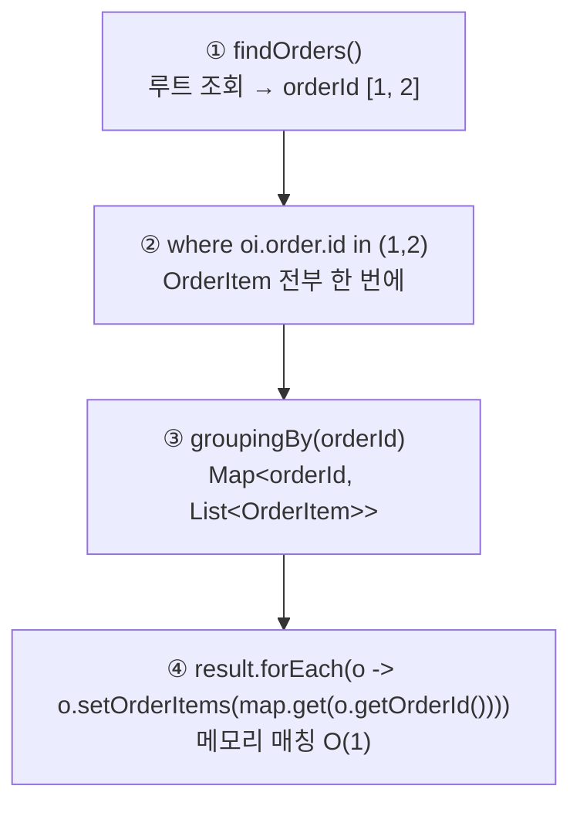

# 4. API 개발 고급 - 컬렉션 조회 최적화 — 주문 조회 V1~V6

> `4. API 개발 고급 - 컬렉션 조회 최적화.pdf` 강의자료와, 내가 작성한 `OrderApiController`·`OrderRepository`·`OrderQueryRepository` 코드를 기준으로 정리한다.
> Spring Boot 3.5.16, Java 17, Hibernate 6.6, `jakarta.persistence` 기준.
>
> ✅ 이 문서의 **쿼리 수는 전부 실제로 호출해서 센 값**이다. `InitDb`가 넣는 **주문 2건 / 주문당 상품 2개 / 상품 4종** 기준.

---

## 0. 이 챕터의 한 줄 요약

> **3장은 `xToOne`만 다뤘다. 이번엔 컬렉션(`@OneToMany`)이다. 조인하는 순간 결과 row가 뻥튀기되기 때문에 3장의 해법을 그대로 쓸 수 없다.**

```
Order ──@ManyToOne(LAZY)──▶ Member       ← 3장에서 끝난 이야기 (row 안 늘어남)
      ├─@OneToOne (LAZY)──▶ Delivery     ← 3장에서 끝난 이야기 (row 안 늘어남)
      └─@OneToMany(LAZY)──▶ OrderItem ──▶ Item   ← 이번 장 (row 뻥튀기)
```

### 결론 먼저 — 실측 결과

`default_batch_fetch_size`와 `@BatchSize`를 **끈 상태 / 켠 상태**를 각각 재봤다.

| 버전 | 엔드포인트 | 방식 | 배치 **OFF** | 배치 **ON(100)** |
|------|-----------|------|:---:|:---:|
| V1 | `/api/v1/orders` | 엔티티 직접 노출 | **11** | 5 |
| V2 | `/api/v2/orders` | 엔티티를 DTO로 변환 | **11** | 5 |
| V3 | `/api/v3/orders` | 컬렉션 페치 조인 | **1** | 1 |
| V3.1 | `/api/v3.1/orders` | ToOne만 페치 조인 + 배치 | 7 | **3** |
| V4 | `/api/v4/orders` | JPA에서 DTO 직접 조회 | 3 | 3 |
| V5 | `/api/v5/orders` | DTO 직접 조회 + IN 절 | **2** | 2 |
| V6 | `/api/v6/orders` | 플랫 데이터 | **1** | 1 |

> ⚠️ **V3.1의 `7 → 3`이 이 장의 하이라이트다.** 설정 한 줄로 `1+N+M`이 `1+1+1`이 된다.
> V4는 배치 설정과 **무관하다**(3으로 고정). 지연 로딩이 아니라 내가 직접 짠 반복 쿼리이기 때문이다.

---

## 1. V1 — 엔티티 직접 노출

```java
// 내 코드 (OrderApiController)
/** v1: 엔티티 직접 노출
 * 3장의 simple-orders와 달리 컬렉션(Order → OrderItem)까지 딸려 나온다.
 *
 * 1. 지연 로딩 프록시는 Jackson이 직렬화하지 못하므로 전부 강제 초기화해야 한다.
 *   - xToOne(member, delivery)뿐 아니라 컬렉션 orderItems, 그 안의 item까지 건드려야 한다.
 * 2. 양방향 연관관계는 한쪽에 @JsonIgnore를 걸어 무한 루프를 끊어야 한다.
 *
 * 쿼리: order 1 + member N + delivery N + orderItem N + item M (최악의 경우)
 *
 * 엔티티가 그대로 API 스펙이 되므로 절대 사용하면 안 된다.
 */
@GetMapping("/api/v1/orders")
public List<Order> ordersV1() {
    List<Order> orders = orderRepository.findAllByString(new OrderSearch());
    for (Order order : orders) {
        // 강제 초기화 Member, Delivey
        order.getMember().getName();
        order.getDelivery().getAddress();

        // 강제 초기화 OrderItem, Order
        List<OrderItem> orderItems = order.getOrderItems();
        orderItems.stream().forEach(orderItem -> orderItem.getItem().getName());
    }
    return orders;
}
```

3장의 `simple-orders`와 비교하면 **강제 초기화가 한 단계 더 깊어졌다.**

| | 3장 (`xToOne`) | 4장 (컬렉션 포함) |
|---|---|---|
| 초기화 대상 | `member`, `delivery` | `member`, `delivery`, **`orderItems`, `orderItems[].item`** |

💡 `order.getOrderItems()`만으로는 초기화되지 않는다. 컬렉션 프록시도 **실제로 순회해야** 채워진다. 그래서 `orderItems.stream().forEach(...)`로 안쪽 `item`까지 건드린다.

### V1 실측 — 배치 OFF 기준 11번

| 대상 | 횟수 | 이유 |
|------|-----|------|
| `orders` | 1 | `findAllByString` |
| `member` | 2 | 주문당 1 |
| `delivery` | 2 | 주문당 1 |
| `order_item` | 2 | 주문당 1 |
| `item` | **4** | **주문상품당 1** |
| **합계** | **11** | |

`item`이 4번인 게 컬렉션의 특징이다. 3장은 `1 + N + N`이었지만 여기는 **`1 + N + N + N + (N×M)`** 이다. 주문 100건에 주문당 상품 3개면 **1 + 100 + 100 + 100 + 300 = 601번**이 된다.

⚠️ 엔티티 직접 노출의 문제(프록시 직렬화 예외, 양방향 무한 루프, `@JsonIgnore` 오염)는 [3장](./3.%20API%20개발%20고급%20-%20지연%20로딩과%20조회%20성능%20최적화.md)에서 이미 다뤘다. 여기에 **컬렉션까지 통째로 노출**되는 문제가 더해질 뿐이다.

---

## 2. V2 — 엔티티를 DTO로 변환

```java
// 내 코드 (OrderApiController)
/** v2: 엔티티를 DTO로 변환 (fetch join 미사용)
 * API 스펙 문제는 해결되지만 성능 문제는 그대로다.
 *
 * ⚠️ OrderDto 안의 List<OrderItem>을 그대로 두면 안 된다.
 *    엔티티가 DTO에 껍데기만 씌워진 채 그대로 노출되므로 OrderItemDto로 한 번 더 감싼다.
 *
 * 쿼리: order 1 + member N + delivery N + orderItem N + item M (v1과 동일)
 */
@GetMapping("/api/v2/orders")
public List<OrderDto> ordersV2() {
    List<Order> orders = orderRepository.findAllByString(new OrderSearch());
    List<OrderDto> collect = orders.stream()
            .map(order -> new OrderDto(order))
            .collect(toList());

    return collect;
}
```

### 이 장에서 가장 놓치기 쉬운 함정 — DTO 안의 엔티티

내 코드에 그 고민이 주석으로 남아 있다.

```java
// 내 코드 (OrderApiController.OrderDto)
@Getter
static class OrderDto {
    private Long orderId;
    private String name;
    private LocalDateTime orderDate;
    private OrderStatus orderStatus;
    private Address address;
    // private List<OrderItem> orderItems; // [] 형식이 아닌가?
    private List<OrderItemDto> orderItems;

    public OrderDto(Order order) {
        ...
//        orderItems = order.getOrderItems(); // 객체가 직접적으로 응답으로 노출되는 안좋은 케이스이다. >> DTO 반환
    }
}
```

`OrderDto`로 감쌌으니 됐다고 생각하기 쉽지만, **`List<OrderItem>`을 그대로 담으면 엔티티가 그대로 노출된다.** 껍데기만 DTO일 뿐 V1과 다를 게 없다.

> ✅ **DTO 안에 엔티티가 있으면 안 된다. `Address` 같은 값 타입(Value Object)은 괜찮다.**
> `Address`는 `@Embeddable` 불변 값 타입이라 스펙이 바뀔 일도, 지연 로딩도 없다. ([기본편 9장 값 타입](../../jpaBasic/09.%20값%20타입.md))

그래서 `OrderItemDto`를 하나 더 만든다.

```java
// 내 코드 (OrderApiController)
@Getter
static class OrderItemDto {
//        private Long orderItemId;
    private String itemName;
    private int itemPrice;
    private int count;

    public OrderItemDto(OrderItem orderItem) {
        itemName = orderItem.getItem().getName();
        itemPrice = orderItem.getOrderPrice();
        count = orderItem.getCount();
    }
}
```

💡 `orderItemId`를 주석 처리한 건 옳은 판단이다. **DB 식별자는 클라이언트에게 의미가 없다.** 필요한 건 상품명·가격·수량뿐이다.

### V2 실측 — 11번 (V1과 동일)

**쿼리가 하나도 안 줄었다.** 3장의 교훈이 그대로 반복된다.

> ✅ **DTO는 API 스펙 문제를 푸는 도구지 성능 도구가 아니다.**

---

## 3. V3 — 컬렉션 페치 조인

```java
// 내 코드 (OrderApiController)
/** v3: 엔티티를 DTO로 변환 - 컬렉션 페치 조인 최적화
 * 컬렉션까지 join fetch로 끌어와 쿼리를 1번으로 줄인다.
 *
 * ⚠️ 1:N 조인이라 DB row가 뻥튀기되고, 같은 Order가 OrderItem 수만큼 중복된다.
 *    JPQL의 distinct가 같은 식별자의 엔티티를 애플리케이션에서 걸러준다.
 *    (아래 println으로 중복 제거 후 같은 참조를 쓰는지 확인)
 *
 * ⚠️ 치명적 한계 — 페이징 불가.
 *    setFirstResult/setMaxResults를 걸면 하이버네이트가 전체를 메모리로 퍼올린 뒤 페이징한다.
 *    데이터가 많으면 OutOfMemory. 그래서 주석으로만 남겨 뒀다.
 *
 * ⚠️ 컬렉션 페치 조인은 1개만 가능하다. 둘 이상이면 N*M 곱집합이 되어 데이터 정합성이 깨진다.
 *
 * 쿼리: 1번
 */
@GetMapping("/api/v3/orders")
public List<OrderDto> ordersV3() {
    List<Order> orders = orderRepository.findAllWithItem();// fetchJoin > 일대다로 인한 데이터 중복발생
    for (Order order : orders) {
        System.out.println("order ref = " + order + " id = " + order.getId());
    }
    ...
}
```

```java
// 내 코드 (OrderRepository)
/**
 * v3 - 컬렉션 페치 조인 (/api/v3/orders)
 *
 * distinct: 1:N 조인으로 뻥튀기된 row 중 같은 식별자의 Order를 애플리케이션에서 걸러준다.
 * ⚠️ 하이버네이트 6부터는 엔티티 조회 시 중복 제거가 기본이라 distinct가 없어도 동작한다.
 *    (강의는 부트 2.x / 하이버네이트 5 기준이라 distinct가 필수였다)
 * ⚠️ 컬렉션 페치 조인은 페이징이 불가능하고, 둘 이상 사용할 수 없다.
 */
public List<Order> findAllWithItem() {
    return em.createQuery(
                            "select distinct o from Order o" +
                                    " join fetch o.member" +
                                    " join fetch o.delivery" +
                                    " join fetch o.orderItems oi" +
                                    " join fetch oi.item", Order.class)
//                .setFirstResult(1)
//                .setMaxResults(100) // 페이징 쿼리 불가능
            .getResultList();
}
```

### V3 실측 — 쿼리 1번

```sql
select distinct o1_0.order_id, d1_0.delivery_id, ..., m1_0.name, ...,
       oi1_0.order_id, oi1_0.order_item_id, oi1_0.count,
       i1_0.item_id, i1_0.dtype, i1_0.name, ...
from orders o1_0
  join member     m1_0 on m1_0.member_id   = o1_0.member_id
  join delivery   d1_0 on d1_0.delivery_id = o1_0.delivery_id
  join order_item oi1_0 on o1_0.order_id   = oi1_0.order_id   -- 1:N, 여기서 row 뻥튀기
  join item       i1_0 on i1_0.item_id     = oi1_0.item_id
```

**11번이 1번이 됐다.** 3장의 페치 조인이 컬렉션에도 그대로 통한다.

### 1:N 조인은 row를 뻥튀기한다

```
orders          order_item        조인 결과
├ order 1       ├ JPA1 BOOK       ├ order 1 - JPA1 BOOK
│               └ JPA2 BOOK       ├ order 1 - JPA2 BOOK   ← order 1이 2번
└ order 2       ├ SPRING1 BOOK    ├ order 2 - SPRING1 BOOK
                └ SPRING2 BOOK    └ order 2 - SPRING2 BOOK ← order 2가 2번
```

주문 2건인데 DB는 **4 row**를 돌려준다. `distinct` 없이 그대로 받으면 `Order`가 2개씩 중복된 리스트가 된다.

`distinct`는 두 가지 일을 한다.

| | 하는 일 |
|---|---|
| SQL `distinct` | 전체 컬럼이 같은 row만 제거 → **1:N 조인에서는 거의 무용지물** (`order_item_id`가 다르니까) |
| **JPA `distinct`** | **같은 식별자의 엔티티를 애플리케이션 메모리에서 제거** ← 이게 진짜 목적 |

내 코드의 확인용 출력이 이걸 그대로 보여준다.

```
order ref = jpabook.jpashop.domain.Order@419dd736 id = 1
order ref = jpabook.jpashop.domain.Order@4a3eb621 id = 2
```

**2줄만 찍힌다.** 중복이 제거됐고, 같은 주문이면 참조까지 동일하다(영속성 컨텍스트 1차 캐시).

### ⚠️ 강의(부트 2.x)와 다른 점 — 하이버네이트 6에서는 `distinct`가 필요 없다

`distinct`를 빼고 직접 호출해 봤다.

| | 응답 주문 수 | SQL에 `DISTINCT` |
|---|:---:|:---:|
| `select distinct o from Order o ...` | 2 | **있음** |
| `select o from Order o ...` | **2** | 없음 |

**하이버네이트 6부터는 엔티티 조회 결과의 중복 제거가 기본 동작**이라 `distinct` 없이도 결과가 같다. 반대로 `distinct`를 쓰면 SQL에 진짜 `DISTINCT`가 붙어서 **DB가 28개 컬럼을 정렬·비교하는 헛수고**를 한다.

> 💡 강의(하이버네이트 5)에서는 `hibernate.query.passDistinctThrough=false` 옵션으로 SQL에 안 넘기는 트릭이 있었는데, 이 옵션은 **하이버네이트 6에서 제거**됐다. 6에서는 그냥 `distinct`를 안 쓰면 된다.
> 다만 이 저장소 코드는 **강의 코드와 대조하기 쉽도록 `distinct`를 남겨 두고 주석으로 설명**해 뒀다.

### 치명적 한계 1 — 페이징 불가

```java
//                .setFirstResult(1)
//                .setMaxResults(100) // 페이징 쿼리 불가능
```

주석 처리해 둔 이유가 있다. 컬렉션 페치 조인에 페이징을 걸면 이런 경고가 뜬다.

```
firstResult/maxResults specified with collection fetch; applying in memory
```

**하이버네이트가 DB의 모든 데이터를 메모리로 읽어 들인 뒤 애플리케이션에서 페이징한다.** 주문 10만 건이면 10만 건을 전부 올린다 → `OutOfMemoryError`.

왜 이럴 수밖에 없냐면, **페이징의 기준이 어긋나기 때문**이다.

```
사용자가 원하는 것: 주문(Order) 2건
DB가 아는 것:      조인 결과 4 row
→ limit 2 를 걸면 order 1의 상품 2개만 나온다. order 2는 통째로 사라진다.
```

### 치명적 한계 2 — 컬렉션 페치 조인은 1개만

컬렉션을 둘 이상 페치 조인하면 **N × M 곱집합**이 되어 데이터 정합성이 깨진다. 하이버네이트가 예외를 던진다.

> ✅ **컬렉션 페치 조인은 1개만 가능하다. ToOne은 몇 개든 상관없다.**

---

## 4. V3.1 — 페이징 한계 돌파 (실무 권장)

이 장에서 **실무에서 가장 많이 쓰게 되는 방식**이다. 내가 붙여 둔 주석이 이 절의 요약이다.

```java
// 내 코드 (OrderApiController)
/** v3.1: 엔티티를 DTO로 변환 - 페이징과 한계 돌파 (실무 권장)
 * 컬렉션 fetch join시 paging 불가 > 최악의 경우 장애(out of memeory)
 *
 * !한계 돌파!
 * 1. ToOne 관계를 모두 fetch join합니다. (ToOne은 row 수를 늘리지 않으므로 페이징에 영향 없음)
 * 2. 컬렉션은 LAZY 로딩으로 조회합니다.
 * 3. 지연 로딩 성능 최적화
 *   - hibernate.default_batch_fetch_size(글로벌) > 1 + n + m 에서 1 + 1 + 1로 최적화가 가능합니다.
 *   - @BatchSize (개별 최적화) 를 적용합니다.
 *
 * v3와 비교했을 때의 장점
 * - 쿼리 수는 1번 더 많지만, 중복 row가 없어 DB 데이터 전송량이 오히려 적다.
 * - 페이징이 가능하다.
 *
 * @Param("offset") 페이징 쿼리 시작점
 * @Param("limit") 페이징 쿼리 끝점
 *
 * @return 주문 정보(Order(Member + Delivery + OrderItems(OrderItem... + Item...))
 */
@GetMapping("/api/v3.1/orders")
public List<OrderDto> ordersV3_page(
        @RequestParam(value = "offset", defaultValue = "0") int offset,
        @RequestParam(value = "limit", defaultValue = "100") int limit)
{
    List<Order> orders = orderRepository.findAllWithMemberDelivery(offset, limit); // 페이징 영향 x
    ...
}
```

```java
// 내 코드 (OrderRepository)
/**
 * v3.1 - ToOne만 페치 조인 + 페이징 (/api/v3.1/orders)
 *
 * ToOne(member, delivery)은 조인해도 row 수가 늘지 않으므로 페이징에 영향이 없다.
 * 컬렉션(orderItems)은 지연 로딩으로 두고 default_batch_fetch_size / @BatchSize로 최적화한다.
 */
public List<Order> findAllWithMemberDelivery(int offset, int limit) {
    return em.createQuery("select o from Order o" +
                    " join fetch o.member m" +
                    " join fetch o.delivery d", Order.class
            ).setFirstResult(offset)
             .setMaxResults(limit)
             .getResultList();
}
```

핵심 아이디어는 **연관관계를 성격별로 나누는 것**이다.

| 관계 | row 수 | 처리 |
|------|--------|------|
| **ToOne** (`member`, `delivery`) | 안 늘어남 | **페치 조인** — 페이징에 영향 없음 |
| **ToMany** (`orderItems`) | **늘어남** | **지연 로딩 + 배치 사이즈** |

### 설정 — 딱 한 줄

```yaml
# 내 코드 (application.yml)
spring:
  jpa:
    properties:
      hibernate:
        default_batch_fetch_size: 100 # 컬렉션의 요소들을 한번에 100개까지 가져옴
```

개별 최적화가 필요하면 `@BatchSize`를 쓴다. **붙이는 위치가 다르다.**

```java
// 내 코드 (Order)
@BatchSize(size = 100) // ToMany는 필드에 추가
@OneToMany(mappedBy = "order", cascade = CascadeType.ALL)
private List<OrderItem> orderItems = new ArrayList<>();
```

```java
// 내 코드 (Item)
@BatchSize(size = 100) // ToOne 관계일때는 Class 상단에 어노테이션으로 적용
@Entity
@Inheritance(strategy = InheritanceType.SINGLE_TABLE)
public abstract class Item { ... }
```

| 대상 | 위치 |
|------|------|
| 컬렉션 (ToMany) | **필드**에 `@BatchSize` |
| 엔티티 (ToOne) | **클래스** 선언부에 `@BatchSize` |

### V3.1 실측 — 7 → 3

| | 배치 OFF | 배치 ON(100) |
|---|:---:|:---:|
| `orders` (+member+delivery 페치 조인) | 1 | 1 |
| `order_item` | 2 | **1** |
| `item` | 4 | **1** |
| **합계** | **7** | **3** |

**`1 + N + M`이 `1 + 1 + 1`이 됐다.** 실제로 나간 배치 쿼리를 보면 원리가 그대로 보인다.

```sql
select ... from order_item oi1_0 where oi1_0.order_id in (1,2,NULL,NULL,...)
select ... from item       i1_0 where i1_0.item_id   in (1,2,3,4,NULL,NULL,...)
```

**프록시를 하나씩 초기화하는 대신, 지금 필요한 ID를 전부 모아 `IN` 절 한 방으로 가져온다.**

### 💡 `NULL` 패딩 — 하이버네이트 6의 SQL 캐시 최적화

위 SQL의 `NULL,NULL,...`이 눈에 띈다. `default_batch_fetch_size: 100`이라 **IN 절 자리를 100개로 맞추고 남는 칸을 `NULL`로 채운다.**

왜 이런 짓을 하냐면, **DB는 SQL 문자열 단위로 실행 계획을 캐싱**하기 때문이다.

```sql
where order_id in (?)          -- 서로 다른 SQL
where order_id in (?,?)        -- 서로 다른 SQL
where order_id in (?,?,?,?)    -- 서로 다른 SQL   → 파싱 3번, 캐시 3개
```

IN 절 길이를 고정하면 **항상 같은 SQL 문자열**이 되어 파싱 결과를 재사용할 수 있다.

> ⚠️ 그래서 `default_batch_fetch_size`를 무작정 크게 잡으면 안 된다. **1000으로 두면 IN 절에 인자가 1000개 붙는다.**
> 강의 권장값은 **100~1000**. 클수록 쿼리 수는 줄지만, DB·애플리케이션 순간 메모리 사용량이 늘고 DB에 순간 부하가 걸릴 수 있다.
>
> 💡 강의자료에는 하이버네이트 6.2+에서 `where in` 대신 `array_contains`를 쓴다는 설명이 있는데, **내 환경(H2 + 하이버네이트 6.6)에서는 위처럼 `NULL` 패딩된 `in`이 나갔다.** 방언(dialect)이 배열 타입을 지원하는지에 따라 달라진다.

### V3 vs V3.1 — 쿼리 수가 적은 쪽이 항상 좋은 게 아니다

| | V3 (컬렉션 페치 조인) | V3.1 (ToOne 페치 조인 + 배치) |
|---|---|---|
| 쿼리 수 | **1** | 3 |
| 중복 데이터 | **있음** (주문 정보가 상품 수만큼 반복) | 없음 |
| DB 전송량 | 많음 | **적음** |
| **페이징** | 불가 | **가능** |

V3.1은 쿼리가 3배지만 **중복 데이터를 안 보내므로 DB 데이터 전송량이 오히려 적다.** 게다가 페이징이 된다.

> ✅ **결론: ToOne은 페치 조인으로 쿼리 수를 줄이고, 컬렉션은 배치 사이즈로 최적화한다.**

---

## 5. V4 — JPA에서 DTO 직접 조회 (1 + N)

여기부터는 엔티티를 거치지 않고 **처음부터 DTO로 조회**한다. 3장 V4와 같은 아이디어지만, 컬렉션이 끼면서 코드가 확 복잡해진다.

```java
// 내 코드 (OrderApiController)
/** v4: JPA에서 DTO 직접 조회
 * 컬렉션이 있을때의 DTO 변환 및 반환
 *
 * 단 조회마다 N + 1 문제가 2번이나 발생한다.
 *
 * row 수가 늘지 않는 ToOne(member, delivery)은 처음부터 join으로 함께 조회하고,
 * row 수를 늘리는 ToMany(orderItems)는 주문 건마다 별도 쿼리로 채운다.
 *
 * 쿼리: 루트 1번 + 컬렉션 N번 (1 + N)
 */
@GetMapping("/api/v4/orders")
public List<OrderQueryDto> ordersV4() {
    return orderQueryRepository.findOrderQueryDtos();
}
```

```java
// 내 코드 (OrderQueryRepository)
/**
 * 컬렉션은 별도로 조회
 * Query: 루트 1번, 컬렉션 N번
 * 단건 조회에서 많이 사용되는 방식
 */
public List<OrderQueryDto> findOrderQueryDtos() {
    // 루트 조회 - 컬렉션인 orderItems 제외
    List<OrderQueryDto> result = findOrders(); // query 1번 -> N개

    // 루프를 돌면서 컬렉션 추가(추가 쿼리 실행)
    result.forEach(o -> {
        List<OrderItemQueryDto> orderItems = findOrderItems(o.getOrderId()); // Query N번
        o.setOrderItems(orderItems);
    });

    return result;
}
```

**핵심 원리: row 수가 늘어나느냐로 갈라친다.**

| 관계 | row | 처리 |
|------|-----|------|
| ToOne (`member`, `delivery`) | 안 늘어남 | 루트 쿼리에 `join`으로 함께 조회 |
| ToMany (`orderItems`) | 늘어남 | **주문 건마다 별도 쿼리** |

```java
// 내 코드 (OrderQueryRepository)
/**
 * 1:N 관계(컬렉션)를 제외한 나머지를 한번에 조회
 * ToOne 관계는 join해도 row 수가 늘지 않으므로 루트 쿼리에 그대로 붙인다.
 */
private List<OrderQueryDto> findOrders() {
    return em.createQuery("select new jpabook.jpashop.repository.order.query.OrderQueryDto(o.id, m.name, o.orderDate, o.orderStatus, d.address)" +
            " from Order o" +
            " join o.member m" +
            " join o.delivery d", OrderQueryDto.class)
            .getResultList();
}

/**
 * 1:N 관계인 orderItems 조회
 */
private List<OrderItemQueryDto> findOrderItems(Long orderId) {
    return em.createQuery("select new jpabook.jpashop.repository.order.query.OrderItemQueryDto(oi.order.id, i.name, oi.orderPrice, oi.count)" +
                                    " from OrderItem oi" +
                                    " join oi.item i" +
                                    " where oi.order.id = :orderId", OrderItemQueryDto.class)
            .setParameter("orderId", orderId)
            .getResultList();
}
```

⚠️ `select new 패키지.클래스(...)`는 JPQL **생성자 표현식**이다. **패키지명을 전부 적어야 하고**, 파라미터 개수·순서·타입이 정확히 일치하는 생성자가 DTO에 있어야 한다.

### V4 실측 — 3번 (1 + N)

| 대상 | 횟수 |
|------|-----|
| `orders` (+member+delivery join) | 1 |
| `order_item` | **2** (주문당 1) |
| **합계** | **3** |

⚠️ **V4는 배치 사이즈 설정과 무관하다.** 지연 로딩이 아니라 내가 직접 `forEach`로 돌린 쿼리라서 하이버네이트가 개입할 여지가 없다. 배치 OFF/ON 모두 3번으로 동일했다.

---

## 6. V5 — 컬렉션 조회 최적화 (1 + 1)

V4의 `1 + N`을 `1 + 1`로 줄인다. **`IN` 절 한 방 + 메모리에서 매칭.**

```java
// 내 코드 (OrderApiController)
/** v5: JPA에서 DTO 직접 조회 - 컬렉션 조회 최적화
 * v4의 1 + N을 1 + 1로 줄인다.
 *
 * 1. 루트(ToOne)를 먼저 조회해 orderId 목록을 뽑는다.
 * 2. 그 orderId들을 IN 절 한 방으로 던져 OrderItem을 전부 가져온다.
 * 3. orderId를 key로 Map을 만들어 메모리에서 매칭한다. (조회 O(1))
 *
 * 주문이 1000건이면 v4는 1 + 1000번, v5는 1 + 1번. 실무에서 체감 차이가 크다.
 *
 * 쿼리: 루트 1번 + 컬렉션 1번 (1 + 1)
 */
@GetMapping("/api/v5/orders")
public List<OrderQueryDto> orderV5() {
    return orderQueryRepository.findAllByDto_optimization();
}
```

```java
// 내 코드 (OrderQueryRepository)
/**
 * v5 - 컬렉션 조회 최적화
 * Query: 루트 1번, 컬렉션 1번
 * 데이터를 한꺼번에 처리할 때 많이 사용하는 방식
 */
public List<OrderQueryDto> findAllByDto_optimization() {
    List<OrderQueryDto> result = findOrders();

    List<Long> orderIds = toOrderIds(result);
    // 컬렉션 조회는 다르게
    Map<Long, List<OrderItemQueryDto>> orderItemMap = findOrderItemMap(orderIds);

    result.forEach(o -> o.setOrderItems(orderItemMap.get(o.getOrderId())));

    return result;
}

/**
 * orderId N개를 IN 절 한 방으로 던져 OrderItem을 통째로 가져온 뒤,
 * orderId를 key로 Map을 만들어 둔다. (이후 매칭이 O(1))
 */
@NonNull
private Map<Long, List<OrderItemQueryDto>> findOrderItemMap(List<Long> orderIds) {
    List<OrderItemQueryDto> orderItems = em.createQuery("select new jpabook.jpashop.repository.order.query.OrderItemQueryDto(oi.order.id, i.name, oi.orderPrice, oi.count)" +
                    " from OrderItem oi" +
                    " join oi.item i" +
                    " where oi.order.id in :orderIds", OrderItemQueryDto.class)
            .setParameter("orderIds", orderIds)
            .getResultList();

    Map<Long, List<OrderItemQueryDto>> orderItemMap = orderItems.stream()
            .collect(Collectors.groupingBy(orderItemQueryDto -> orderItemQueryDto.getOrderId()));
    return orderItemMap;
}
```

흐름은 네 단계다.



💡 `OrderItemQueryDto`의 첫 필드가 `orderId`인 이유가 여기 있다. 생성자로 들어오는 값이 `oi.order.id`라서, 이 값이 있어야 `groupingBy`의 key로 쓸 수 있다. 강의에서는 이 필드에 `@JsonIgnore`를 붙여 응답에서 숨긴다 — 그룹핑용 값이라 클라이언트에게는 의미가 없기 때문이다.

### V5 실측 — 2번

```sql
select o1_0.order_id, m1_0.name, o1_0.order_date, o1_0.order_status, d1_0.city, d1_0.street, d1_0.zipcode
from orders o1_0 join member m1_0 on ... join delivery d1_0 on ...;

select oi1_0.order_id, i1_0.name, oi1_0.order_price, oi1_0.count
from order_item oi1_0 join item i1_0 on i1_0.item_id = oi1_0.item_id
where oi1_0.order_id in (1,2);
```

💡 V3.1의 배치 쿼리와 달리 **`NULL` 패딩이 없다.** 배치 페치가 아니라 내가 JPQL에 직접 쓴 `IN`이라 인자가 딱 2개다.

### 왜 V5가 중요한가 — 주문 1000건이면

| | 쿼리 수 |
|---|---|
| V4 | **1 + 1000** |
| V5 | **1 + 1** |

> ⚠️ 강의 표현: **"실무에서는 100배 이상의 성능 차이가 날 수도 있다."**

---

## 7. V6 — 플랫 데이터 최적화 (쿼리 1번)

조인 결과를 **한 줄짜리 flat 데이터**로 통째로 받아온 뒤, 애플리케이션에서 다시 묶는다.

```java
// 내 코드 (OrderQueryRepository)
/**
 * v6 - 플랫 데이터 최적화
 * Query: 1번
 *
 * ToOne, ToMany를 전부 조인해 한 줄짜리 flat 데이터로 받는다.
 * 1:N 조인이므로 주문 정보가 OrderItem 수만큼 중복돼서 넘어온다.
 * (중복 제거는 컨트롤러에서 groupingBy로 처리)
 */
public List<OrderFlatDto> findAllByDto_flat() {
    return em.createQuery(
            "select new jpabook.jpashop.repository.order.query.OrderFlatDto(o.id, m.name, o.orderDate, o.orderStatus, d.address, i.id, i.name, oi.orderPrice, oi.count)" +
            " from Order o" +
            " join o.member m" +
            " join o.delivery d" +
            " join o.orderItems oi" +
            " join oi.item i", OrderFlatDto.class)
            .getResultList();
}
```

```java
// 내 코드 (OrderApiController)
/** v6: JPA에서  DTO로 직접 조회, 플랫 데이터 최적화
 * OrderFlatDto로 반환하게 되면 페이징이 가능은 하나 중복된 데이터를 페이징하게 되어 원치않은 결과가 나올수있다.
 * OrderQueryDto로 응답 형식을 일괄적으로 맞추고 싶을경우에는 중복을 거르는 긴 수작업 코드가 필요하다.
 *
 * 조인 결과를 한 줄짜리 flat 데이터로 한 번에 받아온 뒤, 애플리케이션에서 groupingBy로 다시 묶는다.
 * groupingBy의 key가 OrderQueryDto이므로 @EqualsAndHashCode(of = "orderId")가 반드시 필요하다.
 * (orderId 기준으로 같은 주문임을 판단해야 컬렉션이 하나로 합쳐진다)
 *
 * 단점
 * - 쿼리는 1번이지만 조인으로 중복 row가 그대로 넘어와 v5보다 더 느릴 수도 있다.
 * - Order 기준 페이징이 불가능하다.
 * - 위 스트림처럼 애플리케이션 추가 작업이 크다.
 *
 * 쿼리: 1번
 */
@GetMapping("/api/v6/orders")
public List<OrderQueryDto> orderV6() {
     List<OrderFlatDto> flats = orderQueryRepository.findAllByDto_flat();

     return flats.stream()
             .collect(groupingBy(o -> new OrderQueryDto(
                                             o.getOrderId(), o.getName(), o.getOrderDate(),
                                             o.getOrderStatus(), o.getAddress()
                             ), mapping(o -> new OrderItemQueryDto(
                                                 o.getOrderId(), o.getItemName(),
                                                 o.getOrderPrice(), o.getCount()), toList()
                                    )
                            )
             ).entrySet().stream()
             .map(e -> new OrderQueryDto(
                     e.getKey().getOrderId(), e.getKey().getName(), e.getKey().getOrderDate(),
                     e.getKey().getOrderStatus(), e.getKey().getAddress(), e.getValue()
                    )
             ).collect(toList());
 }
```

### `@EqualsAndHashCode(of = "orderId")`가 없으면 동작하지 않는다

```java
// 내 코드 (OrderQueryDto)
@Data
@EqualsAndHashCode(of = "orderId")
public class OrderQueryDto {
```

`groupingBy`의 key가 **`OrderQueryDto` 객체**다. `Map`의 key로 쓰이니 `equals`/`hashCode`가 같아야 같은 그룹으로 묶인다.

| | 결과 |
|---|---|
| `@EqualsAndHashCode(of = "orderId")` | `orderId`만 비교 → **주문 1건당 그룹 1개** |
| 없음 (`@Data` 기본: 전 필드 비교) | `orderItems` 필드까지 비교에 끼어들어 그룹이 안 묶임 |

`of = "orderId"`로 **비교 대상을 식별자 하나로 못 박는 게 핵심**이다.

### V6 실측 — 쿼리 1번

```sql
select o1_0.order_id, m1_0.name, o1_0.order_date, o1_0.order_status,
       d1_0.city, d1_0.street, d1_0.zipcode,
       i1_0.item_id, i1_0.name, oi1_0.order_price, oi1_0.count
from orders o1_0
  join member     m1_0 on ...
  join delivery   d1_0 on ...
  join order_item oi1_0 on ...
  join item       i1_0 on ...
```

응답은 V5와 **완전히 동일**했다. 그런데 이게 V5보다 낫냐면, 아니다.

| | V5 | V6 |
|---|---|---|
| 쿼리 수 | 2 | **1** |
| DB → 앱 전송 row | 주문 2 + 상품 4 = **6** | 조인 결과 **4** (주문 정보가 상품 수만큼 중복) |
| **Order 기준 페이징** | 가능 | **불가** |
| 애플리케이션 코드 | 짧음 | **위 스트림 덩어리** |

> ⚠️ **쿼리 1번이 곧 빠름은 아니다.** 주문 하나에 상품이 100개면 주문 정보(회원명·주소 등)가 100번 중복 전송된다. 데이터가 커질수록 **V5보다 느려질 수 있다.**

⚠️ **강의와 다른 점** — 강의의 `OrderFlatDto`에는 `itemId`가 없다. 나는 `itemId`를 추가했기 때문에 JPQL `select`에도 `i.id`를 함께 넣어야 한다. **`new` 생성자 표현식은 파라미터 개수·순서·타입이 정확히 일치해야 매칭된다.**

---

## 8. ✅ 권장 순서 (강의 결론)

```
1. 엔티티 조회 방식으로 우선 접근
   1-1. 페치 조인으로 쿼리 수를 최적화               (V3)
   1-2. 컬렉션 최적화
        · 페이징 필요 O  → default_batch_fetch_size / @BatchSize  (V3.1)
        · 페이징 필요 X  → 컬렉션 페치 조인                        (V3)
2. 엔티티 조회 방식으로 해결이 안 되면 DTO 직접 조회  (V4 → V5)
3. DTO 조회로도 안 되면 NativeSQL / 스프링 JdbcTemplate
```

### 왜 "엔티티 조회"가 먼저인가

| | 엔티티 조회 | DTO 직접 조회 |
|---|---|---|
| 코드 수정 범위 | **거의 없음** (`findAllWithItem()` ↔ `findAllWithMemberDelivery()` 한 줄) | **쿼리를 새로 짜야 함** |
| 최적화 방법 | 설정 한 줄(`default_batch_fetch_size`) | 리포지토리 코드 전체 |
| 재사용성 | 다른 API에서도 씀 | 이 API 전용 |
| 변경 감지 | 가능 | 불가 |

> ✅ **엔티티 조회 방식은 JPA가 대부분을 최적화해 준다. DTO 직접 조회는 SQL을 직접 짜는 것과 비슷해서, 성능 최적화와 코드 복잡도 사이에서 저울질해야 한다.**

### DTO 조회 방식끼리의 선택 (V4 / V5 / V6)

| | 언제 쓰나 | 주의 |
|---|---|---|
| **V4** | 코드가 단순. **주문 1건 조회**처럼 루트가 몇 개 안 될 때 | 루트가 1000개면 쿼리 1001번 |
| **V5** | **루트가 많을 때의 기본 선택** | V4보다 코드가 조금 김 |
| **V6** | 쿼리 1번이 절실할 때 | **Order 기준 페이징 불가**, 중복 전송, 스트림 코드가 김 |

---

## ✅ 핵심 요약

| # | 핵심 | 근거 |
|---|------|------|
| 1 | 컬렉션은 **조인하는 순간 row가 뻥튀기**된다 | 주문 2건 → 조인 결과 4 row |
| 2 | DTO 안에 **엔티티가 있으면 안 된다** | `List<OrderItem>` → `List<OrderItemDto>` |
| 3 | **V2는 성능을 개선하지 못한다** | 11 → 11, 그대로 |
| 4 | 컬렉션 페치 조인의 `distinct`는 **애플리케이션 중복 제거**가 목적 | SQL `distinct`는 1:N에서 무용지물 |
| 5 | **하이버네이트 6은 `distinct` 없이도 중복을 제거**한다 | 빼고 호출해도 주문 2건 그대로 |
| 6 | 컬렉션 페치 조인은 **페이징 불가 + 1개만 가능** | `applying in memory` → OOM 위험 |
| 7 | **ToOne은 페치 조인, ToMany는 배치 사이즈** | V3.1: 7 → **3** (`1+1+1`) |
| 8 | `@BatchSize`는 **컬렉션은 필드, 엔티티는 클래스**에 | `Order.orderItems` / `Item` 클래스 |
| 9 | 배치 IN 절은 **`NULL`로 패딩**된다 | SQL 문자열 고정 → 실행 계획 캐시 재사용 |
| 10 | `default_batch_fetch_size`는 **100~1000** | 클수록 순간 부하 ↑ |
| 11 | V5는 **IN 절 + Map 매칭**으로 `1+N` → `1+1` | 주문 1000건이면 1001번 → 2번 |
| 12 | V6의 `groupingBy`는 **`@EqualsAndHashCode(of = "orderId")`** 가 필수 | key가 DTO 객체라서 |
| 13 | **쿼리 1번이 곧 빠름은 아니다** | V6는 중복 전송 + 페이징 불가 |
| 14 | JPQL은 **엔티티 필드명**을 쓰고 대소문자를 구분한다 | `o.status`가 아니라 `o.orderStatus` |

> 다음 5장은 OSIV(Open Session In View)와 커맨드/쿼리 분리 등 **실무 필수 최적화**다.
